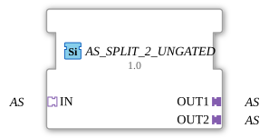

# AS_SPLIT_2_UNGATED

> ℹ️ **UNGATED-Variante:** Dieser Baustein ist die ungegatete Version von [`AS_SPLIT_2`](AS_SPLIT_2.md). Er unterdrückt **keine** unveränderten Wiederholungen – jedes neu berechnete Ergebnis wird bedingungslos weitergegeben, auch ohne Wertänderung. Das ist wichtig für Verbraucher, die eine periodische Kadenz unabhängig von Wertänderung brauchen (z. B. Ableitungs-/Frequenzberechnungen, die sonst nicht gegen Null abklingen). Alle Angaben zu Änderungserkennung/Change-Gating weiter unten auf dieser Seite gelten **nicht** für diesen Baustein.

* * * * * * * * * *

## Einleitung

Der Funktionsblock **AS_SPLIT_2_UNGATED** dient dem Aufteilen eines eingehenden Adapter-Signals vom Typ `adapter::types::unidirectional::AS` auf zwei identische Ausgangsadapter. Er ist als generischer Baustein konzipiert und eignet sich für Anwendungen, in denen ein Adapter-Datenstrom an mehrere nachfolgende Komponenten verteilt werden muss, ohne das Originalsignal zu verändern.

## Schnittstellenstruktur

### **Ereignis-Eingänge**

Keine vorhanden. Der Baustein arbeitet rein datengetrieben über die Adapter.

### **Ereignis-Ausgänge**

Keine vorhanden.

### **Daten-Eingänge**

Keine vorhanden. Die gesamte Datenübertragung erfolgt über den Adapter-Eingang `IN`.

### **Daten-Ausgänge**

Keine vorhanden. Die Ausgangsdaten werden über die Adapter `OUT1` und `OUT2` bereitgestellt.

### **Adapter**

| Richtung | Name | Typ | Beschreibung |
| ---------- | ------ | ----- | -------------- |
| Socket | `IN` | `adapter::types::unidirectional::AS` | Eingangsadapter, dessen Daten auf beide Ausgänge verteilt werden. |
| Plug | `OUT1` | `adapter::types::unidirectional::AS` | Erster Ausgangsadapter – erhält eine Kopie der eingehenden Daten. |
| Plug | `OUT2` | `adapter::types::unidirectional::AS` | Zweiter Ausgangsadapter – erhält ebenfalls eine Kopie der eingehenden Daten. |

## Funktionsweise

Der Baustein fungiert als passiver Verteiler: Ein am Socket `IN` anliegender Adapter-Datenstrom wird unverändert an beide Plugs `OUT1` und `OUT2` weitergeleitet. Es findet keinerlei Datenmanipulation, Pufferung oder Filterung statt. Die Aufteilung erfolgt signalgetreu, sodass die an `OUT1` und `OUT2` anliegenden Daten zeitlich und inhaltlich exakt den Daten von `IN` entsprechen.

## Technische Besonderheiten

- **Generischer Typ:** Der Baustein ist als generischer Funktionsblock deklariert (`GenericClassName = GEN_AS_SPLIT`). Dies ermöglicht die Verwendung in verschiedenen Kontexten, sofern die angeschlossenen Adapter dem Typ `AS` entsprechen.
- **Keine Ereignissteuerung:** Der Datenfluss erfolgt rein über die Adapter-Schnittstellen. Es sind keine Ereignis-Ein- oder Ausgänge vorhanden, wodurch der Baustein keine eigenständige Ablaufsteuerung besitzt.
- **Keine Datenpuffer:** Da weder Speicher noch Verzögerung implementiert sind, eignet sich der Baustein besonders für Echtzeitanwendungen mit niedriger Latenz.

## Zustandsübersicht

Der Baustein besitzt keine inneren Zustände oder sequentielle Logik. Er verhält sich wie eine reine Verdrahtungskomponente und arbeitet kontinuierlich ohne explizite Zustandsmaschine.

## Anwendungsszenarien

- **Signalfan-out:** Verteilung eines Sensor-Adapters an mehrere parallel geschaltete Auswerteeinheiten.
- **Redundanz:** Einspeisung eines Steuersignals in zwei unabhängige Aktorstränge.
- **Monitoring:** Anschluss eines Analyse- oder Logging-Adapters parallel zum bestehenden Datenpfad.

## Vergleich mit ähnlichen Bausteinen

Im Gegensatz zu einem einfachen Verbindungsknoten (der nur eine 1:1-Leitung realisiert) ermöglicht `AS_SPLIT_2_UNGATED` eine saubere, konfigurierbare Aufteilung auf zwei Ausgänge. Gegenüber einem **AS_MUX** oder **AS_DEMUX** fehlen diesem Baustein Auswahl- oder Priorisierungslogik – er verteilt immer alle eingehenden Daten an alle Ausgänge. Ähnliche Blöcke wie `AS_SPLIT_3` oder `AS_SPLIT_N` erweitern die Anzahl der Ausgänge entsprechend.

- **[`AS_SPLIT_2`](AS_SPLIT_2.md)**: Die gegatete Variante – aktualisiert den Ausgang nur bei tatsächlicher Wertänderung.

## Änderungserkennung

Dieser Baustein führt **keine** Änderungserkennung durch. Jedes neu berechnete Ergebnis wird bedingungslos auf den Ausgang geschrieben und das zugehörige Adapter-Event gesendet, unabhängig davon, ob sich der Wert gegenüber dem vorherigen Durchlauf geändert hat.

## Fazit

Der **AS_SPLIT_2_UNGATED** ist ein einfacher, aber nützlicher Baustein zur Vervielfältigung von Adapter-Datenströmen. Durch seine generische Definition und den Verzicht auf komplexe Logik eignet er sich hervorragend als universelles Verteilerelement in 4diac-basierten Automatisierungssystemen, bei denen Signalaufteilung ohne Datenveränderung gefordert ist.

---

### 🌐 Passende Themen-Unterseiten auf ms-muc-docs.de

- [🌐 Eclipse 4diac IDE & Farb-Referenz auf ms-muc-docs.de](https://www.ms-muc-docs.de/iec-61499/eclipse-4diac/)
