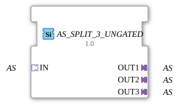

# AS_SPLIT_3_UNGATED

> ℹ️ **UNGATED-Variante:** Dieser Baustein ist die ungegatete Version von [`AS_SPLIT_3`](AS_SPLIT_3.md). Er unterdrückt **keine** unveränderten Wiederholungen – jedes neu berechnete Ergebnis wird bedingungslos weitergegeben, auch ohne Wertänderung. Das ist wichtig für Verbraucher, die eine periodische Kadenz unabhängig von Wertänderung brauchen (z. B. Ableitungs-/Frequenzberechnungen, die sonst nicht gegen Null abklingen). Alle Angaben zu Änderungserkennung/Change-Gating weiter unten auf dieser Seite gelten **nicht** für diesen Baustein.

* * * * * * * * * *

## Einleitung

Der Funktionsblock AS_SPLIT_3_UNGATED dient der Verteilung eines eingehenden Adapter-Datenstroms auf drei identische Ausgänge. Er ist als generischer Baustein realisiert und auf die Verwendung mit dem `adapter::types::unidirectional::AS`-Adaptertyp ausgelegt.

## Schnittstellenstruktur

### **Ereignis-Eingänge**

Keine

### **Ereignis-Ausgänge**

Keine

### **Daten-Eingänge**

Keine

### **Daten-Ausgänge**

Keine

### **Adapter**

| Bezeichnung | Typ | Richtung | Beschreibung |
| ------------- | ----- | ---------- | -------------- |
| IN | `adapter::types::unidirectional::AS` | Socket | Eingangsadapter – Datenquelle, die auf drei Ausgänge verteilt wird. |
| OUT1 | `adapter::types::unidirectional::AS` | Plug | Erster Ausgang – erhält die unveränderten Daten von IN. |
| OUT2 | `adapter::types::unidirectional::AS` | Plug | Zweiter Ausgang – erhält die unveränderten Daten von IN. |
| OUT3 | `adapter::types::unidirectional::AS` | Plug | Dritter Ausgang – erhält die unveränderten Daten von IN. |

## Funktionsweise

Der Baustein leitet die über den Socket `IN` empfangenen Adapterdaten identisch und ohne Verzögerung an alle drei Adapter-Plugs `OUT1`, `OUT2` und `OUT3` weiter. Es findet keine Datenmanipulation, Filterung oder Pufferung statt. Die Verteilung erfolgt in einem reinen Durchleitungsmodus.

## Technische Besonderheiten

- **Generischer Typ**: Der Baustein verwendet das Attribut `eclipse4diac::core::GenericClassName` mit dem Wert `'GEN_AS_SPLIT'`, um eine generische Instanziierung zu ermöglichen. Der konkrete Adaptertyp (`adapter::types::unidirectional::AS`) wird zur Projektierungszeit festgelegt.
- **Ereignislos**: Da keine Ereignisse (Event-Ein-/Ausgänge) definiert sind, erfolgt die Datenweitergabe rein datengetrieben – Änderungen am Eingangsadapter werden sofort an alle Ausgänge propagiert.
- **Eingetragenes Copyright**: Der FB ist urheberrechtlich geschützt unter der Eclipse Public License 2.0.

## Zustandsübersicht

Der Baustein besitzt keinen internen Zustandsautomaten und kein ECC (Execution Control Chart). Das Verhalten ist rein kombinatorisch: Sobald sich die Daten des Eingangsadapters ändern, werden die Ausgangsdaten entsprechend aktualisiert.

## Anwendungsszenarien

- **Datenverteilung in Steuerungssystemen**: Aufteilung eines Sensordatenstroms (z.B. AS-i-Bus-Daten) auf mehrere parallel arbeitende Verarbeitungsblöcke.
- **Signalkopie für Diagnosezwecke**: Anschließen eines separaten Monitor- oder Logging-Pfads ohne Beeinflussung der Hauptdaten.
- **Multiplikation von Steuersignalen**: Verteilung eines einzigen Befehlssatzes an mehrere Aktoren oder Subsysteme.

## Vergleich mit ähnlichen Bausteinen

- **AS_SPLIT_2**: Ein analoger Baustein mit nur zwei Ausgängen. AS_SPLIT_3_UNGATED erweitert die Anzahl auf drei Ausgänge.
- **AS_MERGE (theoretisch)**: Im Gegensatz zu einem Merge-Baustein, der mehrere Eingänge zu einem Ausgang zusammenführt, realisiert AS_SPLIT_3_UNGATED die umgekehrte Funktion (1 → N).
- **Generische Split-FBs**: Ähnliche Konzepte existieren für Daten-Eingänge (z.B. SPLIT_INT), jedoch arbeiten diese auf Elementardaten, während AS_SPLIT_3_UNGATED Adapter (komplexe Datentypen) verarbeitet.

- **[`AS_SPLIT_3`](AS_SPLIT_3.md)**: Die gegatete Variante – aktualisiert den Ausgang nur bei tatsächlicher Wertänderung.

## Änderungserkennung

Dieser Baustein führt **keine** Änderungserkennung durch. Jedes neu berechnete Ergebnis wird bedingungslos auf den Ausgang geschrieben und das zugehörige Adapter-Event gesendet, unabhängig davon, ob sich der Wert gegenüber dem vorherigen Durchlauf geändert hat.

## Fazit

AS_SPLIT_3_UNGATED ist ein einfacher, aber nützlicher Funktionsblock zur Vervielfältigung von Adapterdaten in der 4diac-IDE. Seine generische Auslegung und der fehlende Ereignisverkehr machen ihn besonders leichtgewichtig und in vielen Szenarien einsetzbar. Die dokumentierte Lizenz (EPL 2.0) stellt sicher, dass der Baustein rechtlich klar in eigene Projekte integriert werden kann.

---

### 🌐 Passende Themen-Unterseiten auf ms-muc-docs.de

- [🌐 Eclipse 4diac IDE & Farb-Referenz auf ms-muc-docs.de](https://www.ms-muc-docs.de/iec-61499/eclipse-4diac/)
