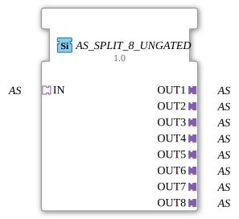

# AS_SPLIT_8_UNGATED

> ℹ️ **UNGATED-Variante:** Dieser Baustein ist die ungegatete Version von [`AS_SPLIT_8`](AS_SPLIT_8.md). Er unterdrückt **keine** unveränderten Wiederholungen – jedes neu berechnete Ergebnis wird bedingungslos weitergegeben, auch ohne Wertänderung. Das ist wichtig für Verbraucher, die eine periodische Kadenz unabhängig von Wertänderung brauchen (z. B. Ableitungs-/Frequenzberechnungen, die sonst nicht gegen Null abklingen). Alle Angaben zu Änderungserkennung/Change-Gating weiter unten auf dieser Seite gelten **nicht** für diesen Baustein.

* * * * * * * * * *

## Einleitung

Der Funktionsbaustein **AS_SPLIT_8_UNGATED** dient dazu, einen eingehenden *Application Specific* (AS)-Adapter-Datenstrom in acht identische Ausgänge zu verzweigen. Er wird als generischer Baustein (generic FB) bereitgestellt und ist speziell für die Aufteilung von Adapterdaten innerhalb einer IEC 61499-basierten Steuerungsapplikation konzipiert.

## Schnittstellenstruktur

### **Ereignis-Eingänge**

Keine.

### **Ereignis-Ausgänge**

Keine.

### **Daten-Eingänge**

Keine.

### **Daten-Ausgänge**

Keine.

### **Adapter**

| Typ | Name | Richtung | Beschreibung |
| --- | --- | --- | --- |
| `adapter::types::unidirectional::AS` | IN | Socket (Eingang) | Empfängt den zu verteilenden AS-Datenstrom. |
| `adapter::types::unidirectional::AS` | OUT1 | Plug (Ausgang) | Erste Kopie des eingehenden AS-Datenstroms. |
| `adapter::types::unidirectional::AS` | OUT2 | Plug (Ausgang) | Zweite Kopie des eingehenden AS-Datenstroms. |
| `adapter::types::unidirectional::AS` | OUT3 | Plug (Ausgang) | Dritte Kopie. |
| `adapter::types::unidirectional::AS` | OUT4 | Plug (Ausgang) | Vierte Kopie. |
| `adapter::types::unidirectional::AS` | OUT5 | Plug (Ausgang) | Fünfte Kopie. |
| `adapter::types::unidirectional::AS` | OUT6 | Plug (Ausgang) | Sechste Kopie. |
| `adapter::types::unidirectional::AS` | OUT7 | Plug (Ausgang) | Siebte Kopie. |
| `adapter::types::unidirectional::AS` | OUT8 | Plug (Ausgang) | Achte Kopie. |

## Funktionsweise

Der Baustein arbeitet rein adapterbasiert, ohne Nutzung von Ereignissen oder Daten-Ein-/Ausgängen. Der am Socket `IN` anliegende Adapter-Datenstrom wird intern auf alle acht Ausgangs-Plugs (`OUT1` … `OUT8`) gespiegelt. Jeder Ausgang gibt exakt dieselben Daten weiter, die am Eingang anliegen. Es findet keine Verzögerung, Filterung oder Modifikation statt. Die Verzweigung erfolgt passiv und ohne aktive Laufzeitlogik (kein Zustandsautomat).

## Technische Besonderheiten

- **Reiner Adapterbaustein**: Der FB besitzt weder Ereignis- noch Datenschnittstellen im klassischen Sinne; die gesamte Datenübertragung erfolgt über die Adapterverbindungen.
- **Generische Implementierung**: Durch die Deklaration als generischer FB (`GenericClassName = 'GEN_AS_SPLIT'`) kann der Baustein für beliebige AS-Adapter-Typen eingesetzt werden, sofern der zugrunde liegende Adapter-Typ `unidirectional::AS` ist.
- **Keine Zustandsmaschine**: Aufgrund der fehlenden Ereignisse entfällt ein ECC (Execution Control Chart). Die Verteilung erfolgt kontinuierlich.
- **Einfaches 1:8-Splitting**: Optimiert für Situationen, in denen ein Signal auf mehrere nachfolgende Module verteilt werden muss.

## Zustandsübersicht

Nicht zutreffend – der Baustein besitzt keine internen Zustände oder Ablaufsteuerung.

## Anwendungsszenarien

- **Parallelverteilung von Sensordaten**: Ein einzelner Adapter, der z. B. Füllstandsdaten eines Tanks bereitstellt, wird auf acht überwachnde oder regelnde Funktionseinheiten aufgeteilt.
- **Signal-Multicasting in der Industrie 4.0**: Verteilung eines Steuerbefehls an mehrere Aktoren oder Subsysteme.
- **Testumgebungen** zur Simulation mehrfacher Empfänger eines Datenstroms.

## Vergleich mit ähnlichen Bausteinen

- **AS_SPLIT_2 / AS_SPLIT_4**: Analoge Bausteine mit geringerer Ausgangszahl. AS_SPLIT_8_UNGATED bietet die maximale Verteilung in einem Schritt bei acht Ausgängen.
- **Ereignisbasierte Splitter (z. B. E_SPLIT)**: Diese arbeiten mit Ereignissen und verteilen diese zeitlich gesteuert. Der vorliegende Baustein verteilt dagegen dauerhaft die gesamten Adapterdaten ohne Ereigniskontrolle.
- **Daten-basierte Splitter (z. B. ANY_DISTRIBUTE)**: Trennen Datenwerte auf, benötigen aber zusätzliche Ereignisse. AS_SPLIT_8_UNGATED ist für reine Adapter-Weiterleitungen optimiert.

- **[`AS_SPLIT_8`](AS_SPLIT_8.md)**: Die gegatete Variante – aktualisiert den Ausgang nur bei tatsächlicher Wertänderung.

## Änderungserkennung

Dieser Baustein führt **keine** Änderungserkennung durch. Jedes neu berechnete Ergebnis wird bedingungslos auf den Ausgang geschrieben und das zugehörige Adapter-Event gesendet, unabhängig davon, ob sich der Wert gegenüber dem vorherigen Durchlauf geändert hat.

## Fazit

Der **AS_SPLIT_8_UNGATED** ist ein einfacher, aber nützlicher Adapterverteiler, der ohne zusätzliche Logik einen eingehenden AS-Datenstrom auf acht Ausgänge dupliziert. Sein generischer Charakter und die klare Struktur machen ihn zu einer soliden Lösung für Szenarien, in denen ein Adaptersignal mehrfach verwendet werden muss. Die Dokumentation des Bausteins erhebt keinen Anspruch auf Vollständigkeit hinsichtlich der Implementierungsdetails; die genaue Funktionalität kann je nach verwendeter Laufzeitumgebung variieren.
