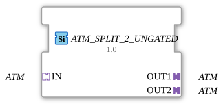

# ATM_SPLIT_2_UNGATED

> ℹ️ **UNGATED-Variante:** Dieser Baustein ist die ungegatete Version von [`ATM_SPLIT_2`](ATM_SPLIT_2.md). Er unterdrückt **keine** unveränderten Wiederholungen – jedes neu berechnete Ergebnis wird bedingungslos weitergegeben, auch ohne Wertänderung. Das ist wichtig für Verbraucher, die eine periodische Kadenz unabhängig von Wertänderung brauchen (z. B. Ableitungs-/Frequenzberechnungen, die sonst nicht gegen Null abklingen). Alle Angaben zu Änderungserkennung/Change-Gating weiter unten auf dieser Seite gelten **nicht** für diesen Baustein.

* * * * * * * * * *

## Einleitung

Der **ATM_SPLIT_2_UNGATED** ist ein generischer Funktionsbaustein, der einen eingehenden Adapter vom Typ `adapter::types::unidirectional::ATM` auf 2 separate Ausgänge (OUT1, OUT2) aufteilt. Er dient zur Weiterleitung eines Zeitsignals an 2 nachfolgende Bausteine, ohne die Daten zu verändern. Der Baustein ist als generischer Typ (`GEN_ATM_SPLIT`) implementiert und wird zur Laufzeit parametrisiert.

## Schnittstellenstruktur

### **Ereignis-Eingänge**

Keine Ereignis-Eingänge vorhanden.

### **Ereignis-Ausgänge**

Keine Ereignis-Ausgänge vorhanden.

### **Daten-Eingänge**

Keine Daten-Eingänge vorhanden.

### **Daten-Ausgänge**

Keine Daten-Ausgänge vorhanden.

### **Adapter**

| Typ | Name | Richtung | Beschreibung |
| ----- | ------ | ---------- | -------------- |
| `adapter::types::unidirectional::ATM` | IN | Socket | Eingangssignal (ATM) |
| `adapter::types::unidirectional::ATM` | OUT1 | Plug | Ausgang 1 (identisch zu IN) |
| `adapter::types::unidirectional::ATM` | OUT2 | Plug | Ausgang 2 (identisch zu IN) |

## Funktionsweise

Der Baustein leitet das am Socket **IN** anliegende ATM-Signal unverändert auf alle 2 Plugs (OUT1, OUT2) weiter. Es findet keine Datenmanipulation, Filterung oder Verzögerung statt. Die Aufteilung erfolgt rein strukturell: Jeder Ausgang erhält eine eigene Kopie der Referenz auf den zugrundeliegenden Zeitwert.

## Technische Besonderheiten

- **Generische Implementierung**: Der FB verwendet das Generic-Class-Name-Attribut (`eclipse4diac::core::GenericClassName`) mit dem Wert `'GEN_ATM_SPLIT'`, sodass dieselbe Klasse über den GenericClassName-Mechanismus die Aritäten `ATM_SPLIT_2_UNGATED`, `ATM_SPLIT_3` und `ATM_SPLIT_4` abdeckt.
- **Unidirektionale Adapter**: Alle Adapter sind vom Typ `adapter::types::unidirectional::ATM` (nur Vorwärtsrichtung).
- **Keine Zustandsautomatik**: Der Baustein besitzt keinen expliziten ECC (Execution Control Chart); die Weiterleitung erfolgt direkt und ereignisunabhängig.

## Zustandsübersicht

Der Baustein implementiert keine Zustandsautomaten. Die Funktionalität beschränkt sich auf die passive Weiterleitung des Eingangssignals an alle 2 Ausgänge. Eine Zustandsvisualisierung ist daher nicht erforderlich.

## Anwendungsszenarien

- **Signalverteilung**: Aufteilung eines ATM-basierten Zeitsignals (z. B. einer Verzögerungsdauer) an mehrere parallel arbeitende Steuerungskomponenten.
- **Redundanz**: Bereitstellung desselben Zeitwerts für ein primäres und ein redundantes System.
- **Debugging**: Anschluss eines Analyse- oder Logging-Bausteins parallel zum bestehenden Pfad, ohne die Originalsignalkette zu unterbrechen.

## Vergleich mit ähnlichen Bausteinen

Ähnliche Funktionalität bieten die weiteren Aritäten `ATM_SPLIT_2_UNGATED`/`ATM_SPLIT_3`/`ATM_SPLIT_4` sowie der strukturell identische `AR_SPLIT_2` für den Datentyp `REAL`. Die Auswahl der Arität hängt von der benötigten Anzahl an Ausgängen ab.

- **[`ATM_SPLIT_2`](ATM_SPLIT_2.md)**: Die gegatete Variante – aktualisiert den Ausgang nur bei tatsächlicher Wertänderung.

## Änderungserkennung

Dieser Baustein führt **keine** Änderungserkennung durch. Jedes neu berechnete Ergebnis wird bedingungslos auf den Ausgang geschrieben und das zugehörige Adapter-Event gesendet, unabhängig davon, ob sich der Wert gegenüber dem vorherigen Durchlauf geändert hat.

## Fazit

Der **ATM_SPLIT_2_UNGATED** ist ein einfacher, aber essenzieller Baustein zur Vervielfachung eines Zeitsignals in IEC 61499-basierten Steuerungssystemen. Seine generische Auslegung und die klare Schnittstelle machen ihn zur ersten Wahl, wenn ein Zeitwert an mehrere unabhängige Zielbausteine weitergegeben werden muss.
