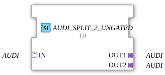

# AUDI_SPLIT_2_UNGATED

> ℹ️ **UNGATED-Variante:** Dieser Baustein ist die ungegatete Version von [`AUDI_SPLIT_2`](AUDI_SPLIT_2.md). Er unterdrückt **keine** unveränderten Wiederholungen – jedes neu berechnete Ergebnis wird bedingungslos weitergegeben, auch ohne Wertänderung. Das ist wichtig für Verbraucher, die eine periodische Kadenz unabhängig von Wertänderung brauchen (z. B. Ableitungs-/Frequenzberechnungen, die sonst nicht gegen Null abklingen). Alle Angaben zu Änderungserkennung/Change-Gating weiter unten auf dieser Seite gelten **nicht** für diesen Baustein.

* * * * * * * * * *

## Einleitung

Der Funktionsblock **AUDI_SPLIT_2_UNGATED** ist ein generischer Baustein zur Signalverteilung. Er empfängt über einen einzelnen **AUDI**-Adapter (unidirektional) ein Signal und leitet es an zwei identische **AUDI**-Ausgangsadapter weiter. Der FB wird als **generic FB** deklariert, d.h. der konkrete Signaltyp kann zur Projektierungszeit über das Attribut `GenericClassName` festgelegt werden. Entwickelt wurde er von der HR Agrartechnik GmbH (Version 1.0, 2025-01-24).

## Schnittstellenstruktur

### **Ereignis-Eingänge**

Keine.

### **Ereignis-Ausgänge**

Keine.

### **Daten-Eingänge**

Keine.

### **Daten-Ausgänge**

Keine.

### **Adapter**

| Richtung | Name | Typ | Beschreibung |
| ---------- | ------ | ----- | -------------- |
| **Socket** | `IN` | `adapter::types::unidirectional::AUDI` | Eingehender unidirektionaler AUDI-Adapter (Signalquelle). |
| **Plug** | `OUT1` | `adapter::types::unidirectional::AUDI` | Erster Ausgang – leitet das Eingangssignal weiter. |
| **Plug** | `OUT2` | `adapter::types::unidirectional::AUDI` | Zweiter Ausgang – leitet das Eingangssignal weiter. |

## Funktionsweise

Der Baustein arbeitet als **passiver Splitter** ohne eigene Logik oder Zustände. Das über den Socket `IN` ankommende Signal wird auf beide Plugs `OUT1` und `OUT2` durchgeschliffen. Die Weiterleitung erfolgt unverändert und ohne Pufferung – jede Änderung am Eingang wird sofort an beiden Ausgängen sichtbar.

Da es sich um einen **unidirektionalen** Adapter handelt, fließen Daten nur vom Socket zu den Plugs. Eine Rückwirkung von den Ausgängen auf den Eingang ist nicht vorgesehen.

## Technische Besonderheiten

- **Generischer Baustein**: Das Attribut `eclipse4diac::core::GenericClassName` erlaubt die Anpassung an unterschiedliche AUDI-Typen (z.B. `AUDI_Int`, `AUDI_Bool`). Der tatsächliche Typ wird erst bei der Instanziierung festgelegt.
- **Kein internes ECC**: Der FB besitzt keinen Ausführungszustandsautomaten, da er keine Ereignisse verarbeitet. Die Datenweitergabe erfolgt rein strukturell.
- **Unidirektionale Schnittstelle**: Sowohl Socket als auch Plugs sind vom Typ `adapter::types::unidirectional::AUDI`, was bedeutet, dass die Datenflussrichtung fest vorgegeben ist.
- **Urheberrecht**: Der Baustein steht unter der Eclipse Public License 2.0.

## Zustandsübersicht

Der FB hat keine eigenen Zustandsdiagramme, da er keine ereignisgesteuerten Abläufe beinhaltet. Die Funktion beschränkt sich auf eine reine Leitungsverzweigung.

## Anwendungsszenarien

- **Signalverteilung**: Ein zentraler Sensor oder eine Steuerung (z.B. ein PID-Regler) sendet einen Wert, der parallel an zwei nachgelagerte Aktoren oder Überwachungseinheiten weitergegeben werden soll.
- **Redundante Überwachung**: Ein Messwert wird gleichzeitig an zwei unabhängige Auswerteblöcke gesendet, um Vergleichs- oder Sicherheitsfunktionen zu realisieren.
- **Generische Adapter-Architektur**: Besonders nützlich in Systemen, bei denen der konkrete AUDI-Typ erst zur Laufzeit festgelegt wird (z.B. in einer konfigurierbaren Geräteplattform).

## Vergleich mit ähnlichen Bausteinen

- **Nicht-generische Splitter** (z.B. `AUDI_SPLIT_2_UNGATED` mit festem Typ): Lassen keine Typanpassung zu; der hier vorgestellte FB ist flexibler.
- **Andere Splitter mit mehr Ausgängen** (z.B. `AUDI_SPLIT_3`): Erweitern die Verzweigungszahl, folgen aber dem gleichen Prinzip.
- **Ereignisbasierte Splitter** (z.B. `E_SPLIT`): Benötigen Ereignis- und Daten-Eingänge/-Ausgänge und führen eine synchronisierte Verteilung durch – im Gegensatz zum vorliegenden asynchronen Daten-Adapter-Split.

- **[`AUDI_SPLIT_2`](AUDI_SPLIT_2.md)**: Die gegatete Variante – aktualisiert den Ausgang nur bei tatsächlicher Wertänderung.

## Änderungserkennung

Dieser Baustein führt **keine** Änderungserkennung durch. Jedes neu berechnete Ergebnis wird bedingungslos auf den Ausgang geschrieben und das zugehörige Adapter-Event gesendet, unabhängig davon, ob sich der Wert gegenüber dem vorherigen Durchlauf geändert hat.

## Fazit

Der **AUDI_SPLIT_2_UNGATED** ist ein kompakter, generischer Adapter-Splitter für die 4diac-IDE. Er erfüllt die einfache Aufgabe der Signalverzweigung auf zwei Ausgänge, ohne zusätzliche Latenz oder Logik zu verursachen. Durch die generische Auslegung eignet er sich für unterschiedlichste AUDI-Datentypen und ermöglicht eine flexible Wiederverwendung in modularen Automatisierungsprojekten. Seine Einfachheit und Typsicherheit machen ihn zu einem soliden Grundbaustein für verteilte Steuerungssysteme.

---

### 🌐 Passende Themen-Unterseiten auf ms-muc-docs.de

- [🌐 Eclipse 4diac IDE & Farb-Referenz auf ms-muc-docs.de](https://www.ms-muc-docs.de/iec-61499/eclipse-4diac/)
