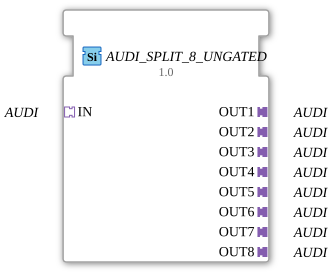

# AUDI_SPLIT_8_UNGATED

> ℹ️ **UNGATED-Variante:** Dieser Baustein ist die ungegatete Version von [`AUDI_SPLIT_8`](AUDI_SPLIT_8.md). Er unterdrückt **keine** unveränderten Wiederholungen – jedes neu berechnete Ergebnis wird bedingungslos weitergegeben, auch ohne Wertänderung. Das ist wichtig für Verbraucher, die eine periodische Kadenz unabhängig von Wertänderung brauchen (z. B. Ableitungs-/Frequenzberechnungen, die sonst nicht gegen Null abklingen). Alle Angaben zu Änderungserkennung/Change-Gating weiter unten auf dieser Seite gelten **nicht** für diesen Baustein.

* * * * * * * * * *

## Einleitung

Der Funktionsblock **AUDI_SPLIT_8_UNGATED** dient dazu, ein eingehendes unidirektionales **AUDI**-Adapter-Signal auf acht parallele Ausgänge zu verteilen.
Er ist als generischer Baustein (generic FB) implementiert und ermöglicht eine einfache Weiterleitung eines Adaptersignals an bis zu acht Empfänger.

## Schnittstellenstruktur

### **Ereignis-Eingänge**

Keine.

### **Ereignis-Ausgänge**

Keine.

### **Daten-Eingänge**

Keine.

### **Daten-Ausgänge**

Keine.

### **Adapter**

| Typ | Richtung | Name | Beschreibung |
|-----|----------|------|--------------|
| `adapter::types::unidirectional::AUDI` | Socket (Eingang) | `IN` | Eingangsadapter, der das zu verteilende Signal empfängt. |
| `adapter::types::unidirectional::AUDI` | Plug (Ausgang) | `OUT1` .. `OUT8` | Acht Ausgangsadapter, die jeweils das identische Signal des Eingangs bereitstellen. |

## Funktionsweise

Der Baustein leitet das am Socket `IN` anliegende **AUDI**-Adapter-Signal unverändert an alle acht Plugs (`OUT1` bis `OUT8`) weiter.
Es findet keine Verarbeitung, Filterung oder Pufferung statt – die Verteilung erfolgt vollständig passiv auf Adapterebene.
Durch die Verwendung eines generischen Typs (siehe Technische Besonderheiten) kann der Baustein flexibel für verschiedene konkrete AUDI-Adapterausprägungen eingesetzt werden.

## Technische Besonderheiten

- **Generischer Baustein**: Der FB ist als generischer Typ deklariert (`eclipse4diac::core::GenericClassName = 'GEN_AUDI_SPLIT'`).
  Dies erlaubt die Wiederverwendung für beliebige AUDI-Adapter-Spezialisierungen, ohne den FB selbst ändern zu müssen.

- **Keine Zustandslogik**: Da ausschließlich Adapter verwendet werden, besitzt der Baustein weder Ereignisse noch eine eigene Zustandsmaschine.
- **Platzersparnis**: Durch die Zusammenfassung von acht Ausgängen in einem einzigen FB wird das Netzwerkdiagramm übersichtlicher als bei Verwendung mehrerer einfacher Split-Blöcke.

## Zustandsübersicht

Der Baustein besitzt keine interne Zustandsmaschine (kein ECC).
Die Funktionalität ist rein kombinatorisch: Das Signal am Eingang wird permanent auf alle Ausgänge durchgeschaltet.

## Anwendungsszenarien

- **Signalbroadcast** in Steuerungsanwendungen, bei denen ein einziges AUDI-Adapter-Signal an mehrere unabhängige Empfängerbausteine verteilt werden muss (z. B. intelligente Sensoren, Aktuatoren oder Buskoppler).
- **Erweiterung von Teilnehmern** in einer bestehenden AUDI-Verdrahtung, ohne das Original-Signal zu beeinflussen.
- **Strukturierte Automatisierungslösungen** in landwirtschaftlichen Maschinen, in denen Adapter nach IEC 61499 für die Kommunikation zwischen Komponenten eingesetzt werden (z. B. in HR Agrartechnik GmbH Systemen).

## Vergleich mit ähnlichen Bausteinen

- **Einfacher Split-FB (z. B. SPLIT_2)** : Verteilt ein Signal auf zwei Ausgänge – der AUDI_SPLIT_8_UNGATED bietet acht Ausgänge in einem Baustein.
- **Data Distribution FB**: Einige Bibliotheken stellen generische Verteiler für Datenports bereit; dieser FB ist speziell für den AUDI-Adapter-Typ optimiert und benötigt keine zusätzliche Konfiguration der Datenstruktur.
- **Manuelle Parallelschaltung**: Mehrere AUDI-Socket-zu-Plug-Verbindungen könnten das Gleiche bewirken, sind aber unübersichtlicher und fehleranfälliger.

- **[`AUDI_SPLIT_8`](AUDI_SPLIT_8.md)**: Die gegatete Variante – aktualisiert den Ausgang nur bei tatsächlicher Wertänderung.

## Änderungserkennung

Dieser Baustein führt **keine** Änderungserkennung durch. Jedes neu berechnete Ergebnis wird bedingungslos auf den Ausgang geschrieben und das zugehörige Adapter-Event gesendet, unabhängig davon, ob sich der Wert gegenüber dem vorherigen Durchlauf geändert hat.

## Fazit

**AUDI_SPLIT_8_UNGATED** ist ein kompakter, generischer Spezialbaustein zur Signalverteilung auf Adapterebene.
Er reduziert den Modellierungsaufwand, erhöht die Lesbarkeit von Steuerungsprogrammen und lässt sich durch seine generische Natur flexibel in verschiedenen AUDI-basierten Umgebungen einsetzen.
Für Anwendungen, die eine 1:8-Aufteilung eines unidirektionalen AUDI-Adapters benötigen, stellt er eine ideale und saubere Lösung dar.

---

### 🌐 Passende Themen-Unterseiten auf ms-muc-docs.de

- [🌐 Eclipse 4diac IDE & Farb-Referenz auf ms-muc-docs.de](https://www.ms-muc-docs.de/iec-61499/eclipse-4diac/)
- [🌐 Gesamtwiderstand in Reihen- & Parallelschaltung auf ms-muc-docs.de](https://www.ms-muc-docs.de/elektrotechnik/elektrik/widerstand/widerstand-theorie/gesamtwiderstand-reihen-parallelschaltung/)
