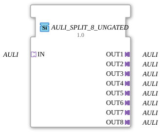

# AULI_SPLIT_8_UNGATED

> ℹ️ **UNGATED-Variante:** Dieser Baustein ist die ungegatete Version von [`AULI_SPLIT_8`](AULI_SPLIT_8.md). Er unterdrückt **keine** unveränderten Wiederholungen – jedes neu berechnete Ergebnis wird bedingungslos weitergegeben, auch ohne Wertänderung. Das ist wichtig für Verbraucher, die eine periodische Kadenz unabhängig von Wertänderung brauchen (z. B. Ableitungs-/Frequenzberechnungen, die sonst nicht gegen Null abklingen). Alle Angaben zu Änderungserkennung/Change-Gating weiter unten auf dieser Seite gelten **nicht** für diesen Baustein.

* * * * * * * * * *

## Einleitung

Der Funktionsbaustein `AULI_SPLIT_8_UNGATED` dient dazu, einen eingehenden unidirektionalen AULI‑Adapter (Socket `IN`) auf acht baugleiche AULI‑Ausgangsadapter (`OUT1` bis `OUT8`) aufzuteilen. Er arbeitet als reiner Verteiler – das eingehende Signal wird ohne Verzögerung oder Logikänderung an alle Ausgänge weitergegeben. Der Baustein ist generisch ausgelegt und kann mit verschiedenen AULI‑Typen verwendet werden (siehe Attribut `GenericClassName`).

## Schnittstellenstruktur

### **Ereignis-Eingänge**

Keine Ereignis-Eingänge vorhanden.

### **Ereignis-Ausgänge**

Keine Ereignis-Ausgänge vorhanden.

### **Daten-Eingänge**

Keine Daten-Eingänge vorhanden.

### **Daten-Ausgänge**

Keine Daten-Ausgänge vorhanden.

### **Adapter**

| Richtung | Name | Typ | Beschreibung |
|----------|------|-----|--------------|
| Socket (Eingang) | `IN` | `adapter::types::unidirectional::AULI` | Eingehender AULI‑Adapter, der auf die acht Ausgänge verteilt wird. |
| Plug (Ausgang) | `OUT1` – `OUT8` | `adapter::types::unidirectional::AULI` | Acht parallele Ausgänge, die das identische Signal des Eingangs weiterleiten. |

## Funktionsweise

Der Baustein verfügt über keine eigene Ablaufsteuerung (kein ECC) und keine datenverarbeitenden Algorithmen. Er verbindet den eingehenden Adapter `IN` direkt mit allen acht Ausgangsadaptern `OUT1` bis `OUT8`. Jeder Datenaustausch, der über den Adapter `IN` stattfindet (z. B. Ereignisse, Werteänderungen), wird ohne Änderung an sämtliche Ausgangsadapter weitergegeben. Die Verteilung erfolgt kombinatorisch – es gibt keine Zwischenspeicherung oder zeitliche Staffelung.

## Technische Besonderheiten

- **Generischer Aufbau:** Der Baustein ist als generischer FB mit `eclipse4diac::core::GenericClassName = 'GEN_AULI_SPLIT'` deklariert. Dadurch kann er für verschiedene AULI‑Adaptertypen (z. B. mit unterschiedlichen Datentypen) parametrisiert werden.
- **Reine Adapter‑Verbindung:** Es werden weder Ereignisein‑/ausgänge noch Datenelemente auf der FB‑Ebene benötigt – die gesamte Kommunikation erfolgt über die AULI‑Adapter.
- **Keine Zustandslogik:** Der FB besitzt kein ECC; das Verhalten ist vollständig durch die Adapterverdrahtung bestimmt.

## Zustandsübersicht

Der Funktionsbaustein enthält keinen internen Zustandsautomaten. Es gibt keine unterscheidbaren Betriebsmodi oder Zustandsänderungen – das Verhalten ist rein kombinatorisch.

## Anwendungsszenarien

- **Signalverteilung:** Ein AULI‑Sensor (z. B. Temperatur, Druck) soll sein Signal an mehrere unabhängige Verbraucher (Steuerungen, Anzeigen, Datenlogger) gleichzeitig weiterleiten.
- **Redundanz / Broadcasting:** Ein Befehl oder eine Konfiguration wird von einer zentralen Instanz an bis zu acht Aktoren oder Subsysteme verteilt.
- **Testumgebungen:** Ein simulierter AULI‑Wert wird parallel an mehrere FB‑Instanzen zur Validierung gesendet.

## Vergleich mit ähnlichen Bausteinen

In der 4diac‑IDE existieren häufig Bausteine wie `SPLIT_2`, `SPLIT_4` oder generische Split‑Bausteine für Ereignis‑/Datenleitungen. `AULI_SPLIT_8_UNGATED` spezialisiert dies auf den AULI‑Adapter und bietet eine kompakte 1:8‑Verteilung ohne zusätzliche Datentyp‑Konvertierung. Gegenüber einer manuellen Verkettung von einfacheren Split‑Bausteinen reduziert er die Verdrahtungskomplexität und erhöht die Übersichtlichkeit.

- **[`AULI_SPLIT_8`](AULI_SPLIT_8.md)**: Die gegatete Variante – aktualisiert den Ausgang nur bei tatsächlicher Wertänderung.

## Änderungserkennung

Dieser Baustein führt **keine** Änderungserkennung durch. Jedes neu berechnete Ergebnis wird bedingungslos auf den Ausgang geschrieben und das zugehörige Adapter-Event gesendet, unabhängig davon, ob sich der Wert gegenüber dem vorherigen Durchlauf geändert hat.

## Fazit

Der `AULI_SPLIT_8_UNGATED` ist ein einfacher, aber nützlicher Verteilerbaustein für unidirektionale AULI‑Adapter. Er ermöglicht eine saubere, generische Aufteilung eines Signals auf bis zu acht Ausgänge und eignet sich besonders für Broadcasting‑Szenarien, in denen mehrere Empfänger denselben Adapter‑Wert benötigen. Sein generischer Charakter macht ihn flexibel einsetzbar und erleichtert die Wiederverwendung in verschiedenen Projekten.

---

### 🌐 Passende Themen-Unterseiten auf ms-muc-docs.de

- [🌐 Eclipse 4diac IDE & Farb-Referenz auf ms-muc-docs.de](https://www.ms-muc-docs.de/iec-61499/eclipse-4diac/)
