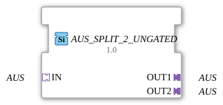

# AUS_SPLIT_2_UNGATED

> ℹ️ **UNGATED-Variante:** Dieser Baustein ist die ungegatete Version von [`AUS_SPLIT_2`](AUS_SPLIT_2.md). Er unterdrückt **keine** unveränderten Wiederholungen – jedes neu berechnete Ergebnis wird bedingungslos weitergegeben, auch ohne Wertänderung. Das ist wichtig für Verbraucher, die eine periodische Kadenz unabhängig von Wertänderung brauchen (z. B. Ableitungs-/Frequenzberechnungen, die sonst nicht gegen Null abklingen). Alle Angaben zu Änderungserkennung/Change-Gating weiter unten auf dieser Seite gelten **nicht** für diesen Baustein.

* * * * * * * * * *

## Einleitung

Der Funktionsbaustein **AUS_SPLIT_2_UNGATED** dient dazu, ein eingehendes AUS-Signal auf zwei identische Ausgänge zu verteilen. Er ist als generischer Baustein (generic FB) realisiert und eignet sich für Anwendungen, bei denen ein universelles Steuersignal mehrfach benötigt wird. Der Baustein arbeitet rein adapterbasiert und besitzt keine eigenen Ereignis- oder Dateneingänge.

## Schnittstellenstruktur

### **Ereignis-Eingänge**

Keine Ereignis-Eingänge vorhanden.

### **Ereignis-Ausgänge**

Keine Ereignis-Ausgänge vorhanden.

### **Daten-Eingänge**

Keine Daten-Eingänge vorhanden.

### **Daten-Ausgänge**

Keine Daten-Ausgänge vorhanden.

### **Adapter**

| Richtung | Name | Typ              | Beschreibung                                       |
|----------|------|------------------|----------------------------------------------------|
| Sockets  | IN   | AUS (unidirectional) | Eingangsadapter, der das zu verteilende Signal empfängt |
| Plugs    | OUT1 | AUS (unidirectional) | Erster Ausgangsadapter, identisch zum Eingangssignal |
| Plugs    | OUT2 | AUS (unidirectional) | Zweiter Ausgangsadapter, identisch zum Eingangssignal |

## Funktionsweise

Der Baustein leitet das am Socket **IN** anliegende AUS-Signal unverändert an beide Plugs **OUT1** und **OUT2** weiter. Es findet keine Verarbeitung oder Pufferung statt – die Aufteilung erfolgt rein topologisch. Das Eingangssignal wird auf beiden Ausgängen gleichzeitig und ohne Verzögerung zur Verfügung gestellt. Die Verbindung wird erst dann aktiv, wenn der Socket mit einem entsprechenden Adapter verbunden ist.

## Technische Besonderheiten

- **Generischer Typ**: Der Baustein ist als `GEN_AUS_SPLIT` mit dem Attribut `eclipse4diac::core::GenericClassName` deklariert. Dadurch kann er in verschiedenen Projekten ohne Typanpassung wiederverwendet werden.
- **Keine Zustandsabhängigkeit**: Der Baustein arbeitet zustandslos – es gibt kein internes Verhalten, das von einer Zustandsmaschine gesteuert wird.
- **Adapterbasiert**: Alle Schnittstellen sind als Adapter vom Typ `adapter::types::unidirectional::AUS` ausgeführt. Dies ermöglicht flexible Verkabelung in einer gerichteten Kommunikation.
- **Copyright**: Der Baustein stammt von der HR Agrartechnik GmbH und unterliegt der Eclipse Public License 2.0.

## Zustandsübersicht

Da der Baustein keinerlei Zustandslogik besitzt, existiert keine Zustandsmaschine. Die Funktionalität beschränkt sich auf die einfache Signaldurchleitung.

## Anwendungsszenarien

- **Signalverteilung in der Steuerungstechnik**: Wenn ein Bus-Signal oder ein universelles Steuersignal an mehrere parallele Module weitergegeben werden muss.
- **Test- und Simulationsaufbauten**: Um ein einzelnes Testsignal auf zwei parallele Pfade zu splitten.
- **Redundante Anbindung**: Falls ein Signal aus Gründen der Verfügbarkeit an zwei unabhängige Empfänger gesendet werden soll.

## Vergleich mit ähnlichen Bausteinen

- **AUS_SPLIT_3 / AUS_SPLIT_N**: Analoge Bausteine mit drei oder mehr Ausgängen. `AUS_SPLIT_2_UNGATED` ist die einfachste Variante zur Aufteilung auf zwei Kanäle.
- **Ereignis-basierte Splitter**: Im Gegensatz zu Bausteinen mit Ereignis-Eingängen (z.B. `E_SPLIT`) arbeitet `AUS_SPLIT_2_UNGATED` ausschließlich über Adapter und eignet sich daher für reine Signalverteilung ohne Steuerlogik.
- **Merge-Bausteine**: Während Splitter Signale vervielfältigen, fassen Merge-Bausteine mehrere Signale zu einem zusammen (z.B. `AUS_MERGE_2`).

- **[`AUS_SPLIT_2`](AUS_SPLIT_2.md)**: Die gegatete Variante – aktualisiert den Ausgang nur bei tatsächlicher Wertänderung.

## Änderungserkennung

Dieser Baustein führt **keine** Änderungserkennung durch. Jedes neu berechnete Ergebnis wird bedingungslos auf den Ausgang geschrieben und das zugehörige Adapter-Event gesendet, unabhängig davon, ob sich der Wert gegenüber dem vorherigen Durchlauf geändert hat.

## Fazit

Der `AUS_SPLIT_2_UNGATED` ist ein minimalistischer, aber nützlicher Funktionsbaustein zur dezentralen Signalverteilung in 4diac-Anwendungen. Seine generische Natur und die reine Adapter-Schnittstelle machen ihn universell einsetzbar, insbesondere wenn nur eine unidirektionale Signalkopie benötigt wird. Für komplexere Aufgaben mit Steuer- oder Verarbeitungslogik sind erweiterte Varianten erforderlich.

---

### 🌐 Passende Themen-Unterseiten auf ms-muc-docs.de

- [🌐 Eclipse 4diac IDE & Farb-Referenz auf ms-muc-docs.de](https://www.ms-muc-docs.de/iec-61499/eclipse-4diac/)
