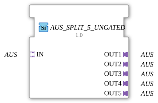

# AUS_SPLIT_5_UNGATED

> ℹ️ **UNGATED-Variante:** Dieser Baustein ist die ungegatete Version von [`AUS_SPLIT_5`](AUS_SPLIT_5.md). Er unterdrückt **keine** unveränderten Wiederholungen – jedes neu berechnete Ergebnis wird bedingungslos weitergegeben, auch ohne Wertänderung. Das ist wichtig für Verbraucher, die eine periodische Kadenz unabhängig von Wertänderung brauchen (z. B. Ableitungs-/Frequenzberechnungen, die sonst nicht gegen Null abklingen). Alle Angaben zu Änderungserkennung/Change-Gating weiter unten auf dieser Seite gelten **nicht** für diesen Baustein.

* * * * * * * * * *

## Einleitung

Der Funktionsblock `AUS_SPLIT_5_UNGATED` verteilt ein eingehendes AUS-Ereignis (z. B. ein Signal oder eine Nachricht) auf fünf identische Ausgänge. Es handelt sich um einen generischen Baustein, der in der 4diac-IDE als Platzhalter für einen anwendungsspezifischen Typ (`GEN_AUS_SPLIT`) dient.

## Schnittstellenstruktur

### **Ereignis-Eingänge**

Keine (Signalaustausch erfolgt ausschließlich über Adapter).

### **Ereignis-Ausgänge**

Keine (Signalaustausch erfolgt ausschließlich über Adapter).

### **Daten-Eingänge**

Keine.

### **Daten-Ausgänge**

Keine.

### **Adapter**

| Richtung | Name | Typ |
| ---------- | ------ | ----- |
| Socket (Eingang) | `IN` | `adapter::types::unidirectional::AUS` |
| Plug (Ausgang) | `OUT1` | `adapter::types::unidirectional::AUS` |
| Plug (Ausgang) | `OUT2` | `adapter::types::unidirectional::AUS` |
| Plug (Ausgang) | `OUT3` | `adapter::types::unidirectional::AUS` |
| Plug (Ausgang) | `OUT4` | `adapter::types::unidirectional::AUS` |
| Plug (Ausgang) | `OUT5` | `adapter::types::unidirectional::AUS` |

## Funktionsweise

Der Baustein empfängt über den Socket `IN` ein unidirektionales AUS-Ereignis (z. B. einen Impuls oder eine logische 1) und leitet dieses ohne Verzögerung oder Verarbeitung an alle fünf angeschlossenen Plugs (`OUT1` bis `OUT5`) weiter. Jedes ausgehende Ereignis ist eine exakte Kopie des eingehenden Ereignisses.

## Technische Besonderheiten

- **Generischer Typ**: Der FB wird durch das Attribut `GenericClassName = 'GEN_AUS_SPLIT'` als generischer Platzhalter definiert. Bei der Instanziierung kann der tatsächliche Adaptertyp (z. B. spezifische Ereignissignaturen) ersetzt werden.
- **Keine Zustände**: Der Baustein besitzt keine interne Logik oder Zustandsmaschine – die Weiterleitung erfolgt rein strukturell.
- **Unidirektionale Kommunikation**: Alle Adapter sind als `unidirectional::AUS` deklariert, d. h. Daten fließen nur vom Eingang zu den Ausgängen.

## Zustandsübersicht

Der Baustein hat keinen internen Zustand. Er arbeitet deterministisch und durchgängig in einem passiven Modus.

## Anwendungsszenarien

- **Signalverteilung**: Ein zentrales Ereignis (z. B. „Start“ oder „Alarm“) soll parallel mehrere Komponenten ansteuern.
- **Bus-Topologien**: Ersatz für mehrfaches manuelles Verkabeln eines Signals in der IEC‑61499‑Umgebung.
- **Prototyping**: Schnelle Aufteilung einer Ereignisquelle auf fünf Zielbausteine während der Entwicklungsphase.

## Vergleich mit ähnlichen Bausteinen

- **AUS_SPLIT_2 / AUS_SPLIT_3** – Bausteine mit gleicher Funktionalität, aber unterschiedlicher Anzahl an Ausgängen (2 bzw. 3).
- **E_SPLIT** – Ein Standard-Ereignis-Split-Baustein, der Ereignis-Eingänge und -Ausgänge statt Adapter nutzt. `AUS_SPLIT_5_UNGATED` ist adapterbasiert und daher flexibler in der Wiederverwendung mit verschiedenen Protokollen.

- **[`AUS_SPLIT_5`](AUS_SPLIT_5.md)**: Die gegatete Variante – aktualisiert den Ausgang nur bei tatsächlicher Wertänderung.

## Änderungserkennung

Dieser Baustein führt **keine** Änderungserkennung durch. Jedes neu berechnete Ergebnis wird bedingungslos auf den Ausgang geschrieben und das zugehörige Adapter-Event gesendet, unabhängig davon, ob sich der Wert gegenüber dem vorherigen Durchlauf geändert hat.

## Fazit

`AUS_SPLIT_5_UNGATED` ist ein einfacher, generischer Verteilerbaustein für unidirektionale AUS-Signale. Er vereinfacht die modulare Steuerungslogik, indem er eine 1:5‑Aufteilung ohne zusätzliche Logik realisiert. Dank der Adapter‑Schnittstelle kann er in unterschiedlichen Kontexten (z. B. Ereignis-, Daten- oder gemischten Strömen) eingesetzt werden.

---

### 🌐 Passende Themen-Unterseiten auf ms-muc-docs.de

- [🌐 Eclipse 4diac IDE & Farb-Referenz auf ms-muc-docs.de](https://www.ms-muc-docs.de/iec-61499/eclipse-4diac/)
