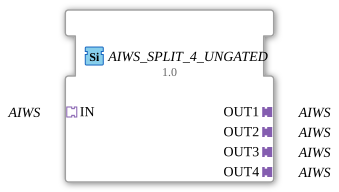

# AIWS_SPLIT_4_UNGATED

> ℹ️ **UNGATED-Variante:** Dieser Baustein ist die ungegatete Version von [`AIWS_SPLIT_4`](AIWS_SPLIT_4.md). Er unterdrückt **keine** unveränderten Wiederholungen – jedes neu berechnete Ergebnis wird bedingungslos weitergegeben, auch ohne Wertänderung. Das ist wichtig für Verbraucher, die eine periodische Kadenz unabhängig von Wertänderung brauchen (z. B. Ableitungs-/Frequenzberechnungen, die sonst nicht gegen Null abklingen). Alle Angaben zu Änderungserkennung/Change-Gating weiter unten auf dieser Seite gelten **nicht** für diesen Baustein.

* * * * * * * * * *

## Einleitung

Der Funktionsblock `AIWS_SPLIT_4_UNGATED` dient dazu, eine eingehende unidirektionale **AIWS**-Adapterverbindung auf vier parallele Ausgänge aufzuteilen. Er fungiert als passiver Splitter, der die über den Socket empfangenen Werte an alle vier Plugs weiterleitet, ohne selbst Ereignisse oder Daten zu verarbeiten.

## Schnittstellenstruktur

### **Ereignis-Eingänge**

Keine.

### **Ereignis-Ausgänge**

Keine.

### **Daten-Eingänge**

Keine.

### **Daten-Ausgänge**

Keine.

### **Adapter**

| Typ | Richtung | Name | Beschreibung |
| ----- | ---------- | ------ | -------------- |
| `adapter::types::unidirectional::AIWS` | Socket | **IN** | Eingangsadapter für die zu verteilende AIWS-Verbindung |
| `adapter::types::unidirectional::AIWS` | Plug | **OUT1** | Erster Ausgangsadapter |
| `adapter::types::unidirectional::AIWS` | Plug | **OUT2** | Zweiter Ausgangsadapter |
| `adapter::types::unidirectional::AIWS** | Plug | **OUT3** | Dritter Ausgangsadapter |
| `adapter::types::unidirectional::AIWS` | Plug | **OUT4** | Vierter Ausgangsadapter |

## Funktionsweise

Der Baustein ist ein reiner „Verteiler“ (Splitter) für den unidirektionalen Datentyp **AIWS**. Er besitzt keine interne Logik, keine Zustände und keine eigenen Ereignisse. Alle Werte, die über den Eingangsadapter `IN` ankommen, werden identisch auf die vier Ausgangsadapter `OUT1` bis `OUT4` kopiert. Dadurch können mehrere nachfolgende FB parallel mit denselben Daten versorgt werden.

Da der FB generisch ausgelegt ist (`GenericClassName = 'GEN_AIWS_SPLIT'`), muss der konkrete Datentyp **AIWS** beim Einfügen in ein Projekt definiert werden.

## Technische Besonderheiten

- **Generische Implementierung**: Der FB wird über das Attribut `eclipse4diac::core::GenericClassName` als generischer Splitter markiert. Der tatsächliche Typ wird erst bei der Instanziierung festgelegt.
- **Keine aktive Steuerung**: Der FB benötigt keine Ereignisse zur Auslösung – die Verteilung erfolgt passiv über die Adapterverbindungen.
- **Vollständige Transparenz**: Änderungen an den Adapterdaten werden ohne Verzögerung an alle Ausgänge weitergegeben.

## Zustandsübersicht

Der FB besitzt keine eigenen Zustände oder Abläufe. Es liegt eine rein kombinatorische Weiterleitung vor.

## Anwendungsszenarien

- **Verteilung von Sensordaten** – Ein Sensorwert (z.B. Temperatur, Druck) soll mehreren Verarbeitungsblöcken gleichzeitig zur Verfügung gestellt werden.
- **Redundante Datensicherung** – Ein Datenstrom soll parallel an zwei oder mehr voneinander unabhängige Logikeinheiten gehen.
- **Test- und Simulationsaufbauten** – Ein Signal wird auf mehrere Pfade aufgeteilt, um verschiedene Reaktionsmuster zu prüfen.

## Vergleich mit ähnlichen Bausteinen

- **Manuelles Verkabeln**: Ohne Splitter müsste jeder nachfolgende FB eine eigene Verbindung zum Quell-FB haben, was die Übersichtlichkeit verringert.
- **Event-basierte Splitter**: Manche Splittter verwenden Ereignisausgänge (z.B. `SPLIT` für beliebige Events). `AIWS_SPLIT_4_UNGATED` ist speziell auf den unidirektionalen **AIWS**-Adapter zugeschnitten und benötigt keine Events.
- **Mehrere Ausgänge**: Es gibt Varianten auf zwei (z.B. `AIWS_SPLIT_2`) oder mehr Ausgänge; `AIWS_SPLIT_4_UNGATED` stellt standardmäßig vier bereit.

- **[`AIWS_SPLIT_4`](AIWS_SPLIT_4.md)**: Die gegatete Variante – aktualisiert den Ausgang nur bei tatsächlicher Wertänderung.

## Änderungserkennung

Dieser Baustein führt **keine** Änderungserkennung durch. Jedes neu berechnete Ergebnis wird bedingungslos auf den Ausgang geschrieben und das zugehörige Adapter-Event gesendet, unabhängig davon, ob sich der Wert gegenüber dem vorherigen Durchlauf geändert hat.

## Fazit

Der `AIWS_SPLIT_4_UNGATED` ist ein einfacher, aber essenzieller Baustein zur Verteilung von unidirektionalen **AIWS**-Adapterverbindungen. Er reduziert den Verdrahtungsaufwand, sorgt für klare Strukturen und ermöglicht die parallele Nutzung eines Datenstroms durch mehrere Funktionsblöcke ohne zusätzliche Logik.

---

### 🌐 Passende Themen-Unterseiten auf ms-muc-docs.de

- [🌐 Eclipse 4diac IDE & Farb-Referenz auf ms-muc-docs.de](https://www.ms-muc-docs.de/iec-61499/eclipse-4diac/)
