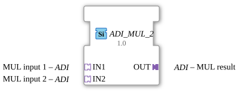

# ADI_MUL_2

*(Kein Bild vorhanden)*

* * * * * * * * * *
## Einleitung

Der Funktionsbaustein `ADI_MUL_2` ist ein generischer arithmetischer Multiplikationsbaustein für die 4diac-IDE, der auf dem IEC 61499-Standard basiert. Er dient dazu, zwei Eingangswerte miteinander zu multiplizieren. Die Besonderheit dieses Bausteins liegt in der Verwendung von unidirektionalen Adaptern (`ADI`) zur Datenübertragung anstelle von klassischen Daten- und Ereignis-Anschlüssen. Dies ermöglicht eine modulare und lose gekoppelte Signalverarbeitung.

## Schnittstellenstruktur

### **Ereignis-Eingänge**

*Es sind keine direkten Ereignis-Eingänge vorhanden. Die Steuerung und Synchronisation erfolgt implizit über die genutzten Adapter.*

### **Ereignis-Ausgänge**

*Es sind keine direkten Ereignis-Ausgänge vorhanden. Die Ereignisweiterleitung erfolgt gekoppelt über den Ausgangs-Adapter.*

### **Daten-Eingänge**

*Der Baustein besitzt keine klassischen Daten-Eingänge. Die Datenaufnahme wird vollständig über die Adapter-Schnittstellen realisiert.*

### **Daten-Ausgänge**

*Der Baustein besitzt keine klassischen Daten-Ausgänge. Die Datenausgabe wird über den Ausgangs-Adapter realisiert.*

### **Adapter**

Der Funktionsbaustein nutzt Adapter zur Kapselung von Daten und Ereignissen:

*   **Sockets (Eingangs-Adapter):**
    *   **IN1** (Typ: `adapter::types::unidirectional::ADI`): Erster Faktor für die Multiplikation (Multiplikand).
    *   **IN2** (Typ: `adapter::types::unidirectional::ADI`): Zweiter Faktor für die Multiplikation (Multiplikator).
*   **Plugs (Ausgangs-Adapter):**
    *   **OUT** (Typ: `adapter::types::unidirectional::ADI`): Das Ergebnis der Multiplikation ($OUT = IN1 \times IN2$).

## Funktionsweise

Sobald über die Adapter `IN1` und `IN2` gültige Werte und die dazugehörigen Trigger-Ereignisse anliegen, führt der Baustein die arithmetische Multiplikation aus:

$$\text{OUT} = \text{IN1} \times \text{IN2}$$

Das Ergebnis wird unmittelbar an den Ausgangs-Adapter `OUT` übergeben und steht für nachfolgende Bausteine zur Verfügung. Da der Baustein als generischer Typ deklariert ist (`GEN_ADI_MUL`), ist die genaue Datentyp-Breite (z. B. INT, REAL, LREAL) flexibel und wird bei der Instanziierung in der 4diac-IDE basierend auf den verbundenen Adaptern bestimmt.

## Technische Besonderheiten

*   **Generische Implementierung:** Durch das Attribut `GenericClassName = 'GEN_ADI_MUL'` ist der Baustein datentypunabhängig konzipiert.
*   **Kapselung durch Adapter:** Die Verwendung des unidirektionalen Adapters `ADI` reduziert die Anzahl der sichtbaren Linien im Funktionsplan, da Daten und Ereignisse in einer Verbindung gebündelt übertragen werden.
*   **Compiler-Kontext:** Der Baustein ist im Paket `adapter::iec61131::arithmetic` organisiert und importiert die Klasse `eclipse4diac::core::GenericClassName`.

## Zustandsübersicht

Der Funktionsbaustein verhält sich rein zustandslos (bzw. kombinatorisch). Es existiert keine interne State-Machine (ECC). Jede Aktivierung an den Eingangs-Adaptern führt direkt zur Berechnung des Ausgangswertes und zur Aktualisierung des Ausgangs-Adapters `OUT`.

## Anwendungsszenarien

*   **Modulare Signalverarbeitung:** Perfekt geeignet für Steuerungsarchitekturen, die konsequent auf Adapter-Verbindungen setzen, um die Übersichtlichkeit von komplexen Funktionsplänen zu wahren.
*   **Skalierbare Berechnungen:** Einsatz in mathematischen Berechnungsnetzwerken innerhalb von IEC 61499 Anwendungen, bei denen unterschiedliche numerische Datentypen multipliziert werden müssen.

## Vergleich mit ähnlichen Bausteinen

Im Vergleich zu einem Standard-Multiplikationsbaustein (wie z. B. dem klassischen `MUL`-Baustein aus der IEC 61131-3-Bibliothek), der mit expliziten Daten-Pins (`IN1`, `IN2`, `OUT`) und Ereignissen (`REQ`, `CNF`) arbeitet, entfällt beim `ADI_MUL_2` die manuelle Verdrahtung von Trigger-Ereignissen. Dies erhöht die Wiederverwendbarkeit und sorgt für ein saubereres Software-Design.

## Fazit

`ADI_MUL_2` ist ein moderner, flexibler und übersichtlich zu verdrahtender Multiplikationsbaustein. Durch die konsequente Nutzung von unidirektionalen Adaptern eignet er sich hervorragend für serviceorientierte Architekturen in der industriellen Automation und erleichtert die Erstellung sauber strukturierter IEC 61499-Applikationen.