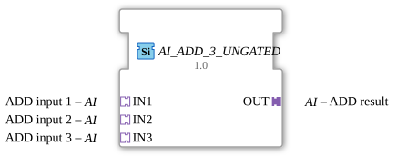

# AI_ADD_3_UNGATED

> ℹ️ **UNGATED-Variante:** Dieser Baustein ist die ungegatete Version von [`AI_ADD_3`](AI_ADD_3.md). Er unterdrückt **keine** unveränderten Wiederholungen – jedes neu berechnete Ergebnis wird bedingungslos weitergegeben, auch ohne Wertänderung. Das ist wichtig für Verbraucher, die eine periodische Kadenz unabhängig von Wertänderung brauchen (z. B. Ableitungs-/Frequenzberechnungen, die sonst nicht gegen Null abklingen). Alle Angaben zu Änderungserkennung/Change-Gating weiter unten auf dieser Seite gelten **nicht** für diesen Baustein.

* * * * * * * * * *

## Einleitung

Der Funktionsbaustein `AI_ADD_3_UNGATED` ist ein generischer, arithmetischer Additionsbaustein für die Entwicklungsumgebung 4diac-ide. Er dient dazu, die Werte von drei analogen Eingängen (AI) zu addieren und das Ergebnis an einem analogen Ausgang bereitzustellen. Durch die Verwendung von unidirektionalen Adaptern wird eine saubere Kapselung von Daten und den dazugehörigen Ereignissen erreicht.

## Schnittstellenstruktur

Der Baustein verwendet ein adapterbasiertes Schnittstellendesign. Er besitzt keine direkten, klassischen Ereignis- oder Datenkanäle auf der Hauptebene, sondern delegiert diese vollständig an die Adapter.

### **Ereignis-Eingänge**

*Keine direkten Ereignis-Eingänge vorhanden.* (Die Ereignissteuerung erfolgt über die Adapter-Schnittstellen).

### **Ereignis-Ausgänge**

*Keine direkten Ereignis-Ausgänge vorhanden.* (Die Ereignissteuerung erfolgt über die Adapter-Schnittstellen).

### **Daten-Eingänge**

*Keine direkten Daten-Eingänge vorhanden.*

### **Daten-Ausgänge**

*Keine direkten Daten-Ausgänge vorhanden.*

### **Adapter**

#### **Sockets (Eingangs-Adapter)**

-   **IN1** (Typ: `adapter::types::unidirectional::AI`): Erster analoger Eingangswert für die Additionsoperation.
-   **IN2** (Typ: `adapter::types::unidirectional::AI`): Zweiter analoger Eingangswert für die Additionsoperation.
-   **IN3** (Typ: `adapter::types::unidirectional::AI`): Dritter analoger Eingangswert für die Additionsoperation.

#### **Plugs (Ausgangs-Adapter)**

-   **OUT** (Typ: `adapter::types::unidirectional::AI`): Ausgangsadapter, der das berechnete Ergebnis der Addition bereitstellt.

---

## Funktionsweise

Sobald an einem der Eingangs-Adapter (`IN1`, `IN2` oder `IN3`) ein Aktualisierungsereignis eintrifft, liest der Funktionsbaustein die analogen Werte der drei Sockets aus.
Es wird folgende mathematische Operation durchgeführt:

$$\text{OUT} = \text{IN1} + \text{IN2} + \text{IN3}$$

Nach erfolgreicher Berechnung wird der Ergebniswert an den Ausgangs-Plug `OUT` übergeben und synchron ein entsprechendes Aktualisierungsereignis am Ausgang ausgelöst.

---

## Technische Besonderheiten

-   **Generischer Baustein (Generic FB):** Der Baustein ist intern als `GEN_AI_ADD` typisiert. Dies ermöglicht eine flexible Anpassung an unterschiedliche numerische Datentypen (z. B. `INT`, `REAL`, `LREAL`), je nachdem, welcher konkrete Typ durch die verbundenen Adapter vorgegeben wird.
-   **Adapter-Kopplung:** Durch die Nutzung von unidirektionalen Adaptern (`unidirectional::AI`) wird das Signal-Routing im Applikationsdiagramm stark vereinfacht. Daten und Trigger-Events werden in einer einzigen Verbindungslinie gebündelt.

---

## Zustandsübersicht

Der Baustein arbeitet rein ereignisgesteuert:

1.  **Bereitschaftszustand (Idle):** Der Baustein wartet auf eingehende Ereignisse an den Sockets `IN1`, `IN2` oder `IN3`.
2.  **Berechnungsphase:** Ein Event triggert die Addition der anliegenden Werte.
3.  **Aktualisierungsphase:** Das Ergebnis wird an `OUT` angelegt und das Ausgangs-Event getriggert. Der Baustein kehrt sofort in den Bereitschaftszustand zurück.

---

## Anwendungsszenarien

-   **Sensordaten-Fusion:** Zusammenführung und Aufsummierung von drei analogen Messwerten (z. B. Ermittlung eines Gesamtvolumenstroms aus drei einzelnen Teilströmen).
-   **Sollwert-Kalkulation:** Berechnung eines Gesamtsollwerts, der sich aus einem Basissollwert und zwei Korrektur- oder Offsetwerten zusammensetzt.
-   **Mischprozesse:** Gewichtung und Zusammenführung von analogen Steuerungssignalen in der Prozessautomatisierung.

---

## Vergleich mit ähnlichen Bausteinen

Im Vergleich zu klassischen IEC 61131-3 Addierern (wie z. B. `F_ADD`) oder Standard-IEC-61499-Funktionsbausteinen entfällt bei `AI_ADD_3_UNGATED` die manuelle und fehleranfällige Verdrahtung von separaten `REQ`- und `CNF`-Ereignisleitungen.

Während Standard-Addierer meist nur zwei Eingänge unterstützen, spart der `AI_ADD_3_UNGATED` bei der Addition von drei Werten die Kaskadierung von zwei separaten Bausteinen ein, was die Ausführungszeit optimiert und die Übersichtlichkeit im System erhöht.

---

- **[`AI_ADD_3`](AI_ADD_3.md)**: Die gegatete Variante – aktualisiert den Ausgang nur bei tatsächlicher Wertänderung.

## Änderungserkennung

Dieser Baustein führt **keine** Änderungserkennung durch. Jedes neu berechnete Ergebnis wird bedingungslos auf den Ausgang geschrieben und das zugehörige Adapter-Event gesendet, unabhängig davon, ob sich der Wert gegenüber dem vorherigen Durchlauf geändert hat.

## Fazit

Der `AI_ADD_3_UNGATED` ist ein modularer und übersichtlicher Hilfsbaustein zur effizienten analogen Signalverarbeitung. Durch die konsequente Nutzung von Adaptern reduziert er das visuelle "Spaghetti-Wiring" in 4diac-Anwendungen erheblich und trägt zu einer performanten, ereignisgesteuerten Steuerungsarchitektur bei.
