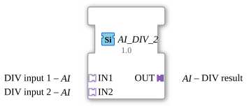

# AI_DIV_2

*(Kein Bild verfügbar)*

* * * * * * * * * *
## Einleitung

Der Funktionsbaustein `AI_DIV_2` ist ein generischer Arithmetik-Baustein für die 4diac-Plattform. Er dient zur Durchführung einer mathematischen Division (DIV) von zwei analogen Werten. Im Gegensatz zu klassischen Arithmetikbausteinen nutzt dieser Baustein standardisierte, unidirektionale Adapter vom Typ `AI` (Analog Input) für die Ein- und Ausgänge. Dies ermöglicht eine strukturierte, modulare und übersichtliche Signalverdrahtung innerhalb von IEC 61499 Anwendungen.

## Schnittstellenstruktur

### **Ereignis-Eingänge**

Der Baustein besitzt keine direkten Ereignis-Eingänge. Die Synchronisation und Ereignissteuerung erfolgt implizit über die angebundenen Adapter.

### **Ereignis-Ausgänge**

Der Baustein besitzt keine direkten Ereignis-Ausgänge.

### **Daten-Eingänge**

Es sind keine direkten Daten-Eingänge vorhanden. Die Datenübertragung wird vollständig über die Adapter-Schnittstellen abgewickelt.

### **Daten-Ausgänge**

Es sind keine direkten Daten-Ausgänge vorhanden.

### **Adapter**

| Name | Typ | Schnittstellen-Typ | Beschreibung |
| :--- | :--- | :--- | :--- |
| **IN1** | `adapter::types::unidirectional::AI` | Socket (Buchse) | Erster Eingangswert (Dividend) |
| **IN2** | `adapter::types::unidirectional::AI` | Socket (Buchse) | Zweiter Eingangswert (Divisor) |
| **OUT** | `adapter::types::unidirectional::AI` | Plug (Stecker) | Ergebniswert der Division (Quotient) |

---

## Funktionsweise

Der Funktionsbaustein berechnet den Quotienten aus den Werten der beiden Eingangs-Adapter:

$$OUT = \frac{IN1}{IN2}$$

Sobald sich die Werte an den Sockets `IN1` oder `IN2` ändern und ein entsprechendes Aktualisierungsereignis über den Adapter eingeht, wird die Division ausgeführt. Das Ergebnis sowie das dazugehörige Aktualisierungsereignis werden unmittelbar an den Ausgangs-Adapter `OUT` (Plug) weitergeleitet.

Aufgrund des generischen Typs (`GEN_AI_DIV`) ist der Baustein nicht auf einen festen Datentyp (wie z. B. `REAL` oder `INT`) beschränkt. Der konkrete Datentyp wird flexibel bei der Instanziierung in der 4diac-IDE bestimmt.

---

## Technische Besonderheiten

- **Generische Typisierung:** Über das Attribut `GenericClassName` mit dem Wert `GEN_AI_DIV` ist der Baustein polymorph einsetzbar und kann mit verschiedenen kompatiblen analogen Datentypen arbeiten.
- **Adapter-Kapselung:** Durch die Verwendung von unidirektionalen Adaptern (`unidirectional::AI`) werden Daten- und Ereignisleitungen in einer einzigen Verbindung gebündelt. Dies reduziert das Risiko von Verdrahtungsfehlern und erhöht die Übersichtlichkeit im Funktionsplan (FBD).
- **Division durch Null:** Da es sich um eine mathematische Division handelt, muss anlagenseitig bzw. in der vorgeschalteten Logik sichergestellt werden, dass der Wert an `IN2` ungleich Null ist, um Berechnungsfehler oder Division-by-Zero-Ausnahmen zur Laufzeit zu vermeiden.

---

## Zustandsübersicht

Der Baustein `AI_DIV_2` ist ein zustandsloser (stateless) Kombinationsbaustein. Er besitzt kein internes Execution Control Chart (ECC). Jedes Ereignis an den Eingangs-Adaptern triggert direkt die Berechnung und die Aktualisierung des Ausgangs-Adapters.

---

## Anwendungsszenarien

- **Verhältnisberechnungen:** Bestimmung von Verhältnissen in verfahrenstechnischen Anlagen (z. B. Luft-Brennstoff-Verhältnis oder Mischungsverhältnisse von Flüssigkeiten).
- **Skalierung und Normierung:** Teilen eines analogen Rohwertes (z. B. Sensor-Messwert) durch einen Skalierungsfaktor zur Umrechnung in physikalische Einheiten.
- **Messwert-Mittelung:** Einsatz in Berechnungsnetzwerken, bei denen Summenwerte durch eine feste oder variable Anzahl dividiert werden müssen.

---

## Vergleich mit ähnlichen Bausteinen

- **Standard-Arithmetikbaustein (DIV):** Ein klassischer `DIV`-Baustein der IEC 61131-3 / IEC 61499 arbeitet mit direkten PIN-Eingängen (z. B. `IN1`, `IN2` als `REAL`) und separaten Event-Pins (`REQ`, `CNF`). `AI_DIV_2` hingegen bündelt diese Signale in Adaptern, was eine sauberere Schnittstellentrennung bei komplexen Signalwegen ermöglicht.
- **AI_SUB_2 / AI_ADD_2:** Diese Bausteine teilen dieselbe Adapter-Philosophie, führen jedoch Subtraktionen bzw. Additionen anstelle einer Division aus.

---

## Änderungserkennung

Das Ergebnis wird nur auf den Ausgangs-Plug (`OUT`) geschrieben und dessen Adapter-Event nur gesendet, wenn sich der neu berechnete Wert vom aktuell auf `OUT` gehaltenen Wert unterscheidet. Bleibt das Ergebnis unverändert, wird kein Adapter-Event gesendet -- so werden überflüssige Updates bei nachgeschalteten Peers vermieden.

## Fazit

Der `AI_DIV_2` ist ein hocheffizienter und moderner Hilfsbaustein für die analoge Signalverarbeitung in 4diac. Durch die konsequente Nutzung von Adaptern fügt er sich nahtlos in serviceorientierte Steuerungsarchitekturen ein und minimiert den Implementierungs- und Testaufwand für mathematische Grundoperationen.