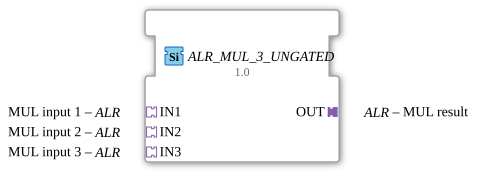

# ALR_MUL_3_UNGATED

> ℹ️ **UNGATED-Variante:** Dieser Baustein ist die ungegatete Version von [`ALR_MUL_3`](ALR_MUL_3.md). Er unterdrückt **keine** unveränderten Wiederholungen – jedes neu berechnete Ergebnis wird bedingungslos weitergegeben, auch ohne Wertänderung. Das ist wichtig für Verbraucher, die eine periodische Kadenz unabhängig von Wertänderung brauchen (z. B. Ableitungs-/Frequenzberechnungen, die sonst nicht gegen Null abklingen). Alle Angaben zu Änderungserkennung/Change-Gating weiter unten auf dieser Seite gelten **nicht** für diesen Baustein.

*(Symbolische Darstellung des Funktionsbausteins)*

* * * * * * * * * *

## Einleitung

Der Funktionsbaustein `ALR_MUL_3_UNGATED` ist ein generischer Baustein aus der Bibliothek `adapter::iec61131::arithmetic`, der für die arithmetische Multiplikation von drei Eingangswerten entwickelt wurde. Anstelle von klassischen, diskreten Dateneingängen nutzt dieser Baustein unidirektionale Adapter des Typs `ALR` zur Kapselung und Übertragung der Daten und Steuerungsereignisse. Dies ermöglicht eine strukturierte, modulare und übersichtliche Verdrahtung innerhalb der 4diac-IDE.

## Schnittstellenstruktur

### **Ereignis-Eingänge**

*Keine direkten Ereignis-Eingänge vorhanden. Die ereignisbasierte Steuerung wird vollständig über die eingebundenen Adapter abgewickelt.*

### **Ereignis-Ausgänge**

*Keine direkten Ereignis-Ausgänge vorhanden. Die ereignisbasierte Steuerung wird vollständig über die eingebundenen Adapter abgewickelt.*

### **Daten-Eingänge**

*Keine direkten Daten-Eingänge vorhanden. Die Datenwerte sind in den Eingangs-Adaptern gekapselt.*

### **Daten-Ausgänge**

*Keine direkten Daten-Ausgänge vorhanden. Das Ergebnis ist im Ausgangs-Adapter gekapselt.*

### **Adapter**

#### **Sockets (Eingangsschnittstellen)**

- **IN1** (Typ: `adapter::types::unidirectional::ALR`): Der erste Faktor für die Multiplikation.
- **IN2** (Typ: `adapter::types::unidirectional::ALR`): Der zweite Faktor für die Multiplikation.
- **IN3** (Typ: `adapter::types::unidirectional::ALR`): Der dritte Faktor für die Multiplikation.

#### **Plugs (Ausgangsschnittstellen)**

- **OUT** (Typ: `adapter::types::unidirectional::ALR`): Das berechnete Produkt der drei Eingangswerte.

---

## Funktionsweise

Der Baustein `ALR_MUL_3_UNGATED` realisiert die mathematische Multiplikation von drei Eingangsvariablen. Sobald an den Sockets neue Werte bzw. Triggerereignisse anliegen, führt der Baustein die Berechnung nach folgender Formel aus:

$$\text{OUT} = \text{IN1} \times \text{IN2} \times \text{IN3}$$

Das Ergebnis der Berechnung sowie das zugehörige Aktualisierungsereignis werden über den Plug `OUT` ausgegeben.

Da es sich um einen generischen Baustein (Generic-Klasse: `GEN_ALR_MUL`) handelt, hängt der tatsächliche Datentyp (z. B. `REAL`, `LREAL`, `INT`) von der Definition des verwendeten `ALR`-Adapters ab.

---

## Technische Besonderheiten

- **Generisches Design:** Durch die Zuweisung des Attributs `GenericClassName = 'GEN_ALR_MUL'` ist der Baustein flexibel für verschiedene Datentypen einsetzbar, sofern die verwendeten Adapter diese unterstützen.
- **Adapterbasierte Kopplung:** Die Verwendung von Adaptern statt loser Event-/Data-Verbindungen reduziert den Verdrahtungsaufwand (Routing) innerhalb der 4diac-Anwendung drastisch und erhöht die Übersichtlichkeit.
- **Unidirektionalität:** Die verwendeten `ALR`-Adapter sind als unidirektional definiert, was einen klaren und rückwirkungsfreien Datenfluss von den Quellen (Sockets) zur Senke (Plug) gewährleistet.

---

## Zustandsübersicht

Der Baustein besitzt keine komplexe interne Zustandsmaschine (ECC). Er arbeitet als rein kombinatorischer/mathematischer Baustein, der direkt auf Ereignisse an den Eingangs-Adaptern reagiert und das Ergebnis unmittelbar an den Ausgang weiterleitet.

---

## Anwendungsszenarien

- **Sensorskalierung und -korrektur:** Multiplikation eines Rohwerts (IN1) mit einem Kalibrierungsfaktor (IN2) und einem anwendungsbezogenen Gewichtungsfaktor (IN3).
- **Dreidimensionale Berechnungen:** Berechnung von Volumen oder Durchsätzen, bei denen drei physikalische Einflussgrößen miteinander multipliziert werden müssen.
- **Kaskadierte Verstärkungsglieder:** Berechnung von kombinierten Verstärkungen in Regelungskreisen.

---

## Vergleich mit ähnlichen Bausteinen

- **Standard MUL-Baustein (IEC 61131-3):** Klassische Multiplizierer arbeiten mit direkten Elementardatentypen (z. B. `REAL`). `ALR_MUL_3_UNGATED` hingegen bündelt Daten und Ereignisse in Adaptern, was die Modularität und Wiederverwendbarkeit in verteilten Systemen nach IEC 61499 verbessert.
- **ALR_MUL_2 (2-fach Multiplizierer):** Für die Multiplikation von nur zwei Werten wird ein entsprechender 2-fach-Baustein bevorzugt. `ALR_MUL_3_UNGATED` spart bei drei Faktoren die zusätzliche Kaskadierung von zwei separaten Bausteinen ein.

---

- **[`ALR_MUL_3`](ALR_MUL_3.md)**: Die gegatete Variante – aktualisiert den Ausgang nur bei tatsächlicher Wertänderung.

## Änderungserkennung

Dieser Baustein führt **keine** Änderungserkennung durch. Jedes neu berechnete Ergebnis wird bedingungslos auf den Ausgang geschrieben und das zugehörige Adapter-Event gesendet, unabhängig davon, ob sich der Wert gegenüber dem vorherigen Durchlauf geändert hat.

## Fazit

Der Baustein `ALR_MUL_3_UNGATED` ist eine effiziente und saubere Lösung für dreifache Multiplikationsaufgaben in IEC 61499-Anwendungen. Durch die konsequente Nutzung von unidirektionalen Adaptern fördert er ein sauberes Software-Design und sorgt für gut strukturierte Datenflüsse in der 4diac-IDE.
