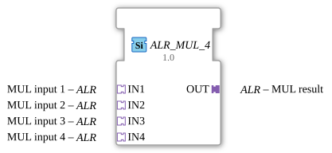

# ALR_MUL_4

* * * * * * * * * *
## Einleitung

Der Funktionsbaustein `ALR_MUL_4` dient der Durchführung einer arithmetischen Multiplikation von vier Eingangswerten. Es handelt sich hierbei um einen generischen Funktionsbaustein (Generic FB) für die 4diac-IDE, der auf dem IEC 61499-Standard basiert. Die Signalübertragung und -verarbeitung erfolgt über spezielle unidirektionale Analogadapter, was eine saubere Kapselung der Datenströme ermöglicht.

## Schnittstellenstruktur

### **Ereignis-Eingänge**
*Für diesen Funktionsbaustein sind keine direkten Ereignis-Eingänge definiert, da die Steuerung und Aktualisierung über die Adapter erfolgt.*

### **Ereignis-Ausgänge**
*Für diesen Funktionsbaustein sind keine direkten Ereignis-Ausgänge definiert.*

### **Daten-Eingänge**
*Für diesen Funktionsbaustein sind keine direkten Daten-Eingänge definiert.*

### **Daten-Ausgänge**
*Für diesen Funktionsbaustein sind keine direkten Daten-Ausgänge definiert.*

### **Adapter**

#### **Sockets (Eingangs-Adapter)**
*   **IN1** (Typ: `adapter::types::unidirectional::ALR`): Erster Eingangswert (Multiplikand 1) für die Multiplikation.
*   **IN2** (Typ: `adapter::types::unidirectional::ALR`): Zweiter Eingangswert (Multiplikand 2) für die Multiplikation.
*   **IN3** (Typ: `adapter::types::unidirectional::ALR`): Dritter Eingangswert (Multiplikand 3) für die Multiplikation.
*   **IN4** (Typ: `adapter::types::unidirectional::ALR`): Vierter Eingangswert (Multiplikand 4) für die Multiplikation.

#### **Plugs (Ausgangs-Adapter)**
*   **OUT** (Typ: `adapter::types::unidirectional::ALR`): Ausgang für das berechnete Produkt der vier Eingangswerte.

## Funktionsweise

Der Baustein `ALR_MUL_4` multipliziert die analogen Werte, die über die vier Eingangs-Adapter (`IN1` bis `IN4`) bereitgestellt werden, miteinander. Das mathematische Ergebnis wird über den Ausgangs-Adapter `OUT` ausgegeben.

Die zugrundeliegende Berechnungsformel lautet:

$$\text{OUT} = \text{IN1} \times \text{IN2} \times \text{IN3} \times \text{IN4}$$

Da es sich um einen generischen Funktionsbaustein handelt, der die Klasse `GEN_ALR_MUL` verwendet, ist die Implementierung flexibel gegenüber den im Adapter genutzten Datentypen (z. B. `REAL` oder `LREAL`).

## Technische Besonderheiten

*   **Generischer Baustein**: Durch das Attribut `GenericClassName` mit dem Wert `GEN_ALR_MUL` kann sich der Baustein zur Laufzeit bzw. beim Kompilieren flexibel an die konkrete Datentyp-Ausprägung der verwendeten Adapter anpassen.
*   **Kapselung durch Adapter**: Die Verwendung des unidirektionalen Adapters `ALR` (`adapter::types::unidirectional::ALR`) sorgt dafür, dass Datenwerte und gegebenenfalls zugehörige Status- oder Triggerereignisse kompakt in einer einzigen Verbindung gebündelt werden. Dies reduziert den Verdrahtungsaufwand im Funktionsplan erheblich.

## Zustandsübersicht

Der Baustein besitzt kein internes Zustandsverhalten (keine State Machine / ECC) und arbeitet rein datenflussorientiert. Sobald sich die Werte an den Eingangs-Adaptern ändern oder ein entsprechendes Aktualisierungsereignis über die Adapter getriggert wird, wird die Multiplikation ausgeführt und das Ergebnis am Ausgang `OUT` bereitgestellt.

## Anwendungsszenarien

*   **Physikalische Berechnungen**: Berechnung von komplexeren Größen, die das Produkt mehrerer Variablen darstellen (z. B. Leistung, Energieberechnungen oder Volumenströme unter Berücksichtigung von Korrekturfaktoren).
*   **Kaskadierte Skalierung**: Anwendung von mehreren Skalierungs- oder Korrekturfaktoren auf ein analoges Eingangssignal in einem einzigen Schritt.
*   **Signalverarbeitung**: Vorverarbeitung von Sensorwerten in Steuerungssystemen, bevor die Daten an Visualisierungen oder Aktoren weitergegeben werden.

## Vergleich mit ähnlichen Bausteinen

*   **Standard-MUL-Bausteine (IEC 61131-3)**: Klassische Multiplikationsbausteine arbeiten in der Regel direkt mit Standard-Datentypen (z. B. `REAL`) und erfordern separate Event-Verbindungen (`REQ`/`CNF`). `ALR_MUL_4` vereinfacht dies durch die Nutzung von Adaptern.
*   **ALR_MUL_2 / ALR_MUL_3**: Diese Bausteine sind für die Multiplikation von nur zwei oder drei Werten ausgelegt. Der `ALR_MUL_4` spart bei der Notwendigkeit von vier Multiplikanden zusätzliche Zwischenschritte und zusätzliche Bausteinkaskaden ein, was die Performance und Übersichtlichkeit des Steuerungsprogramms verbessert.

## Fazit

Der `ALR_MUL_4`-Funktionsbaustein ist ein praktischer Hilfsbaustein für die mathematische Signalverarbeitung in 4diac. Durch die konsequente Nutzung des Adapterkonzepts trägt er maßgeblich zur Reduzierung von Verbindungslinien im Anwendungsdiagramm bei und bietet gleichzeitig die Flexibilität eines generischen Funktionsbausteins.