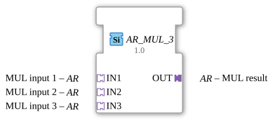

# AR_MUL_3

*(Kein Bild vorhanden)*

* * * * * * * * * *
## Einleitung

Der Funktionsbaustein `AR_MUL_3` ist ein generischer arithmetischer Baustein, der zur Multiplikation von drei Eingangswerten dient. Er basiert auf der Verwendung von unidirektionalen Adaptern des Typs `AR` (Arithmetic), was eine strukturierte und übersichtliche Signalübertragung innerhalb der 4diac-IDE ermöglicht. Da es sich um einen generischen Baustein handelt, ist er flexibel für verschiedene numerische Datentypen einsetzbar.

## Schnittstellenstruktur

Die Schnittstellen dieses Funktionsbausteins sind vollständig über Adapter realisiert. Es gibt keine direkt herausgeführten Standard-Ereignis- oder Datenkanäle.

### **Ereignis-Eingänge**

*Es sind keine direkten Ereignis-Eingänge vorhanden. Die Ereignissteuerung wird über die Eingangs-Adapter abgewickelt.*

### **Ereignis-Ausgänge**

*Es sind keine direkten Ereignis-Ausgänge vorhanden. Die Ereignissteuerung wird über den Ausgangs-Adapter abgewickelt.*

### **Daten-Eingänge**

*Es sind keine direkten Daten-Eingänge vorhanden. Die Datenübertragung erfolgt gekoppelt über die Adapter.*

### **Daten-Ausgänge**

*Es sind keine direkten Daten-Ausgänge vorhanden. Die Datenübertragung erfolgt gekoppelt über die Adapter.*

### **Adapter**

- **Sockets (Eingangs-Adapter):**
  - `IN1` (Typ: `adapter::types::unidirectional::AR`): Erster Multiplikand (Eingang 1).
  - `IN2` (Typ: `adapter::types::unidirectional::AR`): Zweiter Multiplikand (Eingang 2).
  - `IN3` (Typ: `adapter::types::unidirectional::AR`): Dritter Multiplikand (Eingang 3).
- **Plugs (Ausgangs-Adapter):**
  - `OUT` (Typ: `adapter::types::unidirectional::AR`): Ergebnis der Multiplikation ($OUT = IN1 \cdot IN2 \cdot IN3$).

## Funktionsweise

Der Baustein führt eine mathematische Multiplikation der an den Adaptern `IN1`, `IN2` und `IN3` anliegenden Werte aus:

$$\text{OUT} = \text{IN1} \times \text{IN2} \times \text{IN3}$$

Sobald an den Eingangs-Adaptern ein Berechnungsereignis (z. B. eine Werteaktualisierung) signalisiert wird, liest der Baustein die aktuellen Werte aus, berechnet das Produkt und gibt das Ergebnis sowie ein entsprechendes Aktualisierungsereignis über den Ausgangs-Adapter `OUT` weiter.

## Technische Besonderheiten

- **Generisches Verhalten (`GEN_AR_MUL`):** Der Baustein ist als generischer Typ deklariert. Dadurch kann er zur Entwicklungs- oder Laufzeit auf verschiedene numerische Datentypen (z. B. `INT`, `REAL`, `LREAL`) angewendet werden, sofern die verwendeten Adapter diesen Datentyp unterstützen.
- **Adapter-Struktur:** Die Verwendung von `unidirectional::AR`-Adaptern reduziert die Anzahl der sichtbaren Verbindungslinien im Funktionsplan (FBD) drastisch, da Daten und Steuerungsereignisse in einer einzigen Verbindung gebündelt sind.

## Zustandsübersicht

Der Baustein verhält sich rein funktional und besitzt im Wesentlichen folgende logische Zustände:
- **Warten (Idle):** Der Baustein wartet auf ein Trigger-Ereignis über die Eingangs-Adapter.
- **Berechnen (Evaluation):** Nach dem Eintreffen eines Ereignisses werden die Eingangsdaten gelesen und multipliziert.
- **Aktualisieren (Update):** Das berechnete Produkt wird an den Ausgang `OUT` angelegt und das Ausgangsereignis getriggert.

## Anwendungsszenarien

- **Volumenberechnungen:** Multiplikation von drei Dimensionen (Länge $\times$ Breite $\times$ Höhe) zur Ermittlung eines Volumens.
- **Skalierung und Gewichtung:** Anwendung von zwei aufeinanderfolgenden Skalierungsfaktoren auf einen Rohwert (z. B. Sensorwert $\times$ Kalibrierfaktor $\times$ Einheitenumrechnung).
- **Physikalische Formeln:** Berechnung von Größen, die direkt von drei Variablen abhängen (z. B. Leistung $P = U \cdot I \cdot \cos(\varphi)$ bei vereinfachter Betrachtung).

## Vergleich mit ähnlichen Bausteinen

- **Standard-`MUL` (IEC 61131-3):** Klassische Multiplikationsbausteine arbeiten mit diskreten Daten- und Ereignis-Pins. `AR_MUL_3` nutzt stattdessen Adapter, was das Design übersichtlicher macht.
- **`AR_MUL_2`:** Multipliziert lediglich zwei Werte. `AR_MUL_3` spart einen zusätzlichen Kaskadierungs-Baustein ein, wenn drei Variablen multipliziert werden müssen, was die Performance und Übersichtlichkeit optimiert.

## Änderungserkennung

Das Ergebnis wird nur auf den Ausgangs-Plug (`OUT`) geschrieben und dessen Adapter-Event nur gesendet, wenn sich der neu berechnete Wert vom aktuell auf `OUT` gehaltenen Wert unterscheidet. Bleibt das Ergebnis unverändert, wird kein Adapter-Event gesendet -- so werden überflüssige Updates bei nachgeschalteten Peers vermieden.

## Fazit

Der `AR_MUL_3` ist ein praktischer und wiederverwendbarer Funktionsbaustein für die moderne IEC 61499 Entwicklung in 4diac. Durch die Kapselung der mathematischen Logik in einer adapterbasierten Struktur trägt er maßgeblich zur Übersichtlichkeit komplexer Steuerungsapplikationen bei.
