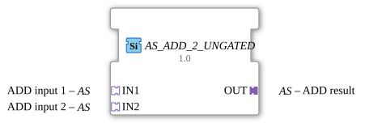

# AS_ADD_2_UNGATED

> ℹ️ **UNGATED-Variante:** Dieser Baustein ist die ungegatete Version von [`AS_ADD_2`](AS_ADD_2.md). Er unterdrückt **keine** unveränderten Wiederholungen – jedes neu berechnete Ergebnis wird bedingungslos weitergegeben, auch ohne Wertänderung. Das ist wichtig für Verbraucher, die eine periodische Kadenz unabhängig von Wertänderung brauchen (z. B. Ableitungs-/Frequenzberechnungen, die sonst nicht gegen Null abklingen). Alle Angaben zu Änderungserkennung/Change-Gating weiter unten auf dieser Seite gelten **nicht** für diesen Baustein.

* * * * * * * * * *

## Einleitung

Der Funktionsbaustein `AS_ADD_2_UNGATED` ist ein generischer arithmetischer Baustein, der für die Addition zweier Werte konzipiert ist. Im Gegensatz zu klassischen mathematischen Funktionsbausteinen nutzt dieser Baustein ein adapterbasiertes Schnittstellenkonzept. Durch die Verwendung von unidirektionalen Adaptern werden Daten und die dazugehörigen Steuerungsereignisse gekapselt übertragen, was zu einem aufgeräumten und modularen Anwendungsdesign in der IEC 61499 Entwicklungsumgebung (wie 4diac IDE) beiträgt.

## Schnittstellenstruktur

### **Ereignis-Eingänge**

*Keine direkten Ereignis-Eingänge vorhanden. Die Ereignissteuerung ist in den Eingangs-Adaptern integriert.*

### **Ereignis-Ausgänge**

*Keine direkten Ereignis-Ausgänge vorhanden. Die Ereignissteuerung ist im Ausgangs-Adapter integriert.*

### **Daten-Eingänge**

*Keine direkten Daten-Eingänge vorhanden. Die Datenübertragung erfolgt gekapselt über die Eingangs-Adapter.*

### **Daten-Ausgänge**

*Keine direkten Daten-Ausgänge vorhanden. Die Datenübertragung erfolgt gekapselt über den Ausgangs-Adapter.*

### **Adapter**

-   **IN1 (Socket / Buchse):** Typ `adapter::types::unidirectional::AS`
    -   Schnittstelle für den ersten Summanden der Addition.
-   **IN2 (Socket / Buchse):** Typ `adapter::types::unidirectional::AS`
    -   Schnittstelle für den zweiten Summanden der Addition.
-   **OUT (Plug / Stecker):** Typ `adapter::types::unidirectional::AS`
    -   Schnittstelle zur Ausgabe des berechneten Additionsergebnisses.

## Funktionsweise

Der Baustein `AS_ADD_2_UNGATED` realisiert die mathematische Operation:
$$\text{OUT} = \text{IN1} + \text{IN2}$$

Sobald an den Eingangs-Adaptern (`IN1` oder `IN2`) neue Daten signalisiert werden, triggert der Baustein intern die Addition der übertragenen Werte. Das Ergebnis wird anschließend unmittelbar berechnet und über den Ausgangs-Adapter `OUT` zusammen mit einem entsprechenden Aktualisierungsereignis an die nachfolgenden Logikglieder weitergegeben.

Aufgrund seiner generischen Natur (`GEN_AS_ADD`) kann der Baustein flexibel mit verschiedenen numerischen Datentypen arbeiten, sofern der zugrunde liegende Adaptertyp `AS` diese unterstützt.

## Technische Besonderheiten

-   **Generische Implementierung:** Der Baustein basiert auf der generischen Klasse `GEN_AS_ADD`, wodurch er für unterschiedliche Datentypen wiederverwendbar ist.
-   **Adapter-Kopplung:** Die Kapselung von Signalen in Adaptern reduziert die Anzahl der sichtbaren Verbindungslinien im Funktionsbausteindiagramm (FBD) drastisch und verbessert die Lesbarkeit komplexer Anwendungen.
-   **Unidirektionaler Datenfluss:** Die Verwendung des Typs `unidirectional::AS` stellt sicher, dass der Informationsfluss klar definiert von den Signalquellen (Sockets) zur Signalsenke (Plug) verläuft.

## Zustandsübersicht

Als rein mathematischer Kombinationsbaustein besitzt `AS_ADD_2_UNGATED` kein komplexes internes Zustandsdiagramm (ECC). Sein Verhalten lässt sich in drei zyklische Schritte unterteilen:

1.  **Warten (Idle):** Der Baustein wartet auf ein Ereignis an einem der Eingangs-Adapter (`IN1` oder `IN2`).
2.  **Berechnen:** Bei Event-Eingang werden die aktuellen Werte aus beiden Adaptern gelesen und addiert.
3.  **Senden:** Das Additionsergebnis wird in den Ausgangs-Adapter `OUT` geschrieben und ein Ausgangsereignis getriggert.

## Anwendungsszenarien

-   **Messwert-Offset-Berechnung:** Aufaddieren eines Kalibrierungs- oder Korrekturwerts (Offset) auf einen analogen Sensorwert innerhalb einer adapterbasierten Signalverarbeitungskette.
-   **Signalzusammenführung:** Summierung von zwei unabhängig voneinander erfassten physikalischen Größen (z. B. zwei Teilströme zur Ermittlung des Gesamtstroms).
-   **Kaskadierte Berechnungen:** Einfache Erweiterung für mehr als zwei Summanden durch kaskadiertes Hintereinanderschalten mehrerer `AS_ADD_2_UNGATED`-Bausteine.

## Vergleich mit ähnlichen Bausteinen

-   **Standard ADD (z. B. F_ADD):** Der klassische IEC 61131-3 bzw. IEC 61499 ADD-Baustein arbeitet mit diskreten Variablen (z. B. `ANY_NUM`) und separaten Event-Ports (`REQ` / `CNF`). `AS_ADD_2_UNGATED` hingegen bündelt diese Signale in Adaptern, was die Verdrahtung vereinfacht, jedoch die Verwendung des spezifischen Adaptertyps `AS` voraussetzt.
-   **Multi-Addierer (z. B. ADD_3):** Ermöglicht die Addition von drei oder mehr Werten in einem einzigen Baustein, ist jedoch oft unhandlicher, wenn Datenstrukturen konsistent über Adapter transportiert werden sollen.

- **[`AS_ADD_2_UNGATED`](AS_ADD_2_UNGATED.md)**: Ungegatete Variante – aktualisiert den Ausgang bei jedem Durchlauf, auch ohne Wertänderung.

- **[`AS_ADD_2`](AS_ADD_2.md)**: Die gegatete Variante – aktualisiert den Ausgang nur bei tatsächlicher Wertänderung.

## Änderungserkennung

Dieser Baustein führt **keine** Änderungserkennung durch. Jedes neu berechnete Ergebnis wird bedingungslos auf den Ausgang geschrieben und das zugehörige Adapter-Event gesendet, unabhängig davon, ob sich der Wert gegenüber dem vorherigen Durchlauf geändert hat.

## Fazit

Der `AS_ADD_2_UNGATED` ist ein spezialisierter Hilfsbaustein für moderne, modular aufgebaute IEC 61499 Steuerungsprogramme. Durch die konsequente Nutzung von Adaptern fügt er sich nahtlos in serviceorientierte Architekturen ein und minimiert den Design- und Verdrahtungsaufwand in der 4diac IDE.
