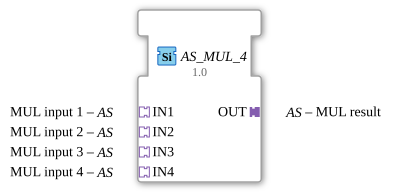

# AS_MUL_4

*(Kein Bild vorhanden)*

* * * * * * * * * *
## Einleitung

Der Funktionsbaustein `AS_MUL_4` ist ein generischer Funktionsbaustein (Generic FB) für die IEC 61499, der für die arithmetische Multiplikation von vier Eingangswerten entwickelt wurde. Anstelle von klassischen Daten- und Ereignispins nutzt dieser Baustein Adapterverbindungen (`AS` - unidirektional), um Daten und die zugehörige Ausführungssteuerung gekapselt zu übertragen. Dies sorgt für ein übersichtlicheres Design in der 4diac-IDE, da die Anzahl der sichtbaren Verbindungslinien drastisch reduziert wird.

## Schnittstellenstruktur

### **Ereignis-Eingänge**

Dieser Funktionsbaustein besitzt keine direkten, eigenständigen Ereignis-Eingänge. Die Ereignissteuerung wird vollständig über die angeschlossenen Adapter abgewickelt.

### **Ereignis-Ausgänge**

Dieser Funktionsbaustein besitzt keine direkten, eigenständigen Ereignis-Ausgänge. Die Ereignissteuerung für nachfolgende Bausteine wird über den Ausgangs-Adapter übertragen.

### **Daten-Eingänge**

Es sind keine direkten Daten-Eingänge vorhanden. Die Datenübergabe erfolgt über die Eingangs-Adapter.

### **Daten-Ausgänge**

Es sind keine direkten Daten-Ausgänge vorhanden. Das Ergebnis wird über den Ausgangs-Adapter bereitgestellt.

### **Adapter**

Der Baustein basiert vollständig auf einer adapterbasierten Kommunikation.

#### Sockets (Steckdosen / Eingänge)

* **IN1** (Typ: `adapter::types::unidirectional::AS`): Erster Multiplikand (Eingang 1).
* **IN2** (Typ: `adapter::types::unidirectional::AS`): Zweiter Multiplikand (Eingang 2).
* **IN3** (Typ: `adapter::types::unidirectional::AS`): Dritter Multiplikand (Eingang 3).
* **IN4** (Typ: `adapter::types::unidirectional::AS`): Vierter Multiplikand (Eingang 4).

#### Plugs (Stecker / Ausgänge)

* **OUT** (Typ: `adapter::types::unidirectional::AS`): Ergebnis der Multiplikation (`IN1 * IN2 * IN3 * IN4`).

---

## Funktionsweise

Sobald über die Adapter-Sockets neue Werte bzw. ein entsprechendes Auslösungsereignis empfangen werden, führt der Baustein die arithmetische Multiplikation der vier Eingangswerte durch:

$$\text{OUT} = \text{IN1} \times \text{IN2} \times \text{IN3} \times \text{IN4}$$

Das Ergebnis sowie das zugehörige Ausgangsereignis werden anschließend über den Adapter-Plug `OUT` an die nachfolgenden Logikglieder weitergegeben.

---

## Technische Besonderheiten

* **Generischer Charakter:** Durch die Zuordnung zur generischen Klasse `GEN_AS_MUL` kann sich der Baustein flexibel an verschiedene numerische Datentypen (z. B. `INT`, `REAL`, `LREAL`) anpassen, sofern die angeschlossenen Adapter vom Typ `AS` denselben Datentyp führen.
* **Unidirektionale Adapter:** Die Verwendung des Typs `adapter::types::unidirectional::AS` stellt sicher, dass der Datenfluss klar und gerichtet von den Eingängen zum Ausgang verläuft.
* **Kompaktes Design:** Durch das Kapseln von Daten- und Event-Kanälen in Adaptern bleibt das Anwendungsdiagramm in 4diac übersichtlich.

---

## Zustandsübersicht

Da es sich bei `AS_MUL_4` um einen mathematischen, zustandslosen Funktionsbaustein handelt, existiert kein komplexes internes Zustandsdiagramm (ECC). 

* **Bereit / Idle:** Der Baustein wartet auf eingehende Ereignisse an den Sockets `IN1` bis `IN4`.
* **Berechnung:** Bei einem eingehenden Trigger-Ereignis werden die Werte aktualisiert, multipliziert und direkt an `OUT` übergeben.

---

## Anwendungsszenarien

* **Skalierung von Messwerten:** Multiplikation eines Sensorwerts mit mehreren Kalibrierungs- und Korrekturfaktoren.
* **Volumenberechnungen:** Berechnung eines Volumens aus drei Dimensionen (Länge × Breite × Höhe) multipliziert mit einem Dichtefaktor.
* **Kaskadierte Verstärkungsglieder:** Berechnung von Gesamtkreisverstärkungen in der Regelungstechnik, bei denen vier unterschiedliche Verstärkungsfaktoren (Gains) multipliziert werden müssen.

---

## Vergleich mit ähnlichen Bausteinen

* **Standard-`MUL`-Baustein (IEC 61131-3):** Dieser benötigt für jeden Wert separate Datenleitungen und mindestens ein Trigger-Ereignis (REQ/CNF). `AS_MUL_4` vereinfacht dies durch die Nutzung von Adaptern auf nur fünf Verbindungen (4 Eingangs-Adapter, 1 Ausgangs-Adapter).
* **`AS_MUL_2` / `AS_MUL_3`:** Bieten dieselbe adapterbasierte Funktionalität, sind jedoch auf zwei bzw. drei Eingangswerte begrenzt. `AS_MUL_4` spart bei der Verknüpfung von vier Faktoren zusätzliche Zwischenschritte und temporäre Hilfsvariablen.

---

## Änderungserkennung

Das Ergebnis wird nur auf den Ausgangs-Plug (`OUT`) geschrieben und dessen Adapter-Event nur gesendet, wenn sich der neu berechnete Wert vom aktuell auf `OUT` gehaltenen Wert unterscheidet. Bleibt das Ergebnis unverändert, wird kein Adapter-Event gesendet -- so werden überflüssige Updates bei nachgeschalteten Peers vermieden.

## Fazit

Der `AS_MUL_4` ist ein hocheffizienter, übersichtlicher und moderner Funktionsbaustein für arithmetische Berechnungen in der IEC 61499. Durch die konsequente Nutzung von unidirektionalen Adaptern wird das Application-Design aufgeräumt gehalten, während gleichzeitig die volle Flexibilität eines generischen Datentyps erhalten bleibt.