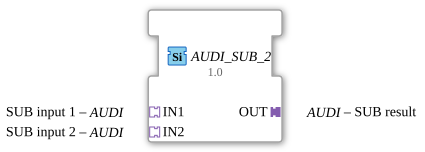

# AUDI_SUB_2

* * * * * * * * * *
## Einleitung

Der Funktionsbaustein (FB) `AUDI_SUB_2` ist ein generischer Funktionsbaustein zur Durchführung einer arithmetischen Subtraktion. Er basiert auf der generischen Klasse `GEN_AUDI_SUB` und nutzt unidirektionale Adapter vom Typ `AUDI` zur strukturierten und ereignisgesteuerten Datenübertragung. Dadurch wird eine saubere Kapselung von Daten und Events erreicht, was die Komplexität der Verkabelung in IEC 61499 Anwendungen reduziert.

## Schnittstellenstruktur

Da der Baustein vollständig auf Adaptern basiert, besitzt er keine klassischen, direkt sichtbaren Ereignis- oder Daten-Pins auf der obersten Ebene. Die gesamte Kommunikation wird über die Adapter abgewickelt.

### **Ereignis-Eingänge**
*Keine direkten Ereignis-Eingänge vorhanden. Die Ereignissteuerung ist in den Adaptern gekapselt.*

### **Ereignis-Ausgänge**
*Keine direkten Ereignis-Ausgänge vorhanden. Die Ereignissteuerung ist in den Adaptern gekapselt.*

### **Daten-Eingänge**
*Keine direkten Daten-Eingänge vorhanden. Die Datenübertragung erfolgt über die Adapter-Schnittstellen.*

### **Daten-Ausgänge**
*Keine direkten Daten-Ausgänge vorhanden. Die Datenübertragung erfolgt über die Adapter-Schnittstellen.*

### **Adapter**

#### **Sockets (Eingangs-Adapter / Steckdosen)**
*   **IN1** (Typ: `adapter::types::unidirectional::AUDI`):
    *   Erster Eingang der Subtraktion (Minuend).
*   **IN2** (Typ: `adapter::types::unidirectional::AUDI`):
    *   Zweiter Eingang der Subtraktion (Subtrahend).

#### **Plugs (Ausgangs-Adapter / Stecker)**
*   **OUT** (Typ: `adapter::types::unidirectional::AUDI`):
    *   Ausgang des Bausteins, der das Ergebnis der Subtraktion (Differenz) bereitstellt.

---

## Funktionsweise

Der Funktionsbaustein berechnet die mathematische Differenz der beiden über die Eingangs-Adapter bereitgestellten Werte nach folgendem Prinzip:

$$\text{OUT} = \text{IN1} - \text{IN2}$$

Sobald sich Werte an den Eingangs-Adaptern `IN1` oder `IN2` ändern und ein entsprechendes Trigger-Ereignis über den Adapter eingeht, wird die Berechnung intern ausgeführt. Das Ergebnis sowie das dazugehörige Update-Ereignis werden anschließend über den Ausgangs-Adapter `OUT` weitergeleitet.

---

## Technische Besonderheiten

*   **Generische Implementierung:** Durch das Attribut `eclipse4diac::core::GenericClassName = 'GEN_AUDI_SUB'` ist der Baustein flexibel einsetzbar. Je nach Implementierung des zugrundeliegenden Adapters kann er verschiedene Datentypen unterstützen.
*   **Kapselung durch Adapter:** Die Verwendung des unidirektionalen Adapters `AUDI` bündelt Daten- und Eventleitungen. Dies erhöht die Übersichtlichkeit im 4diac-Applikationseditor erheblich, da weniger Linien gezogen werden müssen.

---

## Zustandsübersicht

Der Baustein verhält sich wie ein zustandsloser (stateless) mathematischer Operator. Es gibt keine interne Zustandsschleife (ECC-Zustände im klassischen Sinne), die über längere Zeit gehalten wird. Jede Aktivierung durch ein Ereignis an den Eingängen führt zu einer direkten Berechnung und Aktualisierung des Ausgangs.

---

## Anwendungsszenarien

*   **Signalverarbeitung:** Subtraktion von Sensorwerten (z. B. Offset-Kompensation oder Berechnung von Differenzdrücken/-temperaturen) in Systemen, die konsequent auf der `AUDI`-Adapterarchitektur aufbauen.
*   **Regelungstechnik:** Berechnung der Regeldifferenz ($e = w - x$) durch Subtraktion des Istwerts vom Sollwert.

---

## Vergleich mit ähnlichen Bausteinen

*   **Standard SUB-Baustein (IEC 61131-3 / IEC 61499):** Ein klassischer `SUB`-Baustein besitzt dedizierte Daten-Eingänge (`IN1`, `IN2`), einen Daten-Ausgang (`OUT`) sowie Event-Eingänge und -Ausgänge (z.B. `REQ` / `CNF`). Der `AUDI_SUB_2` hingegen bündelt diese Signale in Adaptern, was die Wiederverwendbarkeit und Modularität in komplexen Architekturen verbessert.
*   **AUDI_ADD_2:** Das Gegenstück für die Addition. Verwendet dieselbe Adapter-Schnittstelle, addiert jedoch die Eingangswerte ($IN1 + IN2$).

---

## Fazit

Der `AUDI_SUB_2` ist ein spezialisierter, aber durch seine generische Natur dennoch flexibler Funktionsbaustein zur Subtraktion. Er eignet sich hervorragend für serviceorientierte Architekturen innerhalb von 4diac, bei denen ein einheitliches Schnittstellenkonzept mittels unidirektionaler Adapter im Vordergrund steht.