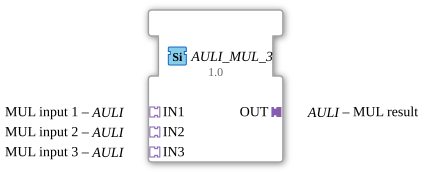

# AULI_MUL_3

*(Kein Bild verfügbar)*

* * * * * * * * * *

## Einleitung

Der Funktionsbaustein `AULI_MUL_3` ist ein generischer Funktionsbaustein (Generic FB), der für die arithmetische Multiplikation von drei Eingangswerten über unidirektionale Adapter entwickelt wurde. Er ist im Package `adapter::iec61131::arithmetic` definiert und ermöglicht eine saubere, adapterbasierte Datenverarbeitung innerhalb der 4diac-Umgebung.

## Schnittstellenstruktur

### **Ereignis-Eingänge**

*Dieser Funktionsbaustein besitzt keine direkten Ereignis-Eingänge. Die Steuerung und Ereignisverarbeitung erfolgt über die angebundenen Adapter.*

### **Ereignis-Ausgänge**

*Dieser Funktionsbaustein besitzt keine direkten Ereignis-Ausgänge. Die Weiterleitung von Ereignissen erfolgt über den Ausgangs-Adapter.*

### **Daten-Eingänge**

*Keine direkten Daten-Eingänge vorhanden.*

### **Daten-Ausgänge**

*Keine direkten Daten-Ausgänge vorhanden.*

### **Adapter**

#### **Sockets (Eingangs-Adapter)**

* **IN1** (Typ: `adapter::types::unidirectional::AULI`): Erster Eingangswert (Multiplikand 1) für die Multiplikation.
* **IN2** (Typ: `adapter::types::unidirectional::AULI`): Zweiter Eingangswert (Multiplikand 2) für die Multiplikation.
* **IN3** (Typ: `adapter::types::unidirectional::AULI`): Dritter Eingangswert (Multiplikand 3) für die Multiplikation.

#### **Plugs (Ausgangs-Adapter)**

* **OUT** (Typ: `adapter::types::unidirectional::AULI`): Ausgang für das berechnete Produkt der drei Eingangswerte.

---

## Funktionsweise

Der Baustein `AULI_MUL_3` führt eine klassische Multiplikation der Werte durch, die über die drei Eingangs-Adapter (`IN1`, `IN2` und `IN3`) bereitgestellt werden. Die Berechnung folgt der mathematischen Formel:

$$\text{OUT} = \text{IN1} \times \text{IN2} \times \text{IN3}$$

Da es sich um einen generischen Baustein (`GEN_AULI_MUL`) handelt, der auf unidirektionalen Adaptern (`AULI`) basiert, werden die Werte und die dazugehörigen Aktualisierungsereignisse innerhalb der Adapterverbindungen übertragen. Sobald an den Eingängen neue Daten anliegen und signalisiert werden, wird die Berechnung durchgeführt und das Ergebnis über den Ausgangs-Adapter `OUT` ausgegeben.

---

## Technische Besonderheiten

* **Generischer Typ:** Der Baustein ist als generischer Typ deklariert (`GenericClassName` = `"GEN_AULI_MUL"`). Dies erlaubt eine flexible Handhabung je nach zugrundeliegendem Datentyp der verwendeten Adapter.
* **Adapter-Kapselung:** Durch die Verwendung von Adaptern des Typs `AULI` werden Daten und zugehörige Kontrollflüsse (Events) in einer einzigen Verbindung gebündelt, was den Verdrahtungsaufwand im Funktionsplan erheblich reduziert.
* **Unidirektionalität:** Die Schnittstellen nutzen das unidirektionale Profil, wodurch ein klarer Informationsfluss von den Eingängen zum Ausgang gewährleistet ist.

---

## Zustandsübersicht

Der Baustein arbeitet ereignisgesteuert und besitzt keinen internen, persistenten Zustand (zustandslos / kombinatorisch). 

1. **Warten auf Aktualisierung:** Der Baustein wartet auf ein Aktualisierungsereignis an den Eingangs-Sockets (`IN1`, `IN2` oder `IN3`).
2. **Berechnung:** Nach Erhalt eines Ereignisses werden die aktuellen Werte gelesen und multipliziert.
3. **Ausgabe:** Das Ergebnis wird an den Plug `OUT` übergeben und das entsprechende Ausgangsereignis ausgelöst.

---

## Anwendungsszenarien

* **Volumenberechnung:** Berechnung von dreidimensionalen Größen (z. B. Länge × Breite × Höhe) in der Prozessautomatisierung.
* **Skalierung und Gewichtung:** Anwendung von zwei aufeinanderfolgenden Skalierungsfaktoren auf einen Messwert (z. B. Sensorwert × Kalibrierungsfaktor × Einheitenumrechnung).
* **Leistungsberechnung:** Dreiphasige oder mehrstufige Berechnungen, bei denen drei physikalische Größen multiplikativ verknüpft werden müssen.

---

## Vergleich mit ähnlichen Bausteinen

* **Standard-MUL (IEC 61131-3):** Der klassische `MUL`-Baustein arbeitet mit direkten Daten- und Ereignispins. `AULI_MUL_3` unterscheidet sich dadurch, dass er genau drei Eingänge besitzt und diese vollständig über Adapter (`AULI`) kapselt, was zu einer übersichtlicheren Architektur führt.
* **AULI_MUL_2 (falls vorhanden):** Ein hypothetischer Baustein mit nur zwei Eingängen. `AULI_MUL_3` spart bei der Multiplikation von drei Werten einen kompletten Kaskadierungsbaustein ein.

---

## Änderungserkennung

Das Ergebnis wird nur auf den Ausgangs-Plug (`OUT`) geschrieben und dessen Adapter-Event nur gesendet, wenn sich der neu berechnete Wert vom aktuell auf `OUT` gehaltenen Wert unterscheidet. Bleibt das Ergebnis unverändert, wird kein Adapter-Event gesendet -- so werden überflüssige Updates bei nachgeschalteten Peers vermieden.

## Fazit

`AULI_MUL_3` ist ein effizienter Hilfsbaustein für Anwendungen, die ein hohes Maß an Modularität erfordern. Durch die konsequente Nutzung von unidirektionalen Adaptern trägt er zur Reduzierung von "Signal-Spaghetti" in komplexen 4diac-Anwendungen bei und vereinfacht die Multiplikation von drei Variablen.