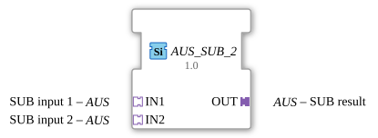

# AUS_SUB_2

*(Kein Bild verfügbar)*

* * * * * * * * * *
## Einleitung

Der Funktionsbaustein (FB) `AUS_SUB_2` ist ein generischer Baustein zur Durchführung von arithmetischen Subtraktionsoperationen innerhalb von 4diac-basierten Steuerungssystemen. Der Baustein nutzt unidirektionale Adapter vom Typ `AUS` zur Kapselung und Übertragung von Eingangs- und Ausgangssignalen. Durch sein generisches Design (Kompilierungsklasse `GEN_AUS_SUB`) kann er flexibel in verschiedenen Steuerungsszenarien eingesetzt werden, um die Differenz zweier Werte zu bilden.

## Schnittstellenstruktur

### **Ereignis-Eingänge**
Dieser Funktionsbaustein besitzt keine direkten, dedizierten Ereignis-Eingänge. Die Ereignissteuerung wird vollständig über die verwendeten Adapter abgewickelt.

### **Ereignis-Ausgänge**
Dieser Funktionsbaustein besitzt keine direkten, dedizierten Ereignis-Ausgänge. Die Ereignissteuerung wird vollständig über die verwendeten Adapter abgewickelt.

### **Daten-Eingänge**
Es sind keine direkten, elementaren Daten-Eingänge vorhanden. Die Datenübergabe erfolgt über die Eingangs-Adapter.

### **Daten-Ausgänge**
Es sind keine direkten, elementaren Daten-Ausgänge vorhanden. Das Ergebnis wird über den Ausgangs-Adapter bereitgestellt.

### **Adapter**

#### **Sockets (Eingangs-Adapter)**
* **IN1** (Typ: `adapter::types::unidirectional::AUS`): Der erste Eingang (Minuend) für die Subtraktionsberechnung.
* **IN2** (Typ: `adapter::types::unidirectional::AUS`): Der zweite Eingang (Subtrahend) für die Subtraktionsberechnung.

#### **Plugs (Ausgangs-Adapter)**
* **OUT** (Typ: `adapter::types::unidirectional::AUS`): Der Ausgang (Differenz), der das berechnete Ergebnis der Subtraktion liefert.

---

## Funktionsweise

Die primäre Aufgabe von `AUS_SUB_2` ist die arithmetische Subtraktion:

$$\text{OUT} = \text{IN1} - \text{IN2}$$

Da der Funktionsbaustein auf Adaptern basiert, empfängt er die Werte und die dazugehörigen Auslöseereignisse über die Sockets `IN1` und `IN2`. Sobald relevante Daten über die Eingangs-Adapter eintreffen, wird die mathematische Operation ausgeführt. Das Ergebnis der Berechnung sowie das entsprechende Ausgabereignis werden anschließend über den Plug `OUT` an die nachfolgenden Bausteine weitergeleitet.

Da es sich um einen generischen Baustein (`GEN_AUS_SUB`) handelt, passt sich die mathematische Verarbeitung dynamisch an die im `AUS`-Adapter definierten Datentypen an.

---

## Technische Besonderheiten

* **Generischer Typ (`GEN_AUS_SUB`):** Der Baustein ist nicht auf einen festen Datentyp (wie z. B. nur `INT` oder `REAL`) beschränkt, sondern unterstützt die durch die Adapterstruktur vorgegebenen Datentypen.
* **Unidirektionale Adapter:** Die Verwendung des Typs `unidirectional::AUS` sorgt für eine klare, einseitige Daten- und Signalflussrichtung. Dies minimiert die Komplexität bei der Signalverfolgung im System.
* **Kapselung:** Durch den Verzicht auf klassische Event- und Daten-Pins bleibt das visuelle Layout im Application Editor der 4diac-ide extrem kompakt und übersichtlich.

---

## Zustandsübersicht

Da dieser Baustein als rein funktionaler bzw. zustandsloser Berechnungsblock konzipiert ist, besitzt er keine komplexe interne Execution Control Chart (ECC). Seine Ausführung ist rein daten- und ereignisgesteuert basierend auf den Interaktionen der angeschlossenen Adapter.

---

## Anwendungsszenarien

* **Prozesswertkorrektur:** Subtraktion von Nullpunkt-Offsets oder Kalibrierungswerten von einem gemessenen Sensorwert.
* **Soll-Ist-Wert-Vergleich:** Berechnung der Regelabweichung ($e = w - x$) in Regelungskreisen, bei denen die Signale bereits als strukturierte Adapter-Kanäle vorliegen.
* **Füllstandsberechnung:** Ermittlung von Differenzmengen in Behältern oder Systemen durch Subtraktion des Abflusses vom Zufluss.

---

## Vergleich mit ähnlichen Bausteinen

Im Vergleich zu einem klassischen IEC 61131-3 `SUB`-Baustein, der direkt mit elementaren Datentypen arbeitet, bietet der `AUS_SUB_2` folgende Vorteile:
* **Weniger Verdrahtungsaufwand:** Ereignis- und Datenleitungen müssen nicht separat gezogen werden, da sie im `AUS`-Adapter gebündelt sind.
* **Höhere Modularität:** Er eignet sich ideal für serviceorientierte Architekturen in der IEC 61499, in denen Subsysteme standardmäßig über Adapter kommunizieren.

---

## Fazit

Der `AUS_SUB_2` ist ein spezialisierter, aber dennoch flexibel einsetzbarer Subtraktionsbaustein. Durch die konsequente Nutzung von unidirektionalen Adaptern fördert er ein sauberes, strukturiertes und übersichtliches Design von Steuerungsprogrammen in der 4diac-ide.