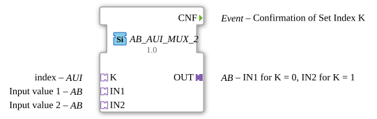

# AB_AUI_MUX_2

* * * * * * * * * *

## Einleitung

Der `AB_AUI_MUX_2` ist die adapterbasierte Variante des generischen Multiplexers für den Datentyp `BYTE`. Anders als `AB_MUX_2` erhält er den Auswahlindex nicht über ein REQ-Ereignis mit zugehörigem K-Dateneingang, sondern über einen eigenen Adapter-Socket **K** vom Typ `AUI` („Adapter Unidirectional Interface“). Das erlaubt es, den Index direkt aus einem anderen Baustein mit passendem `AUI`-Plug einzuspeisen, ohne eigene Verdrahtung von Ereignis- und Datenleitung.

## Schnittstellenstruktur

### **Ereignis-Eingänge**

- Keine expliziten Ereignis-Eingänge am Baustein selbst. Der Index wird ausschließlich über den Adapter-Socket **K** empfangen: Sobald der dort angeschlossene `AUI`-Plug sein internes Ereignis `E1` mit dem Datenwert `D1` sendet, wertet `AB_AUI_MUX_2` intern den Index aus und löst die Verarbeitung aus.

### **Ereignis-Ausgänge**

- **CNF**: Wird immer gesendet, sobald ein Ereignis des Selektor-Adapters `K` verarbeitet wurde – unabhängig davon, ob sich der Ausgangswert dabei geändert hat.

### **Daten-Eingänge**

- Keine direkten Daten-Eingänge. Der Index (`UINT`, 0-basiert) kommt ausschließlich über den `D1`-Wert des am Socket **K** angeschlossenen `AUI`-Adapters.

### **Daten-Ausgänge**

- Keine direkten Datenausgänge vorhanden.

### **Adapter**

- **K** (Socket, Typ `AUI`): Index-Eingang -- Auswahl des aktiven Ein-/Ausgangs über das adaptereigene Ereignis `E1`/`D1`.
- **IN1** (Socket): Eingangsadapter 1 von 2, wird bei Index `K = 0` an `OUT` durchgereicht (AB-Adaptertyp).
- **IN2** (Socket): Eingangsadapter 2 von 2, wird bei Index `K = 1` an `OUT` durchgereicht (AB-Adaptertyp).
- **OUT** (Plug): Ausgangsadapter, gibt den über den Index ausgewählten Eingang weiter (AB-Adaptertyp).

## Funktionsweise

Der Funktionsblock wertet den aktuellen Wert von **K** bei jedem eingehenden Ereignis neu aus -- sowohl beim Ereignis des Selektor-Adapters `K` (Typ `AUI`) als auch bei einem Ereignis an einem der Eingangs-Adapter `IN1`…`IN2`:

1. Der aktuelle Wert von `K.D1` bestimmt, welcher der 2 Eingangs-Adapter (`IN1` … `IN2`) gerade ausgewählt ist.
2. Der Datenwert dieses ausgewählten Eingangs wird mit dem aktuell auf `OUT` gehaltenen Wert verglichen. Nur bei tatsächlicher Änderung wird `OUT` neu beschrieben und dessen Adapter-Event gesendet (siehe „Änderungserkennung“ unten).
3. Kommt das auslösende Ereignis vom Selektor-Adapter `K`, wird zusätzlich -- unabhängig davon, ob sich `OUT` dabei geändert hat -- immer das Ereignis `CNF` gesendet, um die Verarbeitung des Index-Updates zu bestätigen.

Dadurch zieht auch eine reine Änderung von `K` den Ausgang sofort nach, selbst wenn sich der Datenwert des neu ausgewählten Eingangs seit dessen letztem eigenen Ereignis nicht verändert hat.

## Technische Besonderheiten

- Adapterbasierter Indexeingang statt klassischem REQ/K-Eingangspaar -- reduziert die Verdrahtung, wenn der Index bereits als `AUI`-Adapter vorliegt.
- Generische Implementierung (`GEN_AB_AUI_MUX`) -- gemeinsam für alle Portanzahlen dieser Bausteinfamilie (AB_AUI_MUX_2 … AB_AUI_MUX_5).
- **Änderungserkennung**: Der jeweils beschriebene Ausgangs-Plug wird nur aktualisiert und sein Adapter-Event nur gesendet, wenn sich der neue Wert vom aktuell gehaltenen Wert unterscheidet. Bleibt der Wert gleich, bleibt auch das Adapter-Event aus -- so werden überflüssige Updates bei nachgeschalteten Peers vermieden.

## Zustandsübersicht

Der FB besitzt keinen expliziten Zustandsautomaten, sondern wertet bei jedem eingehenden Ereignis den aktuellen Wert von `K.D1` neu aus:

- **Beliebiges Ereignis** (Selektor-Adapter `K` oder `IN1`…`IN2`) → aktuell selektierten Eingang auslesen, `OUT` bei Wertänderung aktualisieren und dessen Adapter-Event senden.
- **Zusätzlich beim Ereignis von `K`** → `CNF` wird immer gesendet, unabhängig davon, ob sich `OUT` dabei geändert hat.

## Anwendungsszenarien

- Auswahl zwischen bis zu 2 Signalquellen (Byte-Wert (8 Bit Bitmuster)) über einen zentral verwalteten Adapter-Index
- Ersatz für ein REQ/K-Eingangspaar durch eine einzelne AUI-Adapterverbindung, wenn der Index bereits von einem anderen Baustein als Adapter bereitgestellt wird
- Aufbau von Auswahlnetzwerken, in denen mehrere MUX-Bausteine denselben Index-Adapter teilen

## ⚖️ Vergleich mit ähnlichen Bausteinen

Vergleich mit `AB_MUX_2` (gleiche Auswahllogik, Index jedoch klassisch über **REQ**-Ereignis + **K**-Dateneingang statt über einen Adapter).

Vergleich mit [F_MUX_2](../../../../../StandardLibraries/iec61131-3/selection/F_MUX_2.md), das dieselbe 2:1-Auswahl rein datenbasiert ohne Adapter/Ereigniskonzept ausführt.

- **[`AB_AUI_MUX_2_UNGATED`](AB_AUI_MUX_2_UNGATED.md)**: Ungegatete Variante – aktualisiert den Ausgang bei jedem Durchlauf, auch ohne Wertänderung.

## Fazit

Der `AB_AUI_MUX_2` überträgt die Multiplexer-Logik von `AB_MUX_2` auf eine rein adapterbasierte Indexversorgung. Das macht ihn zur passenden Wahl, wenn der Auswahlindex bereits als `AUI`-Adapter aus einem anderen Baustein zur Verfügung steht und keine zusätzliche Ereignis-/Datenverdrahtung für den Index gewünscht ist.
