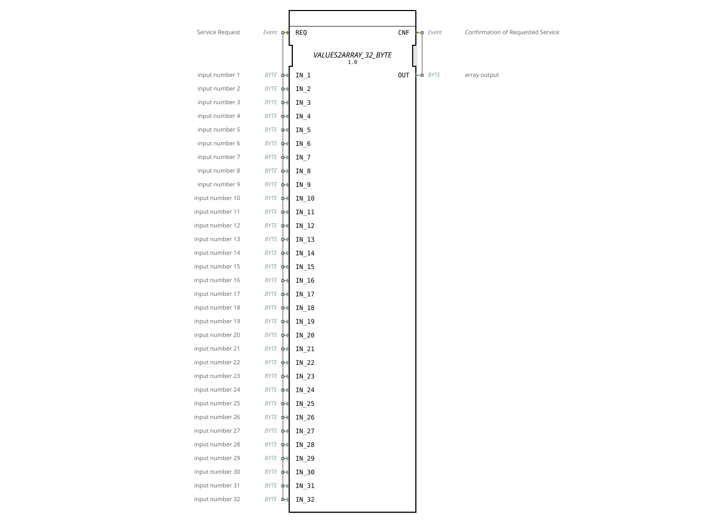

# VALUES2ARRAY_32_BYTE

* * * * * * * * * *
## Einleitung

Der `VALUES2ARRAY_32_BYTE` fasst 32 einzelne `BYTE`-Skalarvariablen `IN_1`…`IN_32` zu einem `BYTE`-Array der Größe 32 zusammen. Er ist die Umkehrung von `ARRAY2VALUES_32_BYTE` und gehört zur generischen `GEN_ARRAY2ARRAY`-Familie (vgl. [VALUES2ARRAY_2_LREAL](VALUES2ARRAY_2_LREAL.md)).

## Schnittstellenstruktur

### **Ereignis-Eingänge**

- **REQ**: Löst die Zusammenführung aus, trägt `IN_1`, `IN_2`, `IN_3`, `IN_4`, `IN_5`, `IN_6`, `IN_7`, `IN_8`, `IN_9`, `IN_10`, `IN_11`, `IN_12`, `IN_13`, `IN_14`, `IN_15`, `IN_16`, `IN_17`, `IN_18`, `IN_19`, `IN_20`, `IN_21`, `IN_22`, `IN_23`, `IN_24`, `IN_25`, `IN_26`, `IN_27`, `IN_28`, `IN_29`, `IN_30`, `IN_31`, `IN_32`.

### **Ereignis-Ausgänge**

- **CNF**: Bestätigt den Abschluss, trägt `OUT`.

### **Daten-Eingänge**

- `IN_1`, `IN_2`, `IN_3`, `IN_4`, `IN_5`, `IN_6`, `IN_7`, `IN_8`, `IN_9`, `IN_10`, `IN_11`, `IN_12`, `IN_13`, `IN_14`, `IN_15`, `IN_16`, `IN_17`, `IN_18`, `IN_19`, `IN_20`, `IN_21`, `IN_22`, `IN_23`, `IN_24`, `IN_25`, `IN_26`, `IN_27`, `IN_28`, `IN_29`, `IN_30`, `IN_31`, `IN_32` (`BYTE`): Die 32 einzelnen Werte (8-Bit-Bitmuster), die zum Array zusammengefasst werden.

### **Daten-Ausgänge**

- **OUT** (`BYTE`, Array-Größe 32): `OUT[i-1]` entspricht `IN_i`.

## Funktionsweise

Bei Eintreffen von `REQ` wird jeder Eingangswert `IN_i` auf das entsprechende Element `OUT[i-1]` geschrieben (`IN_1` → `OUT[0]`, …, `IN_32` → `OUT[31]`), anschließend wird `CNF` ausgelöst.

## Technische Besonderheiten

- **Generische Implementierung**: `eclipse4diac::core::GenericClassName = 'GEN_ARRAY2ARRAY'`, dieselbe C++-Basis wie [VALUES2ARRAY_2_LREAL](VALUES2ARRAY_2_LREAL.md) und die übrigen `VALUES2ARRAY_*`-Varianten.
- **Feste Größe 32**: Für andere Array-Größen desselben Typs siehe `VALUES2ARRAY_2_BYTE`, `VALUES2ARRAY_4_BYTE`, `VALUES2ARRAY_8_BYTE`, `VALUES2ARRAY_16_BYTE`.

## Zustandsübersicht

Zustandslos: jedes `REQ` führt unmittelbar zur vollständigen Zusammenführung und zu `CNF`.

## Anwendungsszenarien

- **Array-Aufbau aus Einzelwerten**: Mehrere diskrete `BYTE`-Variablen sollen als Array an einen nachgeschalteten Baustein übergeben werden, der ein Array-Interface erwartet.
- **Schnittstellenanpassung** zwischen variablenbasierten und array-basierten Bausteinschnittstellen.

## ⚖️ Vergleich mit ähnlichen Bausteinen

- **[VALUES2ARRAY_2_LREAL](VALUES2ARRAY_2_LREAL.md)**: dieselbe generische Implementierung für den Datentyp `LREAL`.
- **`ARRAY2VALUES_32_BYTE`**: die Umkehrrichtung — zerlegt ein Array in 32 Einzelwerte.

## Fazit

`VALUES2ARRAY_32_BYTE` liefert eine einfache, generisch implementierte Zusammenführung von 32 `BYTE`-Einzelwerten zu einem Array und eignet sich zur Anpassung variablenbasierter an array-basierte Schnittstellen.
