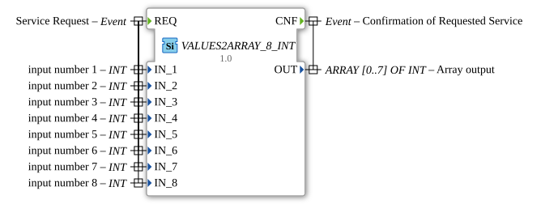

# VALUES2ARRAY_8_INT

* * * * * * * * * *

## Einleitung

Der `VALUES2ARRAY_8_INT` fasst 8 einzelne `INT`-Skalarvariablen `IN_1`…`IN_8` zu einem `INT`-Array der Größe 8 zusammen. Er ist die Umkehrung von `ARRAY2VALUES_8_INT` und gehört zur generischen `GEN_ARRAY2ARRAY`-Familie (vgl. [VALUES2ARRAY_2_LREAL](VALUES2ARRAY_2_LREAL.md)).

## Schnittstellenstruktur

### **Ereignis-Eingänge**

- **REQ**: Löst die Zusammenführung aus, trägt `IN_1`, `IN_2`, `IN_3`, `IN_4`, `IN_5`, `IN_6`, `IN_7`, `IN_8`.

### **Ereignis-Ausgänge**

- **CNF**: Bestätigt den Abschluss, trägt `OUT`.

### **Daten-Eingänge**

- `IN_1`, `IN_2`, `IN_3`, `IN_4`, `IN_5`, `IN_6`, `IN_7`, `IN_8` (`INT`): Die 8 einzelnen Werte (16-Bit-Ganzzahl (vorzeichenbehaftet)), die zum Array zusammengefasst werden.

### **Daten-Ausgänge**

- **OUT** (`INT`, Array-Größe 8): `OUT[i-1]` entspricht `IN_i`.

## Funktionsweise

Bei Eintreffen von `REQ` wird jeder Eingangswert `IN_i` auf das entsprechende Element `OUT[i-1]` geschrieben (`IN_1` → `OUT[0]`, …, `IN_8` → `OUT[7]`), anschließend wird `CNF` ausgelöst.

## Technische Besonderheiten

- **Generische Implementierung**: `eclipse4diac::core::GenericClassName = 'GEN_ARRAY2ARRAY'`, dieselbe C++-Basis wie [VALUES2ARRAY_2_LREAL](VALUES2ARRAY_2_LREAL.md) und die übrigen `VALUES2ARRAY_*`-Varianten.
- **Feste Größe 8**: Für andere Array-Größen desselben Typs siehe .

## Zustandsübersicht

Zustandslos: jedes `REQ` führt unmittelbar zur vollständigen Zusammenführung und zu `CNF`.

## Anwendungsszenarien

- **Array-Aufbau aus Einzelwerten**: Mehrere diskrete `INT`-Variablen sollen als Array an einen nachgeschalteten Baustein übergeben werden, der ein Array-Interface erwartet.
- **Schnittstellenanpassung** zwischen variablenbasierten und array-basierten Bausteinschnittstellen.

## ⚖️ Vergleich mit ähnlichen Bausteinen

- **[VALUES2ARRAY_2_LREAL](VALUES2ARRAY_2_LREAL.md)**: dieselbe generische Implementierung für den Datentyp `LREAL`.
- **`ARRAY2VALUES_8_INT`**: die Umkehrrichtung — zerlegt ein Array in 8 Einzelwerte.

## Fazit

`VALUES2ARRAY_8_INT` liefert eine einfache, generisch implementierte Zusammenführung von 8 `INT`-Einzelwerten zu einem Array und eignet sich zur Anpassung variablenbasierter an array-basierte Schnittstellen.
