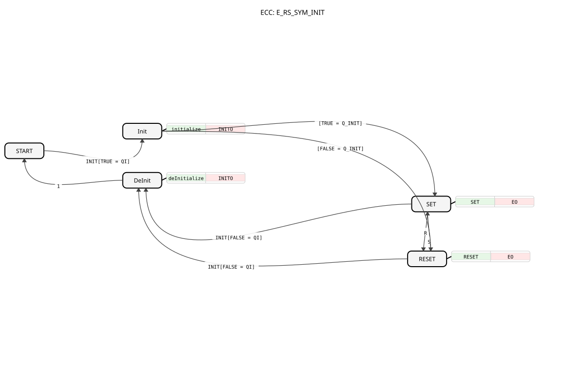

# E_RS_SYM_INIT

* * * * * * * * * *
## Einleitung

Der `E_RS_SYM_INIT` erweitert [E_RS_SYM](E_RS_SYM.md) um eine explizite `INIT`/`INITO`-Schnittstelle: Statt sich den Startwert ausschließlich aus dem ersten `S`- oder `R`-Ereignis zu ergeben, kann er über `INIT` gezielt mit einem vorgegebenen Wert `Q_INIT` initialisiert (oder über `QI = FALSE` deinitialisiert) werden.

## Schnittstellenstruktur

### **Ereignis-Eingänge**

- **INIT**: Initialisierungsanforderung, trägt `QI` und `Q_INIT`.
- **S (Set)**: Setzt den Ausgang `Q` auf `TRUE`.
- **R (Reset)**: Setzt den Ausgang `Q` auf `FALSE`.

### **Ereignis-Ausgänge**

- **INITO**: Bestätigt die (De-)Initialisierung, trägt `QO`.
- **EO**: Wird nach jedem `S`- oder `R`-Ereignis ausgelöst, trägt `Q`.

### **Daten-Eingänge**

- **QI** (BOOL): Eingangs-Event-Qualifier — `TRUE` initialisiert, `FALSE` deinitialisiert.
- **Q_INIT** (BOOL): Der Wert, auf den `Q` beim Initialisieren gesetzt wird.

### **Daten-Ausgänge**

- **QO** (BOOL): Ausgangs-Event-Qualifier, spiegelt `QI` zurück.
- **Q** (BOOL): Der aktuelle Zustand des Flip-Flops.

## Funktionsweise

Aus `START` führt `INIT` mit `QI = TRUE` in den Zustand `Init`, der `QO := QI` setzt und `INITO` auslöst; von dort geht es abhängig von `Q_INIT` direkt in `SET` (`Q_INIT = TRUE`) oder `RESET` (`Q_INIT = FALSE`) über — ohne dass dabei bereits `EO` ausgelöst wird. Aus `SET`/`RESET` heraus verhält sich der Baustein wie [E_RS_SYM](E_RS_SYM.md): `S` schaltet nach `SET`, `R` nach `RESET`, jeweils mit `EO`. Ein erneutes `INIT` mit `QI = FALSE` führt aus `SET` oder `RESET` in den Zustand `DeInit` (setzt `QO := FALSE`, löst `INITO` aus) und von dort zurück nach `START`.

## Technische Besonderheiten

- **QI als Init/Deinit-Schalter**: `QI = TRUE` initialisiert den Baustein mit `Q_INIT`, `QI = FALSE` deinitialisiert ihn und versetzt ihn zurück in den unkonfigurierten `START`-Zustand.
- **Getrennte Ereigniskanäle**: Die Initialisierung (`INIT`/`INITO`) ist vollständig von der laufenden Set/Reset-Logik (`S`/`R`/`EO`) getrennt — eine Initialisierung während des laufenden Betriebs setzt `Q` gezielt neu, ohne dass dies über `EO`, sondern über `INITO` quittiert wird.

## Zustandsübersicht

| Zustand | Bedeutung |
|---|---|
| START | Unkonfigurierter Anfangszustand |
| Init | Initialisierung läuft, `QO := QI` |
| DeInit | Deinitialisierung läuft, `QO := FALSE` |
| SET | `Q = TRUE` |
| RESET | `Q = FALSE` |

## Anwendungsszenarien

- **Definiertes Hochfahren mit Vorbelegung**: Der Startwert von `Q` soll beim Systemstart aus einer Konfigurationsvariable (`Q_INIT`) übernommen werden, statt vom Zufall des ersten `S`/`R`-Ereignisses abzuhängen.
- **Kontrolliertes Zurücksetzen ganzer Subnetze**: Über `INIT`/`QI = FALSE` lässt sich der Baustein gezielt deinitialisieren, z. B. beim Deaktivieren eines FB-Netzwerkteils.

## ⚖️ Vergleich mit ähnlichen Bausteinen

- **[E_RS_SYM](E_RS_SYM.md)**: dieselbe Grundfunktion ohne `INIT`/`INITO`-Schnittstelle.
- **[E_SR_SYM_INIT](E_SR_SYM_INIT.md)**: funktional identisch, nur die Reihenfolge von `S`/`R` in der Schnittstelle ist vertauscht.
- **[E_T_FF_INIT](../E_T_FF_INIT.md)**: dieselbe INIT/DeInit-Struktur, aber mit Toggle- statt Set/Reset-Verhalten im laufenden Betrieb.

## Fazit

`E_RS_SYM_INIT` liefert ein bistabiles Speicherelement mit gezielt steuerbarem, projektierbarem Startwert und eignet sich damit für Anwendungen, bei denen der reine Zufall des ersten Set/Reset-Ereignisses nicht ausreicht.
