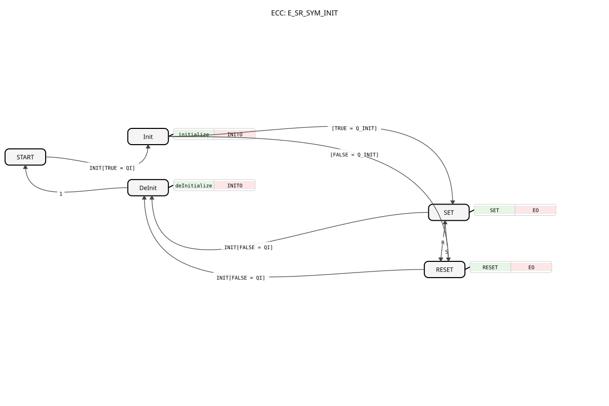

# E_SR_SYM_INIT

* * * * * * * * * *

## Einleitung

Der `E_SR_SYM_INIT` ist funktional identisch zu [E_RS_SYM_INIT](E_RS_SYM_INIT.md) — analog zu [E_SR_SYM](E_SR_SYM.md)/[E_RS_SYM](E_RS_SYM.md) existiert er lediglich zur Wahrung der `SR`-Namenskonvention (Set zuerst) und erweitert [E_SR_SYM](E_SR_SYM.md) um eine `INIT`/`INITO`-Schnittstelle.

## Schnittstellenstruktur

### **Ereignis-Eingänge**

- **INIT**: Initialisierungsanforderung, trägt `QI` und `Q_INIT`.
- **S (Set)**: Setzt den Ausgang `Q` auf `TRUE`.
- **R (Reset)**: Setzt den Ausgang `Q` auf `FALSE`.

### **Ereignis-Ausgänge**

- **INITO**: Bestätigt die (De-)Initialisierung, trägt `QO`.
- **EO**: Wird nach jedem `S`- oder `R`-Ereignis ausgelöst, trägt `Q`.

### **Daten-Eingänge**

- **QI** (BOOL): Eingangs-Event-Qualifier — `TRUE` initialisiert, `FALSE` deinitialisiert.
- **Q_INIT** (BOOL): Der Wert, auf den `Q` beim Initialisieren gesetzt wird.

### **Daten-Ausgänge**

- **QO** (BOOL): Ausgangs-Event-Qualifier, spiegelt `QI` zurück.
- **Q** (BOOL): Der aktuelle Zustand des Flip-Flops.

## Funktionsweise

Identisch zu [E_RS_SYM_INIT](E_RS_SYM_INIT.md): `INIT` mit `QI = TRUE` initialisiert `Q` über `Q_INIT`, `INIT` mit `QI = FALSE` deinitialisiert den Baustein zurück in den `START`-Zustand. Im laufenden Betrieb schaltet `S`/`R` zwischen `SET` und `RESET`, jeweils mit `EO`-Quittierung.

## Technische Besonderheiten

Siehe [E_RS_SYM_INIT](E_RS_SYM_INIT.md) — identisches Verhalten, lediglich `S`/`R`-Reihenfolge im Symbol vertauscht.

## Zustandsübersicht

| Zustand | Bedeutung |
| --- | --- |
| START | Unkonfigurierter Anfangszustand |
| Init | Initialisierung läuft, `QO := QI` |
| DeInit | Deinitialisierung läuft, `QO := FALSE` |
| SET | `Q = TRUE` |
| RESET | `Q = FALSE` |

## Anwendungsszenarien

Siehe [E_RS_SYM_INIT](E_RS_SYM_INIT.md).

## ⚖️ Vergleich mit ähnlichen Bausteinen

- **[E_RS_SYM_INIT](E_RS_SYM_INIT.md)**: funktional identisch, vertauschte `S`/`R`-Reihenfolge.
- **[E_SR_SYM](E_SR_SYM.md)**: dieselbe Grundfunktion ohne `INIT`/`INITO`.

## Fazit

`E_SR_SYM_INIT` ist die zu `E_RS_SYM_INIT` namenskonventionsgleiche, funktional identische Variante mit projektierbarem Startwert.
