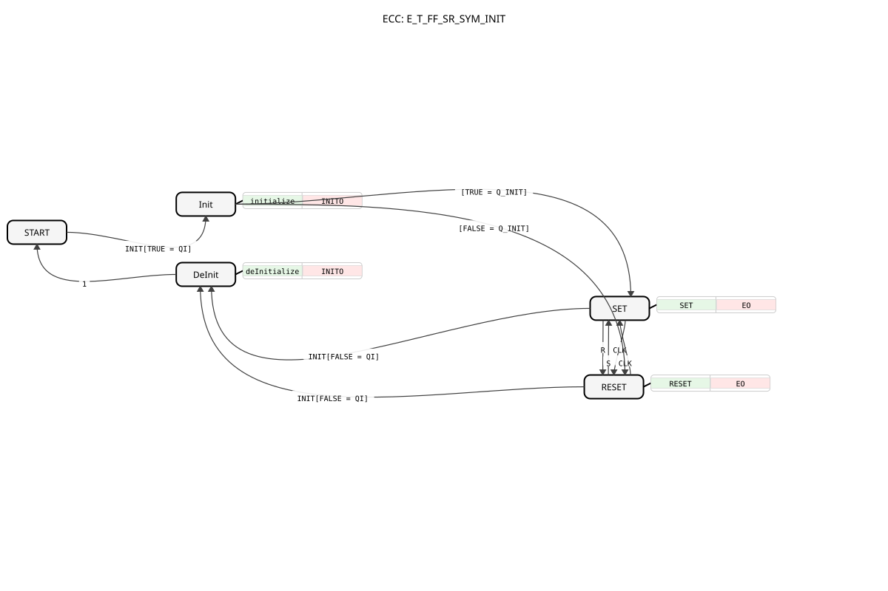

# E_T_FF_SR_SYM_INIT

* * * * * * * * * *
## Einleitung

Der `E_T_FF_SR_SYM_INIT` erweitert [E_T_FF_SR_SYM](E_T_FF_SR_SYM.md) um eine explizite `INIT`/`INITO`-Schnittstelle: Der Startwert von `Q` wird nicht durch das erste `S`-, `R`- oder `CLK`-Ereignis bestimmt, sondern gezielt über `Q_INIT` vorgegeben.

## Schnittstellenstruktur

### **Ereignis-Eingänge**

- **INIT**: Initialisierungsanforderung, trägt `QI` und `Q_INIT`.
- **S (Set)**: Setzt `Q` auf `TRUE`.
- **R (Reset)**: Setzt `Q` auf `FALSE`.
- **CLK**: Kehrt den aktuellen Zustand von `Q` um.

### **Ereignis-Ausgänge**

- **INITO**: Bestätigt die (De-)Initialisierung, trägt `QO`.
- **EO**: Wird nach jedem `S`-, `R`- oder `CLK`-Ereignis ausgelöst, trägt `Q`.

### **Daten-Eingänge**

- **QI** (BOOL): Eingangs-Event-Qualifier — `TRUE` initialisiert, `FALSE` deinitialisiert.
- **Q_INIT** (BOOL): Der Wert, auf den `Q` beim Initialisieren gesetzt wird.

### **Daten-Ausgänge**

- **QO** (BOOL): Ausgangs-Event-Qualifier.
- **Q** (BOOL): Der aktuelle Zustand.

## Funktionsweise

`INIT` mit `QI = TRUE` initialisiert `Q` über `Q_INIT` (`Init` → `SET`/`RESET`). Im laufenden Betrieb schalten `S`/`R` gezielt, `CLK` toggelt zwischen `SET` und `RESET` — identisch zu [E_T_FF_SR_SYM](E_T_FF_SR_SYM.md), jedoch ohne dessen symmetrisches Start-Up-Verhalten aus `START` heraus, da der Startwert stattdessen über `INIT` kommt. `INIT` mit `QI = FALSE` deinitialisiert den Baustein zurück in den `START`-Zustand.

## Technische Besonderheiten

- **Kombiniert alle drei Mechanismen**: gezieltes Set/Reset (`S`/`R`), Toggle (`CLK`) und projektierbare Initialisierung (`INIT`/`Q_INIT`) in einem einzigen Baustein.
- **Gleiche INIT/DeInit-Struktur** wie [E_RS_SYM_INIT](E_RS_SYM_INIT.md), [E_SR_SYM_INIT](E_SR_SYM_INIT.md) und [E_T_FF_INIT](E_T_FF_INIT.md).

## Zustandsübersicht

| Zustand | Bedeutung |
|---|---|
| START | Unkonfigurierter Anfangszustand |
| Init | Initialisierung läuft, `QO := QI` |
| DeInit | Deinitialisierung läuft, `QO := FALSE` |
| SET | `Q = TRUE`; `R`/`CLK`→RESET |
| RESET | `Q = FALSE`; `S`/`CLK`→SET |

## Anwendungsszenarien

- **Vollausgestattetes Bedien- und Blinkelement** mit definiertem Startwert: kombiniert manuelles Setzen/Rücksetzen, taktgesteuertes Umschalten und einen beim Hochfahren projektierbaren Anfangszustand.

## ⚖️ Vergleich mit ähnlichen Bausteinen

- **[E_T_FF_SR_SYM](E_T_FF_SR_SYM.md)**: dieselbe Funktion ohne `INIT`/`INITO`.
- **[E_T_FF_INIT](E_T_FF_INIT.md)**: nur Toggle + Init, ohne `S`/`R`.
- **[E_RS_SYM_INIT](E_RS_SYM_INIT.md) / [E_SR_SYM_INIT](E_SR_SYM_INIT.md)**: nur Set/Reset + Init, ohne `CLK`.

## Fazit

`E_T_FF_SR_SYM_INIT` ist der funktional umfangreichste Baustein der `E_*_SYM`-Familie und vereint Set/Reset, Toggle und projektierbare Initialisierung in einem Funktionsbaustein.
