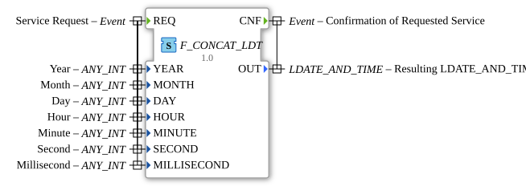

# F_CONCAT_LDT

* * * * * * * * * *
## Einleitung

Der `F_CONCAT_LDT` fügt einzelne Zeit-/Datumsbestandteile (`YEAR`, `MONTH`, `DAY`, `HOUR`, `MINUTE`, `SECOND`, `MILLISECOND`) zu einem zusammengesetzten `LDATE_AND_TIME`-Wert zusammen. Er ist die Umkehrung von [F_SPLIT_LDT](F_SPLIT_LDT.md), das denselben `LDATE_AND_TIME`-Wert wieder in seine Einzelbestandteile zerlegt.

## Schnittstellenstruktur

### **Ereignis-Eingänge**

- **REQ**: Löst die Zusammenführung aus, trägt `YEAR`, `MONTH`, `DAY`, `HOUR`, `MINUTE`, `SECOND`, `MILLISECOND`.

### **Ereignis-Ausgänge**

- **CNF**: Bestätigt den Abschluss, trägt `OUT`.

### **Daten-Eingänge**

- **YEAR** (ANY_INT): Jahr.
- **MONTH** (ANY_INT): Monat.
- **DAY** (ANY_INT): Tag.
- **HOUR** (ANY_INT): Stunde.
- **MINUTE** (ANY_INT): Minute.
- **SECOND** (ANY_INT): Sekunde.
- **MILLISECOND** (ANY_INT): Millisekunde.

### **Daten-Ausgänge**

- **OUT** (`LDATE_AND_TIME`): Der aus den Einzelbestandteilen zusammengesetzte Wert.

## Funktionsweise

Bei Eintreffen von `REQ` werden die Eingangswerte `YEAR`, `MONTH`, `DAY`, `HOUR`, `MINUTE`, `SECOND`, `MILLISECOND` zu einem `LDATE_AND_TIME`-Wert kombiniert und über `OUT` ausgegeben. Anschließend wird `CNF` ausgelöst.

## Technische Besonderheiten

- **`ANY_INT`-Eingänge**: Die Zeit-/Datumsbestandteile akzeptieren beliebige Ganzzahltypen, was die Verdrahtung mit unterschiedlich typisierten Quellwerten vereinfacht.
- **Keine Bereichsprüfung dokumentiert**: Der Baustein geht von plausiblen Eingabewerten aus (z. B. `MONTH` 1–12); eine explizite Validierung obliegt dem Aufrufer.

## Zustandsübersicht

Zustandslos: jedes `REQ` führt unmittelbar zur Zusammenführung und zu `CNF`.

## Anwendungsszenarien

- **Aufbau von Zeitstempeln** aus separat erfassten oder berechneten Einzelwerten, z. B. aus Sensordaten, Benutzereingaben oder Kommunikationsprotokollen.
- **Konfigurationsauswertung**: Zusammenführen von in einzelnen Variablen abgelegten Datums-/Zeitangaben zu einem verwendbaren `LDATE_AND_TIME`-Wert.

## ⚖️ Vergleich mit ähnlichen Bausteinen

- **[F_SPLIT_LDT](F_SPLIT_LDT.md)**: die Umkehrrichtung — zerlegt einen `LDATE_AND_TIME`-Wert in seine Einzelbestandteile.
- **`F_CONCAT_DATE_TOD`**: kombiniert stattdessen einen bereits fertigen `DATE`- und `TIME_OF_DAY`-Wert zu `DATE_AND_TIME`, statt aus Einzelfeldern.

## Fazit

`F_CONCAT_LDT` liefert eine einfache, direkte Zusammenführung von Zeit-/Datumseinzelwerten zu einem `LDATE_AND_TIME`-Wert und ergänzt damit die entsprechende Zerlegungsfunktion [F_SPLIT_LDT](F_SPLIT_LDT.md).
