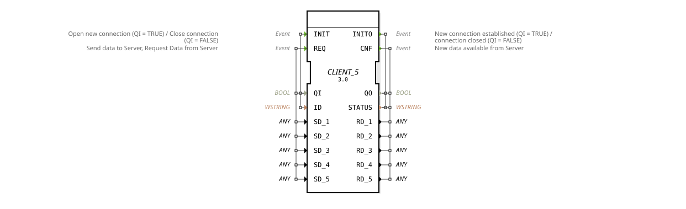

# CLIENT_5

* * * * * * * * * *

## Einleitung

Der `CLIENT_5`-Funktionsblock ist die generische Client-Variante mit 5 Sende- und 5 Empfangsdatenfeldern für die Kommunikation mit einem passenden [SERVER_5](SERVER_5.md)-Block. Er überträgt 5 Datenwerte (`SD_1` `SD_2` `SD_3` `SD_4` `SD_5`) an den Server und empfängt 5 Datenwerte (`RD_1` `RD_2` `RD_3` `RD_4` `RD_5`) zurück. Wie alle `CLIENT_*`-Bausteine basiert er auf der generischen `GEN_CLIENT`-Implementierung — dieselbe C++-Basis wie [CLIENT_1](CLIENT_1.md)/[SERVER_1](SERVER_1.md), lediglich die Anzahl der Sende-/Empfangsfelder unterscheidet sich pro Instanziierung.

## Schnittstellenstruktur

### **Ereignis-Eingänge**

- **INIT**: Öffnet eine neue Verbindung (QI = TRUE) oder schließt eine bestehende Verbindung (QI = FALSE), trägt `QI` und `ID`.
- **REQ**: Sendet Daten an den Server und fordert Daten vom Server an, trägt `QI` sowie `SD_1` `SD_2` `SD_3` `SD_4` `SD_5`.

### **Ereignis-Ausgänge**

- **INITO**: Bestätigt Verbindungsauf-/-abbau, trägt `QO` und `STATUS`.
- **CNF**: Signalisiert, dass neue Daten vom Server verfügbar sind, trägt `QO`, `STATUS` sowie `RD_1` `RD_2` `RD_3` `RD_4` `RD_5`.

### **Daten-Eingänge**

- **QI** (BOOL): Steuert den Verbindungsstatus (`TRUE` = Verbindung öffnen, `FALSE` = Verbindung schließen).
- **ID** (WSTRING): Identifikator der Verbindung (z. B. Zieladresse/Port).
- **SD_1** (ANY): Sendedatum 1, wird mit `REQ` an den Server übertragen.
- **SD_2** (ANY): Sendedatum 2, wird mit `REQ` an den Server übertragen.
- **SD_3** (ANY): Sendedatum 3, wird mit `REQ` an den Server übertragen.
- **SD_4** (ANY): Sendedatum 4, wird mit `REQ` an den Server übertragen.
- **SD_5** (ANY): Sendedatum 5, wird mit `REQ` an den Server übertragen.

### **Daten-Ausgänge**

- **QO** (BOOL): Aktueller Verbindungsstatus.
- **STATUS** (WSTRING): Statusinformationen zur Verbindung.
- **RD_1** (ANY): Empfangsdatum 1, wird mit `CNF` vom Server geliefert.
- **RD_2** (ANY): Empfangsdatum 2, wird mit `CNF` vom Server geliefert.
- **RD_3** (ANY): Empfangsdatum 3, wird mit `CNF` vom Server geliefert.
- **RD_4** (ANY): Empfangsdatum 4, wird mit `CNF` vom Server geliefert.
- **RD_5** (ANY): Empfangsdatum 5, wird mit `CNF` vom Server geliefert.

## Funktionsweise

`CLIENT_5` initialisiert über `INIT` eine Verbindung zum passenden `SERVER_5`-Block (bei `QI = TRUE`) bzw. schließt sie (bei `QI = FALSE`); der Abschluss wird über `INITO` bestätigt. Über `REQ` werden `SD_1` `SD_2` `SD_3` `SD_4` `SD_5` an den Server übertragen. Sobald Antwortdaten (`RD_1` `RD_2` `RD_3` `RD_4` `RD_5`) vorliegen, löst der Baustein `CNF` aus und stellt `RD_1` `RD_2` `RD_3` `RD_4` `RD_5` bereit.

## Technische Besonderheiten

- **Generische Implementierung**: `eclipse4diac::core::GenericClassName = 'GEN_CLIENT'`, dieselbe C++-Basis wie alle anderen `CLIENT_*`-Varianten; Anzahl und Typ (`ANY`) der Sende-/Empfangsfelder werden pro Instanziierung über die Typdefinition festgelegt.
- **`ANY`-Datenfelder**: Alle `SD_i`/`RD_i` sind generisch (`ANY`) typisiert und passen sich beim Verdrahten an den jeweils angeschlossenen Datentyp an.
- **Gegenstück `SERVER_5`**: `CLIENT_5` ist funktional nur mit einem `SERVER_5`-Block auf der Server-Seite kompatibel — die Anzahl der Sendefelder der einen Seite muss der Anzahl der Empfangsfelder der Gegenseite entsprechen.

## Zustandsübersicht

1. **Nicht verbunden**: Initialzustand, `QO = FALSE`.
2. **Verbindungsaufbau**: `INIT` mit `QI = TRUE` wird verarbeitet.
3. **Verbunden**: `INITO` mit `QO = TRUE` bestätigt die Verbindung.
4. **Datenaustausch**: `REQ`/`CNF`-Zyklus für Sende-/Empfangsdaten.
5. **Verbindungstrennung**: `INIT` mit `QI = FALSE` wird verarbeitet.

## Anwendungsszenarien

- **Kommunikation zwischen verteilten Steuerungssystemen**, bei denen genau 5 Werte gesendet und 5 Werte empfangen werden sollen, ohne überzählige, ungenutzte Datenfelder in Kauf zu nehmen.
- **Client-seitige Anbindung** eines Kommunikationspartners, der bereits als `SERVER_5` mit passender Feldanzahl ausgelegt ist.

## ⚖️ Vergleich mit ähnlichen Bausteinen

- **[SERVER_5](SERVER_5.md)**: das direkte Gegenstück auf der Server-Seite, mit vertauschter Sende-/Empfangsfeldanzahl.
- **[CLIENT_1](CLIENT_1.md) / [SERVER_1](SERVER_1.md)**: dieselbe generische Implementierung mit je einem Sende- und Empfangsfeld.

## Fazit

`CLIENT_5` liefert die generische, auf 5 Sende- und 5 Empfangsfelder zugeschnittene Client-Variante der `GEN_CLIENT`-Familie und eignet sich für Netzwerkverbindungen, deren Nutzdatenanzahl von der Standardvariante mit einem Feld abweicht.
