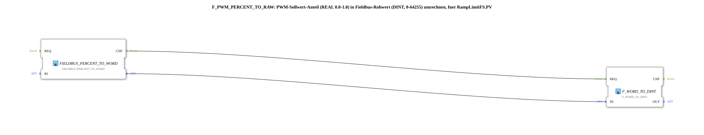

# F_PWM_PERCENT_TO_RAW

* * * * * * * * * *
## Einleitung

`F_PWM_PERCENT_TO_RAW` rechnet einen **PWM-Sollwert-Anteil (REAL 0.0–1.0)** in den **Fieldbus-Rohwert (DINT, 0–64255)** um, den `RampLimitFS.PV` erwartet. Trotz des Namens erwartet der Baustein keinen Prozentwert (0–100), sondern einen Anteil (0.0–1.0) — die Umrechnung von Prozent auf Anteil übernimmt vorgeschaltet `logiBUS::signalprocessing::fieldbus::F_PERCENT_TO_FRACTION`.

## Verwendete Funktionsbausteine (FBs)

### Sub-Bausteine: F_PWM_PERCENT_TO_RAW

- **Typ**: SubAppType
- **Verwendete interne FBs**:
    - **FIELDBUS_PERCENT_TO_WORD**: `eclipse4diac::signalprocessing::FIELDBUS_PERCENT_TO_WORD`
        - Dateneingang: `RI` (Anteil 0.0-1.0)
        - Ereignisausgang: `CNF`
    - **F_WORD_TO_DINT**: `iec61131::conversion::F_WORD_TO_DINT`
        - Dateneingang: `IN`, Datenausgang: `OUT`
- **Funktionsweise**: Der Standard-4diac-Baustein `FIELDBUS_PERCENT_TO_WORD` liefert den Fieldbus-Rohwert bereits als `WORD` (16-Bit); `F_WORD_TO_DINT` konvertiert anschließend auf `DINT`, da `RampLimitFS.PV` diesen Datentyp erwartet.

## Programmablauf und Verbindungen

1. `REQ` (SubApp-Ereigniseingang) → `FIELDBUS_PERCENT_TO_WORD.REQ`
2. `IN` (Anteil 0.0-1.0) → `FIELDBUS_PERCENT_TO_WORD.RI`
3. `FIELDBUS_PERCENT_TO_WORD.CNF` → `F_WORD_TO_DINT.REQ`, Datenausgang → `F_WORD_TO_DINT.IN`
4. `F_WORD_TO_DINT.OUT` → `OUT` (Fieldbus-Rohwert 0-64255)
5. `F_WORD_TO_DINT.CNF` → `CNF` (SubApp-Ereignisausgang)

## Technische Besonderheiten

- Verwendet den Standard-4diac-Baustein `FIELDBUS_PERCENT_TO_WORD` (`eclipse4diac::signalprocessing`) statt einer eigenen Umrechnungsformel — konsistent mit der SAE-J1939/ISO-11783-Konvention `VALID_SIGNAL_W`.
- Erwartet **Anteil 0.0-1.0**, nicht Prozent 0-100 — leicht zu verwechseln mit dem baugleich benannten `F_PERCENT_TO_FRACTION` (Prozent → Anteil), das vorgeschaltet werden muss.

## Anwendungsszenarien

- Jede Übung, die einen analogen 0-100%-Sollwert auf einen `RampLimitFS`- oder anderen Fieldbus-Rohwert-Eingang (0-64255) abbilden muss.

## Zusammenfassung

`F_PWM_PERCENT_TO_RAW` ist ein dünner Adapter um den Standard-Baustein `FIELDBUS_PERCENT_TO_WORD`, der den Anteil-zu-Fieldbus-Rohwert-Übergang auf den von `RampLimitFS.PV` erwarteten `DINT`-Typ bringt.

## 🛠️ Zugehörige Übungen

* [RampLimitFS_TO_logiBUS_QDA_PWM_OPC](./RampLimitFS_TO_logiBUS_QDA_PWM_OPC.md)
* [F_PWM_RAW_TO_PERCENT](./F_PWM_RAW_TO_PERCENT.md) (Gegenstück)
* [InputOutputTesterButton_PWM_OPC_UA](../../../../Uebungen/test_AX/Meins/InputOutputTester/Button_PWM_OPC_UA/InputOutputTesterButton_PWM_OPC_UA.md)

---

### 🌐 Passende Themen-Unterseiten auf ms-muc-docs.de

* [🌐 Eclipse 4diac IDE & Farb-Referenz auf ms-muc-docs.de](https://www.ms-muc-docs.de/iec-61499/eclipse-4diac/)
