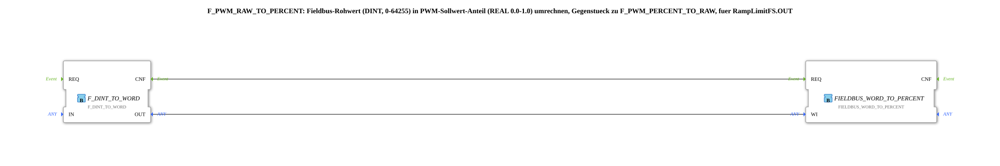

# F_PWM_RAW_TO_PERCENT

* * * * * * * * * *
## Einleitung

`F_PWM_RAW_TO_PERCENT` ist das Gegenstück zu [`F_PWM_PERCENT_TO_RAW`](./F_PWM_PERCENT_TO_RAW.md): Es rechnet den **Fieldbus-Rohwert (DINT, 0–64255)** von `RampLimitFS.OUT` zurück in einen **Anteil (REAL 0.0–1.0)** um. Trotz des Namens liefert der Baustein keinen Prozentwert — die Umrechnung von Anteil auf Prozent übernimmt nachgeschaltet `logiBUS::signalprocessing::fieldbus::F_FRACTION_TO_PERCENT`.

## Verwendete Funktionsbausteine (FBs)

### Sub-Bausteine: F_PWM_RAW_TO_PERCENT

- **Typ**: SubAppType
- **Verwendete interne FBs**:
    - **F_DINT_TO_WORD**: `iec61131::conversion::F_DINT_TO_WORD`
        - Dateneingang: `IN`, Datenausgang: `OUT`
    - **FIELDBUS_WORD_TO_PERCENT**: `eclipse4diac::signalprocessing::FIELDBUS_WORD_TO_PERCENT`
        - Dateneingang: `WI` (Fieldbus-Rohwert als `WORD`)
        - Ereignisausgang: `CNF`
- **Funktionsweise**: `RampLimitFS.OUT` liefert den Rohwert als `DINT`; `F_DINT_TO_WORD` konvertiert zurück auf `WORD`, da der Standard-4diac-Baustein `FIELDBUS_WORD_TO_PERCENT` diesen Typ erwartet und daraus den Anteil (0.0-1.0) berechnet.

## Programmablauf und Verbindungen

1. `REQ` (SubApp-Ereigniseingang) → `F_DINT_TO_WORD.REQ`
2. `IN` (Fieldbus-Rohwert 0-64255, DINT) → `F_DINT_TO_WORD.IN`
3. `F_DINT_TO_WORD.CNF` → `FIELDBUS_WORD_TO_PERCENT.REQ`, Datenausgang → `FIELDBUS_WORD_TO_PERCENT.WI`
4. `FIELDBUS_WORD_TO_PERCENT` (Datenausgang) → `OUT` (Anteil 0.0-1.0)
5. `FIELDBUS_WORD_TO_PERCENT.CNF` → `CNF` (SubApp-Ereignisausgang)

## Technische Besonderheiten

- Verwendet den Standard-4diac-Baustein `FIELDBUS_WORD_TO_PERCENT` (`eclipse4diac::signalprocessing`) — konsistent mit der SAE-J1939/ISO-11783-Konvention `VALID_SIGNAL_W`.
- Liefert **Anteil 0.0-1.0**, nicht Prozent — für eine Prozent-Anzeige muss der Aufrufer noch mit 100.0 multiplizieren bzw. `F_FRACTION_TO_PERCENT` nachschalten.

## Anwendungsszenarien

- Jede Übung, die einen `RampLimitFS`- oder anderen Fieldbus-Rohwert (0-64255) auf einen analogen 0-100%-Sollwert zur Anzeige oder Weiterleitung (z. B. OPC-UA-Publish) zurückrechnen muss.

## Zusammenfassung

`F_PWM_RAW_TO_PERCENT` ist ein dünner Adapter um den Standard-Baustein `FIELDBUS_WORD_TO_PERCENT`, der den Fieldbus-Rohwert-zu-Anteil-Übergang auf den von `RampLimitFS.OUT` gelieferten `DINT`-Typ bringt.

## 🛠️ Zugehörige Übungen

* [RampLimitFS_TO_logiBUS_QDA_PWM_OPC](./RampLimitFS_TO_logiBUS_QDA_PWM_OPC.md)
* [F_PWM_PERCENT_TO_RAW](./F_PWM_PERCENT_TO_RAW.md) (Gegenstück)
* [InputOutputTesterButton_PWM_OPC_UA](../../../../Uebungen/test_AX/Meins/InputOutputTester/Button_PWM_OPC_UA/InputOutputTesterButton_PWM_OPC_UA.md)

---

### 🌐 Passende Themen-Unterseiten auf ms-muc-docs.de

* [🌐 Eclipse 4diac IDE & Farb-Referenz auf ms-muc-docs.de](https://www.ms-muc-docs.de/iec-61499/eclipse-4diac/)
