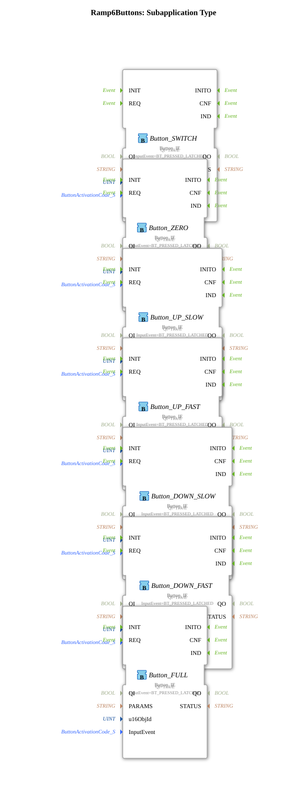

# Ramp6Buttons

* * * * * * * * * *
## Einleitung

`Ramp6Buttons` kapselt die **7 VT-Taster eines PWM-Kanals** — die 6 Ramp-Tasten (`0 -- - + ++ F`) plus den Kanal-Ein/Aus-Schalter — als eigene, wiederverwendbare SubApp. Sie wurde aus [`RampLimitFS_TO_logiBUS_QDA_PWM_OPC`](./RampLimitFS_TO_logiBUS_QDA_PWM_OPC.md) extrahiert, um dessen Netzwerk zu entlasten und die Tasten-Logik unabhängig wiederverwendbar zu machen.

## Verwendete Funktionsbausteine (FBs)

### Sub-Bausteine: Ramp6Buttons

- **Typ**: SubAppType
- **Verwendete interne FBs**:
    - **Button_SWITCH**, **Button_ZERO**, **Button_UP_SLOW**, **Button_UP_FAST**, **Button_DOWN_SLOW**, **Button_DOWN_FAST**, **Button_FULL**: je `isobus::UT::io::Button::Button_IE`
        - Parameter: `QI=TRUE`, `InputEvent=BT_PRESSED_LATCHED` (rastendes Drücken/Loslassen-Ereignis, kein Adapter-Bridging über `AX_RF_TRIG` nötig)
        - Dateneingang: `u16ObjId` (Objekt-ID der jeweiligen VT-Taste)
        - Ereignisausgang: `IND` (Taste gedrückt)
- **Funktionsweise**: Sieben gleichartige `Button_IE`-Instanzen, je an eine eigene VT-Objekt-ID gebunden, reichen ihr `IND`-Ereignis unverändert als eigenes SubApp-Ausgangsereignis nach außen durch — reine 1:1-Durchreichung ohne zusätzliche Logik.

## Programmablauf und Verbindungen

Für jeden der 7 Taster gilt dasselbe Muster (`u16ObjId_<NAME>` → `Button_<NAME>.u16ObjId`, `Button_<NAME>.IND` → `IND_<NAME>`):

- `u16ObjId_SWITCH` → `Button_SWITCH.u16ObjId`; `Button_SWITCH.IND` → `IND_SWITCH` (Kanal-Enable togglen)
- `u16ObjId_ZERO` → `Button_ZERO.u16ObjId`; `Button_ZERO.IND` → `IND_ZERO` (`RampLimitFS.ZERO`)
- `u16ObjId_UP_SLOW` → `Button_UP_SLOW.u16ObjId`; `Button_UP_SLOW.IND` → `IND_UP_SLOW` (`RampLimitFS.UP_SLOW`, ~1 %)
- `u16ObjId_UP_FAST` → `Button_UP_FAST.u16ObjId`; `Button_UP_FAST.IND` → `IND_UP_FAST` (`RampLimitFS.UP_FAST`, ~10 %)
- `u16ObjId_DOWN_SLOW` → `Button_DOWN_SLOW.u16ObjId`; `Button_DOWN_SLOW.IND` → `IND_DOWN_SLOW` (`RampLimitFS.DOWN_SLOW`, ~1 %)
- `u16ObjId_DOWN_FAST` → `Button_DOWN_FAST.u16ObjId`; `Button_DOWN_FAST.IND` → `IND_DOWN_FAST` (`RampLimitFS.DOWN_FAST`, ~10 %)
- `u16ObjId_FULL` → `Button_FULL.u16ObjId`; `Button_FULL.IND` → `IND_FULL` (`RampLimitFS.FULL`, 100 %)

Der aufrufende Baustein verdrahtet `IND_ZERO`/`IND_UP_SLOW`/`IND_UP_FAST`/`IND_DOWN_SLOW`/`IND_DOWN_FAST`/`IND_FULL` direkt auf die gleichnamigen Ereigniseingänge von `RampLimitFS` und `IND_SWITCH` auf den Kanal-Enable-Flipflop.

## Technische Besonderheiten

- **`BT_PRESSED_LATCHED` statt `Button_IXA`+`AX_RF_TRIG`**: einfacheres Muster ohne Adapter-Bridging, da `Button_IE` das Drücken-Ereignis direkt als `IND` ausgibt.
- **Event-Reihenfolge an `RampLimitFS` angeglichen**: Die Ausgangsevents (`SWITCH, ZERO, UP_SLOW, UP_FAST, DOWN_SLOW, DOWN_FAST, FULL`) folgen bewusst der Reihenfolge, in der `RampLimitFS` seine eigenen Ereigniseingänge deklariert, um die Zuordnung beim Verdrahten zu erleichtern.

## Anwendungsszenarien

- Jede Übung mit einem Rampen-Sollwert (`RampLimitFS` oder vergleichbar), der über 6 Tasten plus einen Freigabe-Schalter bedient werden soll.

## Zusammenfassung

`Ramp6Buttons` bündelt sieben gleichartige `Button_IE`-Instanzen zu einer einzigen wiederverwendbaren SubApp und hält damit die Tasten-Verdrahtung aus dem eigentlichen PWM-Kanal-Baustein heraus.

## 🛠️ Zugehörige Übungen

* [RampLimitFS_TO_logiBUS_QDA_PWM_OPC](./RampLimitFS_TO_logiBUS_QDA_PWM_OPC.md)
* [InputOutputTesterButton_PWM_OPC_UA](../../../../Uebungen/test_AX/Meins/InputOutputTester/Button_PWM_OPC_UA/InputOutputTesterButton_PWM_OPC_UA.md)

---

### 🌐 Passende Themen-Unterseiten auf ms-muc-docs.de

* [🌐 Eclipse 4diac IDE & Farb-Referenz auf ms-muc-docs.de](https://www.ms-muc-docs.de/iec-61499/eclipse-4diac/)
