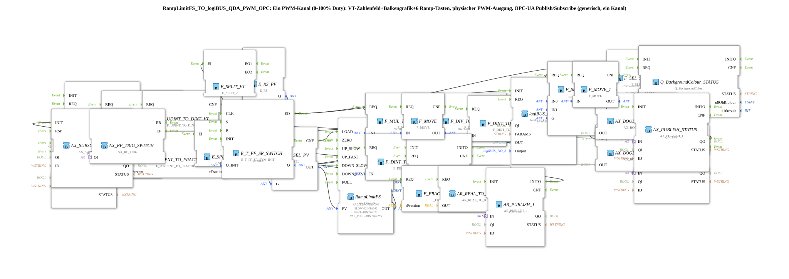

# RampLimitFS_TO_logiBUS_QDA_PWM_OPC

* * * * * * * * * *
## Einleitung

`RampLimitFS_TO_logiBUS_QDA_PWM_OPC` ist der wiederverwendbare Baustein für **einen einzelnen PWM-Ausgangskanal (0–100 % Duty)** mit VT-Zahlenfeld, Balkengrafik, 6 Ramp-Tasten, Kanal-Ein/Aus-Schalter, 3-Farben-Statusanzeige und bidirektionaler OPC-UA-Anbindung. Er wird 12× parametrisiert in [`InputOutputTesterButton_PWM_OPC_UA`](../../../../Uebungen/test_AX/Meins/InputOutputTester/Button_PWM_OPC_UA/InputOutputTesterButton_PWM_OPC_UA.md) instanziiert und ist das PWM-Pendant zum einfacheren, rein digitalen `RampLimitFS_TO_logiBUS_QDA_OPC`.

## Verwendete Funktionsbausteine (FBs)

### Sub-Bausteine: RampLimitFS_TO_logiBUS_QDA_PWM_OPC

- **Typ**: SubAppType
- **Verwendete interne FBs**:
    - **RampLimitFS**: `eclipse4diac::signalprocessing::RampLimitFS`
        - Parameter: `VAL_ZERO=DINT#0`, `SLOW=DINT#643` (~1 %), `FAST=DINT#6426` (~10 %), `VAL_FULL=DINT#64255`
        - Dateneingang: `PV` (Sollwert-Mux-Ausgang), Ereigniseingänge: `ZERO`/`UP_SLOW`/`UP_FAST`/`DOWN_SLOW`/`DOWN_FAST`/`FULL`/`LOAD`
        - Datenausgang: `OUT` (0–64255)
    - **Ramp6Buttons** (SubApp, `MyLib::sys`): kapselt die 7 VT-Taster (6 Ramp-Tasten + Kanal-Schalter), siehe [eigene Dokumentation](./Ramp6Buttons.md)
    - **F_PWM_PERCENT_TO_RAW** / **F_PWM_RAW_TO_PERCENT** (SubApp, `MyLib::sys`): Umrechnung Anteil 0.0-1.0 ↔ Fieldbus-Rohwert, siehe [F_PWM_PERCENT_TO_RAW](./F_PWM_PERCENT_TO_RAW.md) / [F_PWM_RAW_TO_PERCENT](./F_PWM_RAW_TO_PERCENT.md)
    - **F_PERCENT_TO_FRACTION_SUB** / **F_FRACTION_TO_PERCENT_PUB**: `logiBUS::signalprocessing::fieldbus::F_PERCENT_TO_FRACTION`/`F_FRACTION_TO_PERCENT` — Prozent 0-100 ↔ Anteil 0.0-1.0
    - **E_RS_PV** (`iec61499::events::E_RS`) + **F_SEL_PV** (`iec61131::selection::F_SEL`): Zwei-Quellen-Merge (VT-Zahlenfeld und Web-Sollwert) auf den einen Dateneingang `RampLimitFS.PV`, da 4diac IDE keine Mehrfachverbindung auf einen Dateneingang zulässt
    - **E_T_FF_SR_SYM_INIT** (`E_T_FF_SR_SWITCH`): Kanal-Enable-Zustand, gesetzt/rückgesetzt durch VT-Taster (`CLK`, echtes Toggle) und Web-Schreibzugriff (`S`/`R`, über `AX_RF_TRIG` erkannter Flankenwechsel, kein Toggle)
    - **F_MUL_TO_PWM13BIT**/**F_DIV_TO_PWM13BIT** (`iec61131::arithmetic::F_MUL`/`F_DIV`): rechnen `RampLimitFS.OUT` (0-64255) über `×8191 ÷ 64255` auf den 13-Bit-Rohwert (0-8191) für `logiBUS_QD_PWM.OUT` um
    - **logiBUS_QD_PWM**: physischer PWM-Ausgang (`Output`-Parameter identifiziert `Output_Q1`..`Q12`)
    - **F_SEL_OK_FAULT**/**F_SEL_STATUS** (`iec61131::selection::F_SEL`) + **Q_BackgroundColour**: 3-Farben-Statuslogik (Weiß=deaktiviert, Grün=aktiv+`QO`=TRUE, Rot=aktiv+`QO`=FALSE)
    - **AR_SUBSCRIBE_1**/**AR_PUBLISH_1**, **AX_SUBSCRIBE_1**/**AX_PUBLISH_1** (×2): OPC-UA-Adapter für Sollwert (REAL), Schalter (BOOL) und Status (BOOL)

- **Funktionsweise**: Zwei unabhängige Sollwertquellen — das VT-Zahlenfeld/die Ramp-Tasten und ein per OPC-UA-Subscribe empfangener Web-Prozentwert — werden über `E_RS`+`F_SEL` auf denselben `RampLimitFS`-Rampenbaustein gemuxt (die zuletzt aktive Quelle gewinnt). Der Rampenausgang (0-64255) geht dreifach weiter: als 13-Bit-Rohwert an den physischen `logiBUS_QD_PWM`-Ausgang, als Prozentwert zurück an das VT-Zahlenfeld/die Balkengrafik und als Prozentwert per OPC-UA-Publish an den Web-Client. Parallel togglet ein VT-Taster oder ein Web-Schreibzugriff den Kanal-Enable-Zustand (`E_T_FF_SR_SWITCH`), der über `logiBUS_QD_PWM.QI` den physischen Ausgang scharf-/unscharf schaltet und in die 3-Farben-Statusanzeige einfließt.

## Programmablauf und Verbindungen

1. **VT-Sollwertpfad**: `NumericValue_Duty.IND` (Zahlenfeld geändert) → `F_DWORD_TO_UDINT_VT` → `F_UDINT_TO_DINT_VT` → `E_SPLIT_VT` → einerseits `E_RS_PV.R` (Reset: "Web hat Vorrang, bis VT wieder aktiv wird" — siehe unten), andererseits `E_MERGE_SEL` → `F_SEL_PV.REQ`.
2. **Web-Sollwertpfad**: `AR_SUBSCRIBE_1` (OPC-UA-Subscribe, Prozent REAL) → `AR_R_TO_REAL_SUB` → `F_PERCENT_TO_FRACTION_SUB` (Prozent → Anteil) → `F_PWM_PERCENT_TO_RAW` (Anteil → Fieldbus-Rohwert) → `E_SPLIT_WEB` → einerseits `E_RS_PV.S` (Set: Web-Quelle aktiv), andererseits `E_MERGE_SEL` → `F_SEL_PV.REQ`.
3. **Mux und Rampe**: `E_RS_PV.Q` steuert `F_SEL_PV.G` (0=VT-Wert `IN0`, 1=Web-Wert `IN1`); `F_SEL_PV.OUT` lädt `RampLimitFS.PV` per `LOAD`-Event. `Ramp6Buttons` liefert zusätzlich die 6 Ramp-Ereignisse direkt an `RampLimitFS` (`ZERO`/`UP_SLOW`/`UP_FAST`/`DOWN_SLOW`/`DOWN_FAST`/`FULL`).
4. **Ausgabe (physisch)**: `RampLimitFS.OUT` (0-64255) → `F_MUL_TO_PWM13BIT` (×8191) → `F_DIV_TO_PWM13BIT` (÷64255) → `F_DINT_TO_DWORD_OUT` → `logiBUS_QD_PWM.OUT`.
5. **Ausgabe (VT-Anzeige)**: `RampLimitFS.OUT` → `F_DINT_TO_UDINT_DISP` → `Q_NumericValue.REQ` (aktualisiert Zahlenfeld + gemeinsam gebundene Balkengrafik).
6. **Ausgabe (OPC-UA-Publish)**: `RampLimitFS.OUT` → `F_PWM_RAW_TO_PERCENT` (Rohwert → Anteil) → `F_FRACTION_TO_PERCENT_PUB` (Anteil → Prozent) → `AR_REAL_TO_R_PUB` → `AR_PUBLISH_1`.
7. **Kanal-Schalter**: `Ramp6Buttons.IND_SWITCH` (VT-Taster) → `E_T_FF_SR_SWITCH.CLK` (togglet). `AX_SUBSCRIBE_SWITCH` (Web-Schreibzugriff, BOOL) → `AX_RF_TRIG_SWITCH` erkennt echten Flankenwechsel → `ER`→`S` / `EF`→`R` (setzt statt togglet, damit zwei gleiche Web-Schreibzugriffe nicht versehentlich invertieren). `bDefaultEnabled` speist `E_T_FF_SR_SWITCH.Q_INIT` für den Startzustand.
8. **Statuskette**: `E_T_FF_SR_SWITCH.Q` → `logiBUS_QD_PWM.QI` (scharf/unscharf) und → `F_SEL_STATUS.G`. `logiBUS_QD_PWM.INITO`/`.QO` speisen `F_SEL_OK_FAULT` (Rot/Grün nach `QO`), dessen Ergebnis über `F_SEL_STATUS` (Weiß, falls deaktiviert) an `Q_BackgroundColour_STATUS` geht. Zusätzlich spiegeln `AX_BOOL_TO_X_SWITCH`/`AX_PUBLISH_SWITCH` und `AX_BOOL_TO_X_STATUS`/`AX_PUBLISH_STATUS` Enable-Zustand und `QO` per OPC-UA-Publish an den Web-Client.
9. **Boot-Reihenfolge**: Die vier OPC-UA-Adapter werden strikt verkettet initialisiert (`AR_SUBSCRIBE_1.INITO → AR_PUBLISH_1.INIT → AX_SUBSCRIBE_SWITCH.INIT → AX_PUBLISH_SWITCH.INIT → AX_PUBLISH_STATUS.INIT`); erst danach feuert `AX_PUBLISH_STATUS.INITO` das `E_T_FF_SR_SWITCH.INIT`, damit der erste publizierte Enable-Zustand nicht von einem noch nicht bereiten Adapter verworfen wird.

## Technische Besonderheiten

- **Wertebereich**: Intern durchgängig SAE-J1939/ISO-11783-Fieldbus-Konvention `VALID_SIGNAL_W` (0-64255), nicht Prozent — vermeidet Rundungsfehler und ist konsistent mit `RampLimitFS`.
- **13-Bit-PWM-Rohwert**: `logiBUS_QD_PWM.OUT` erwartet empirisch bestätigt 0-8191 (nicht 0-64255) — daher die zusätzliche `×8191÷64255`-Umrechnungskette.
- **Mehrfachverbindungs-Workaround**: `E_RS`+`F_SEL` statt einer (in 4diac IDE nicht erlaubten) doppelten Datenverbindung auf `RampLimitFS.PV`.
- **Kein PERMIT-Gating**: Der Kanal-Schalter verdrahtet `QI` direkt als Datenverbindung (Muster aus `Uebung_094a`), keine `E_PERMIT`-Bausteine.
- **Set/Reset statt Toggle bei Web-Schreibzugriff**: `AX_RF_TRIG` + `E_T_FF_SR_SYM_INIT` statt eines reinen Toggle-Flipflops, damit wiederholte Schreibzugriffe mit demselben Wert nicht zufällig invertieren.

## Anwendungsszenarien

- Trainingsbeispiel für analoge (PWM-)Ausgänge mit Fernbedienung über OPC-UA/Web, parallel zur klassischen VT-Bedienung.
- Vorlage für beliebige weitere Mehrkanal-Analogausgang-Übungen mit Sollwert-Ramping und Kanal-Freigabe.

## Vergleich mit ähnlichen Bausteinen

Gegenüber dem einfacheren, rein digitalen Pendant unterscheidet sich `RampLimitFS_TO_logiBUS_QDA_PWM_OPC` durch den analogen Sollwert (Rampe statt Bit), die zusätzliche Skalierungskette (Prozent ↔ Anteil ↔ Fieldbus-Rohwert ↔ 13-Bit-PWM) und die 3-Farben- statt 2-Farben-Statuslogik.

## Zusammenfassung

`RampLimitFS_TO_logiBUS_QDA_PWM_OPC` kapselt einen vollständigen PWM-Kanal — Sollwert-Ramping, Zwei-Quellen-Mux zwischen VT und Web, Skalierung auf den physischen 13-Bit-PWM-Ausgang, Kanal-Enable-Schalter mit robustem Set/Reset-Verhalten und 3-Farben-Statusrückmeldung — in einem einzigen, 12-fach wiederverwendbaren Baustein.

## 🛠️ Zugehörige Übungen

* [InputOutputTesterButton_PWM_OPC_UA](../../../../Uebungen/test_AX/Meins/InputOutputTester/Button_PWM_OPC_UA/InputOutputTesterButton_PWM_OPC_UA.md)

---

### 🌐 Passende Themen-Unterseiten auf ms-muc-docs.de

* [🌐 Eclipse 4diac IDE & Farb-Referenz auf ms-muc-docs.de](https://www.ms-muc-docs.de/iec-61499/eclipse-4diac/)
