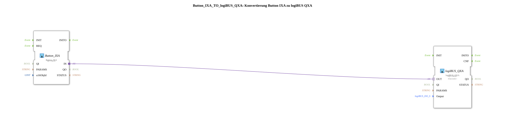

# Button_IXA_TO_logiBUS_QXA

* * * * * * * * * *
## Einleitung

`Button_IXA_TO_logiBUS_QXA` verbindet einen VT-Taster (`Button_IXA`) direkt mit einem physischen digitalen Ausgang (`logiBUS_QXA`) — die einfachste Form eines VT-schaltbaren Ausgangs, ohne Statusanzeige und ohne OPC-UA. Für die Variante mit VT-Statusfarbe siehe [`Button_IXA_TO_logiBUS_QXA_BG`](./Button_IXA_TO_logiBUS_QXA_BG.md).

## Verwendete Funktionsbausteine (FBs)

### Sub-Bausteine: Button_IXA_TO_logiBUS_QXA

- **Typ**: SubAppType
- **Verwendete interne FBs**:
    - **Button_IXA**: `isobus::UT::io::Button::Button_IXA` — VT-Taster-Adapter, `QI=TRUE`, `u16ObjId` identifiziert die VT-Taste.
    - **logiBUS_QXA**: `logiBUS::io::DQ::logiBUS_QXA` — physischer digitaler Ausgang, `QI=TRUE`.
- **Funktionsweise**: Der Adapter-Ausgang des Tasters wird direkt auf den Adapter-Eingang des physischen Ausgangs verdrahtet — keine Zwischenlogik.

## Programmablauf und Verbindungen

1. `u16ObjId` → `Button_IXA.u16ObjId`; `Output` → `logiBUS_QXA.Output`.
2. `Button_IXA.IN` (Adapter) → `logiBUS_QXA.OUT` (Adapter) — direkte Durchschaltung.

## Anwendungsszenarien

- Minimaler VT-Taster-zu-Ausgang-Baustein für Übungen, die noch keine Statusanzeige oder Fernbedienung benötigen.

## Zusammenfassung

Die einfachste Bausteinvariante dieser Familie: ein VT-Taster direkt auf einen physischen Ausgang, ohne Zusatzfunktion.

---

### 🌐 Passende Themen-Unterseiten auf ms-muc-docs.de

* [🌐 Eclipse 4diac IDE & Farb-Referenz auf ms-muc-docs.de](https://www.ms-muc-docs.de/iec-61499/eclipse-4diac/)
