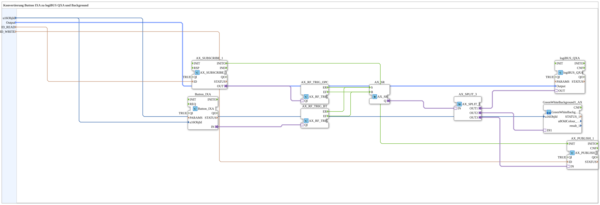

# Button_IXA_TO_logiBUS_QXA_BG_OPC

* * * * * * * * * *
## Einleitung

`Button_IXA_TO_logiBUS_QXA_BG_OPC` erweitert [`Button_IXA_TO_logiBUS_QXA_BG`](./Button_IXA_TO_logiBUS_QXA_BG.md) um eine bidirektionale OPC-UA-Anbindung: der Ausgangszustand kann sowohl vom VT-Taster als auch von außen per OPC-UA gesetzt werden (Set/Reset-Logik über `AX_SR`), und der resultierende Zustand wird per OPC-UA zurückgemeldet.

## Verwendete Funktionsbausteine (FBs)

### Sub-Bausteine: Button_IXA_TO_logiBUS_QXA_BG_OPC

- **Typ**: SubAppType
- **Verwendete interne FBs**:
    - **Button_IXA**: `isobus::UT::io::Button::Button_IXA` — VT-Taster-Adapter, `QI=TRUE`.
    - **AX_SUBSCRIBE_1**: `adapter::net::AX_SUBSCRIBE_1` — abonniert einen externen BOOL-Sollwert per OPC-UA, Adresse `ID_READ`, `QI=TRUE`.
    - **AX_RF_TRIG_BT**, **AX_RF_TRIG_OPC** (beide Typ `AX_RF_TRIG`): `adapter::events::unidirectional::AX_RF_TRIG` — erkennen steigende/fallende Flanke (`ER`/`EF`) am Taster- bzw. am OPC-UA-Eingang.
    - **AX_SR**: `adapter::events::unidirectional::AX_SR` — Set/Reset-Speicherglied: wird von beiden Flankendetektoren gesetzt (`S`) bzw. zurückgesetzt (`R`), unabhängig davon, ob die steigende Flanke vom Taster oder von OPC-UA kommt.
    - **AX_SPLIT_3**: `adapter::events::unidirectional::AX_SPLIT_3` — verzweigt den gespeicherten Zustand auf drei Ausgänge.
    - **logiBUS_QXA**: `logiBUS::io::DQ::logiBUS_QXA` — physischer digitaler Ausgang, `QI=TRUE`.
    - **GreenWhiteBackground1_AX** (SubApp): `MyLib::sys::GreenWhiteBackground1_AX` — VT-Hintergrundfarbanzeige, siehe [Background-Farbbausteine (gemeinsames Muster)](./Background-Farbbausteine.md).
    - **AX_PUBLISH_1**: `adapter::net::AX_PUBLISH_1` — publiziert den resultierenden Zustand per OPC-UA, Adresse `ID_WRITE`, `QI=TRUE`.
- **Funktionsweise**: Sowohl der VT-Taster als auch ein externer OPC-UA-Schreibzugriff können den `AX_SR`-Speicher toggeln (steigende Flanke = setzen, fallende Flanke = zurücksetzen, symmetrisch für beide Quellen); der gespeicherte Zustand wird dreifach verwendet: physischer Ausgang, VT-Hintergrundfarbe, OPC-UA-Rückmeldung.

## Programmablauf und Verbindungen

1. `u16ObjId` → `Button_IXA.u16ObjId` und `GreenWhiteBackground1_AX.u16ObjId`; `Output` → `logiBUS_QXA.Output`; `ID_READ` → `AX_SUBSCRIBE_1.ID`; `ID_WRITE` → `AX_PUBLISH_1.ID`.
2. `Button_IXA.IN` (Adapter) → `AX_RF_TRIG_BT.QI`; `AX_SUBSCRIBE_1.OUT` (Adapter) → `AX_RF_TRIG_OPC.QI`.
3. `AX_RF_TRIG_BT.ER`/`AX_RF_TRIG_OPC.ER` → `AX_SR.S`; `AX_RF_TRIG_BT.EF`/`AX_RF_TRIG_OPC.EF` → `AX_SR.R`.
4. `AX_SR.Q` (Adapter) → `AX_SPLIT_3.IN`.
5. `AX_SPLIT_3.OUT1` → `logiBUS_QXA.OUT`; `AX_SPLIT_3.OUT2` → `GreenWhiteBackground1_AX.DI1`; `AX_SPLIT_3.OUT3` → `AX_PUBLISH_1.IN`.
6. `AX_SUBSCRIBE_1.INITO` → `AX_PUBLISH_1.INIT` (initiale Publikation beim Start).

## Technische Besonderheiten

- Die Set/Reset-Logik über `AX_SR` erlaubt es, dass Taster und OPC-UA-Sollwert gleichberechtigt denselben Ausgangszustand steuern, ohne dass eine Quelle Vorrang hat — beide Flankendetektoren speisen dieselben `S`/`R`-Eingänge.
- Volle bidirektionale OPC-UA-Kopplung: `AX_SUBSCRIBE_1` (lesen/steuern von außen) und `AX_PUBLISH_1` (Zustand nach außen melden) sind unabhängig voneinander adressierbar (`ID_READ` vs. `ID_WRITE`).

## Anwendungsszenarien

- VT-Taster mit physischem Ausgang und Statusanzeige, der zusätzlich von einer übergeordneten Leitwarte per OPC-UA ferngesteuert und dessen Zustand dort überwacht werden soll.

## Zusammenfassung

Voll ausgebaute Variante der Button-zu-Ausgang-Familie mit bidirektionaler OPC-UA-Anbindung über eine gemeinsame Set/Reset-Speicherlogik.

---

### 🌐 Passende Themen-Unterseiten auf ms-muc-docs.de

* [🌐 Eclipse 4diac IDE & Farb-Referenz auf ms-muc-docs.de](https://www.ms-muc-docs.de/iec-61499/eclipse-4diac/)
