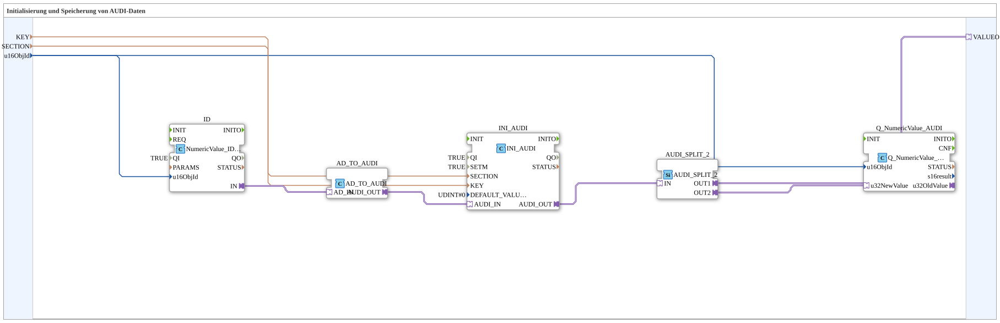

# INI_IN_AND_STORE_AUDI

* * * * * * * * * *
## Einleitung

`INI_IN_AND_STORE_AUDI` speichert einen über VT eingegebenen UDINT-Wert (AUDI-Adapter) persistent in einer INI-Datei.

Allgemeines Muster siehe [INI_IN_AND_STORE / NVS_IN_AND_STORE (gemeinsames Muster)](./INI-NVS-Speicherbausteine.md).

## Zusammenfassung

AUDI-Variante (UDINT) der INI-Speicherfamilie.

---

### 🌐 Passende Themen-Unterseiten auf ms-muc-docs.de

* [🌐 Eclipse 4diac IDE & Farb-Referenz auf ms-muc-docs.de](https://www.ms-muc-docs.de/iec-61499/eclipse-4diac/)
