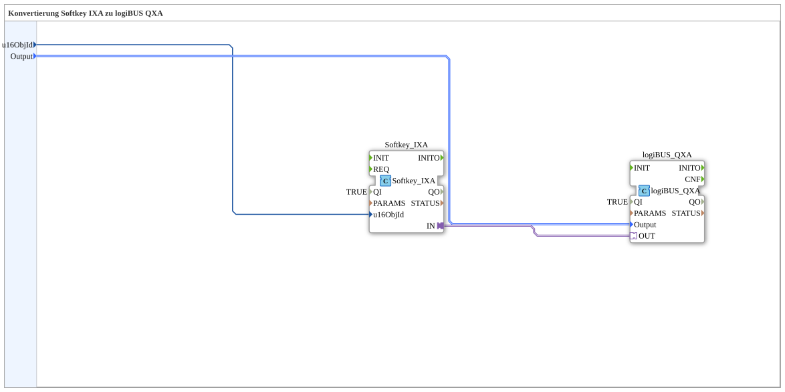

# Softkey_IXA_TO_logiBUS_QXA

* * * * * * * * * *
## Einleitung

`Softkey_IXA_TO_logiBUS_QXA` verbindet einen VT-Softkey (`Softkey_IXA`) direkt mit einem physischen digitalen Ausgang (`logiBUS_QXA`) — funktional identisch zu [`Button_IXA_TO_logiBUS_QXA`](./Button_IXA_TO_logiBUS_QXA.md), aber für Softkeys statt Buttons.

## Verwendete Funktionsbausteine (FBs)

### Sub-Bausteine: Softkey_IXA_TO_logiBUS_QXA

- **Typ**: SubAppType
- **Verwendete interne FBs**:
    - **Softkey_IXA**: `isobus::UT::io::Softkey::Softkey_IXA` — VT-Softkey-Adapter, `QI=TRUE`.
    - **logiBUS_QXA**: `logiBUS::io::DQ::logiBUS_QXA` — physischer digitaler Ausgang.
- **Funktionsweise**: Direkte Adapterverbindung `Softkey_IXA.IN` → `logiBUS_QXA.OUT`, keine Zwischenlogik.

## Programmablauf und Verbindungen

1. `u16ObjId` → `Softkey_IXA.u16ObjId`; `Output` → `logiBUS_QXA.Output`.
2. `Softkey_IXA.IN` → `logiBUS_QXA.OUT`.

## Anwendungsszenarien

- Minimaler Softkey-zu-Ausgang-Baustein ohne Statusanzeige oder Fernbedienung.

## Zusammenfassung

Softkey-Pendant zu `Button_IXA_TO_logiBUS_QXA` — identisches Muster, anderer Tastertyp.

---

### 🌐 Passende Themen-Unterseiten auf ms-muc-docs.de

* [🌐 Eclipse 4diac IDE & Farb-Referenz auf ms-muc-docs.de](https://www.ms-muc-docs.de/iec-61499/eclipse-4diac/)
