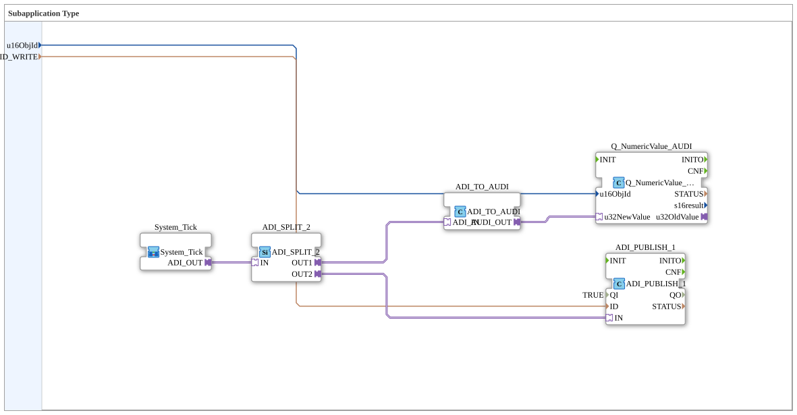

# SystemTickSender

* * * * * * * * * *
## Einleitung

`SystemTickSender` kombiniert den Heartbeat-Zähler [`System_Tick`](./System_Tick.md) mit einer VT-Zahlenfeld-Anzeige und einer OPC-UA-Publikation: der 200-ms-Zählerwert wird sowohl lokal auf dem VT angezeigt als auch nach außen gemeldet — nützlich, um von einer übergeordneten Leitwarte aus zu erkennen, dass die Steuerung aktiv zyklisch arbeitet.

## Verwendete Funktionsbausteine (FBs)

### Sub-Bausteine: SystemTickSender

- **Typ**: SubAppType
- **Verwendete interne FBs**:
    - **System_Tick** (SubApp): `MyLib::sys::System_Tick` — autonomer 200-ms-Heartbeat-Zähler (siehe [System_Tick](./System_Tick.md)), liefert den Zählerwert als `ADI`-Adapter (DINT).
    - **ADI_SPLIT_2**: `adapter::events::unidirectional::ADI_SPLIT_2` — verzweigt den DINT-Adapterwert auf zwei Ausgänge.
    - **ADI_TO_AUDI**: `adapter::conversion::unidirectional::ADI_TO_AUDI` — wandelt den DINT-Wert in UDINT für das VT-Zahlenfeld.
    - **Q_NumericValue_AUDI**: `isobus::UT::Q::Q_NumericValue_AUDI` — schreibt den Zählerwert in das VT-Zahlenfeld `u16ObjId`.
    - **ADI_PUBLISH_1**: `adapter::net::ADI_PUBLISH_1` — publiziert den Zählerwert (DINT) per OPC-UA, Zieladresse `ID_WRITE`, `QI=TRUE`.
- **Funktionsweise**: Der Heartbeat-Zähler wird über `ADI_SPLIT_2` verdoppelt: ein Zweig geht über `ADI_TO_AUDI` an das VT-Zahlenfeld, der andere direkt an die OPC-UA-Publikation.

## Programmablauf und Verbindungen

1. `u16ObjId` → `Q_NumericValue_AUDI.u16ObjId`; `ID_WRITE` → `ADI_PUBLISH_1.ID`.
2. `System_Tick.ADI_OUT` (Adapter) → `ADI_SPLIT_2.IN` (Adapter).
3. `ADI_SPLIT_2.OUT1` → `ADI_TO_AUDI.ADI_IN`; `ADI_TO_AUDI.AUDI_OUT` → `Q_NumericValue_AUDI.u32NewValue` (VT-Zweig).
4. `ADI_SPLIT_2.OUT2` → `ADI_PUBLISH_1.IN` (OPC-UA-Zweig).

## Anwendungsszenarien

- Sichtbares Heartbeat-Signal für den Anlagenbediener am VT und gleichzeitig für eine übergeordnete Leitwarte per OPC-UA, um zu erkennen, dass die Steuerung aktiv läuft (Lebenszeichen-Überwachung).

## Zusammenfassung

Kombiniert den autonomen `System_Tick`-Heartbeat-Zähler mit VT-Anzeige und OPC-UA-Publikation zu einem vollständig sichtbaren Lebenszeichen-Signal.

---

### 🌐 Passende Themen-Unterseiten auf ms-muc-docs.de

* [🌐 Eclipse 4diac IDE & Farb-Referenz auf ms-muc-docs.de](https://www.ms-muc-docs.de/iec-61499/eclipse-4diac/)
