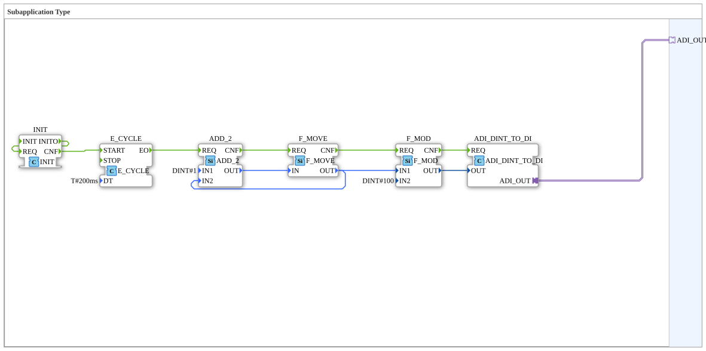

# System_Tick

* * * * * * * * * *
## Einleitung

`System_Tick` erzeugt einen fortlaufenden, zyklisch inkrementierten DINT-Zähler (200-ms-Takt, Wertebereich 1..100, danach Rücksprung auf 1 via Modulo) und stellt ihn über einen `ADI`-Adapter (DINT) für andere Bausteine bereit — ein einfacher "Lebenszeichen"- bzw. Heartbeat-Zähler.

## Verwendete Funktionsbausteine (FBs)

### Sub-Bausteine: System_Tick

- **Typ**: SubAppType
- **Verwendete interne FBs**:
    - **INIT**: `iec61131::booleanOperators::INIT` — feuert einmalig beim Start (`INITO` → `REQ` rückgekoppelt) und startet darüber den Zyklus-Timer.
    - **E_CYCLE**: `iec61499::events::E_CYCLE` — zyklisches Ereignis, `DT=T#200ms`, gestartet über `INIT.CNF`.
    - **ADD_2**: `iec61131::arithmetic::ADD_2` — addiert `IN1=DINT#1` auf den aktuellen Zählerwert (`IN2`, rückgekoppelt aus `F_MOVE.OUT`).
    - **F_MOVE**: `iec61131::selection::F_MOVE` (`DataType=DINT`) — hält/übergibt den aktuellen Zählerwert, dient als Zwischenspeicher der Rückkopplungsschleife.
    - **F_MOD**: `iec61131::arithmetic::F_MOD` — Modulo-Operation mit `IN2=DINT#100`, begrenzt den Wertebereich auf 0..99.
    - **ADI_DINT_TO_DI**: `adapter::conversion::unidirectional::ADI_DINT_TO_DI` — wandelt den DINT-Wert in den `ADI_OUT`-Adapter zur externen Nutzung.
- **Funktionsweise**: `INIT` startet den `E_CYCLE`-Timer; jeder Zyklus erhöht den Zählerwert über `ADD_2`/`F_MOVE` um 1, `F_MOD` hält ihn im Bereich 0..99, und `ADI_DINT_TO_DI` legt das Ergebnis auf den Ausgangsadapter.

## Programmablauf und Verbindungen

1. `INIT.INITO` → `INIT.REQ` (Selbstauslösung beim Start); `INIT.CNF` → `E_CYCLE.START`.
2. `E_CYCLE.EO` → `ADD_2.REQ` (alle 200 ms).
3. `F_MOVE.OUT` → `ADD_2.IN2` (Rückkopplung des aktuellen Werts); `ADD_2.OUT` → `F_MOVE.IN`.
4. `ADD_2.CNF` → `F_MOVE.REQ` → `F_MOD.REQ` (Ereigniskette); `F_MOVE.OUT` → `F_MOD.IN1`.
5. `F_MOD.CNF` → `ADI_DINT_TO_DI.REQ`; `F_MOD.OUT` → `ADI_DINT_TO_DI.OUT`.
6. `ADI_DINT_TO_DI.ADI_OUT` (Adapter) → `ADI_OUT` (SubApp-Schnittstelle).

## Technische Besonderheiten

- Der Zähler läuft rein intern im Baustein (keine externen Dateneingänge) — er ist ein autonomer Taktgeber, der sich selbst über `INIT` anstößt.
- Die Modulo-Grenze `DINT#100` ergibt einen Wertebereich von 0..99, nicht 1..100 wie man beim ersten Blick vermuten könnte — der Startwert nach `INIT` ist implizit 0, danach zählt `ADD_2` jeden Zyklus um 1 hoch.

## Anwendungsszenarien

- Heartbeat- oder Lebenszeichen-Signal für Diagnosezwecke, z. B. um auf dem VT oder per OPC-UA sichtbar zu machen, dass die Steuerung aktiv zyklisch arbeitet.
- Einfacher Sekundentakt-Ersatz (5 Zyklen à 200 ms ≈ 1 s) für Testzwecke, ohne dass ein dedizierter Zeitbaustein konfiguriert werden muss.

## Zusammenfassung

Autonomer, selbstauslösender 200-ms-Zähler mit Modulo-Begrenzung, bereitgestellt über einen DINT-Adapter — ein einfacher Heartbeat-Baustein.

---

### 🌐 Passende Themen-Unterseiten auf ms-muc-docs.de

* [🌐 Eclipse 4diac IDE & Farb-Referenz auf ms-muc-docs.de](https://www.ms-muc-docs.de/iec-61499/eclipse-4diac/)
