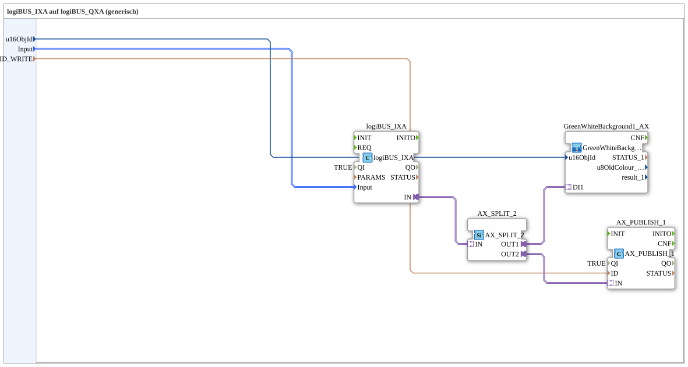

# logiBUS_IXA_BG_OPC

* * * * * * * * * *
## Einleitung

`logiBUS_IXA_BG_OPC` erweitert [`logiBUS_IXA_BG`](./logiBUS_IXA_BG.md) um eine OPC-UA-Rückmeldung: der physische Eingangszustand wird sowohl als VT-Hintergrundfarbe (`GreenWhiteBackground1_AX`) angezeigt als auch per `AX_PUBLISH_1` als BOOL-Wert nach außen publiziert. Der Signalpfad wird dazu mit `AX_SPLIT_2` verzweigt.

## Verwendete Funktionsbausteine (FBs)

### Sub-Bausteine: logiBUS_IXA_BG_OPC

- **Typ**: SubAppType
- **Verwendete interne FBs**:
    - **logiBUS_IXA**: `logiBUS::io::DI::logiBUS_IXA` — physischer digitaler Eingang, `QI=TRUE`.
    - **AX_SPLIT_2**: `adapter::events::unidirectional::AX_SPLIT_2` — verzweigt den BOOL-Adapterwert auf zwei unabhängige Ausgänge (`OUT1`, `OUT2`).
    - **GreenWhiteBackground1_AX** (SubApp): `MyLib::sys::GreenWhiteBackground1_AX` — VT-Hintergrundfarbanzeige, siehe [Background-Farbbausteine (gemeinsames Muster)](./Background-Farbbausteine.md).
    - **AX_PUBLISH_1**: `adapter::net::AX_PUBLISH_1` — publiziert einen BOOL-Wert per OPC-UA, `QI=TRUE`, Zieladresse über `ID_WRITE`.
- **Funktionsweise**: Der Eingangswert wird über `AX_SPLIT_2` dupliziert; ein Pfad speist die VT-Statusanzeige, der andere die OPC-UA-Publikation.

## Programmablauf und Verbindungen

1. `Input` → `logiBUS_IXA.Input`; `u16ObjId` → `GreenWhiteBackground1_AX.u16ObjId`; `ID_WRITE` → `AX_PUBLISH_1.ID`.
2. `logiBUS_IXA.IN` (Adapter) → `AX_SPLIT_2.IN` (Adapter).
3. `AX_SPLIT_2.OUT1` → `GreenWhiteBackground1_AX.DI1`.
4. `AX_SPLIT_2.OUT2` → `AX_PUBLISH_1.IN`.

## Anwendungsszenarien

- Physischer digitaler Eingang, dessen Zustand sowohl lokal auf dem VT sichtbar sein als auch von einer übergeordneten Leitwarte per OPC-UA gelesen werden soll (z. B. Endschalter- oder Störmeldungen).

## Zusammenfassung

VT-Statusanzeige plus OPC-UA-Publikation eines physischen digitalen Eingangs, per `AX_SPLIT_2` aus einem gemeinsamen Adapterwert abgeleitet.

---

### 🌐 Passende Themen-Unterseiten auf ms-muc-docs.de

* [🌐 Eclipse 4diac IDE & Farb-Referenz auf ms-muc-docs.de](https://www.ms-muc-docs.de/iec-61499/eclipse-4diac/)
