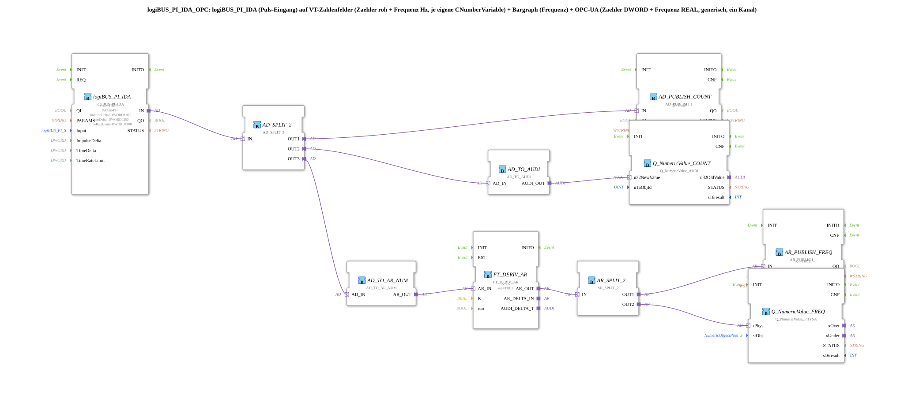

# logiBUS_PI_IDA_OPC

* * * * * * * * * *
## Einleitung

`logiBUS_PI_IDA_OPC` bindet einen physischen Puls-/Zähler-Eingang (`logiBUS_PI_IDA`) an zwei unabhängige VT-Zahlenfelder (roher Zählerstand und daraus abgeleitete Frequenz in Hz) sowie an OPC-UA an: der rohe Zählerstand (DWORD) wird direkt publiziert, die Frequenz wird per zeitlicher Ableitung (`FT_DERIV_AR`) aus dem Zählerstand berechnet und separat publiziert (REAL, physikalisch skaliert über `NumericObjectPool_S`).

## Verwendete Funktionsbausteine (FBs)

### Sub-Bausteine: logiBUS_PI_IDA_OPC

- **Typ**: SubAppType
- **Verwendete interne FBs**:
    - **logiBUS_PI_IDA**: `logiBUS::io::PI::logiBUS_PI_IDA` — physischer Puls-Eingang, `ImpulseDelta=DWORD#100`, `TimeDelta=DWORD#250`, `TimeRateLimit=DWORD#100`, `QI=TRUE`.
    - **AD_SPLIT_2** (Typ `AD_SPLIT_3`): `adapter::events::unidirectional::AD_SPLIT_3` — verzweigt den DWORD-Zählerwert auf drei Ausgänge.
    - **AD_PUBLISH_COUNT** (Typ `AD_PUBLISH_1`): `adapter::net::AD_PUBLISH_1` — publiziert den rohen Zählerstand per OPC-UA, Zieladresse `ID_COUNT_WRITE`.
    - **AD_TO_AUDI**: `adapter::conversion::unidirectional::AD_TO_AUDI` — Bit-Reinterpretation DWORD→UDINT für das VT-Zählerfeld.
    - **Q_NumericValue_COUNT** (Typ `Q_NumericValue_AUDI`): `isobus::UT::Q::Q_NumericValue_AUDI` — schreibt den rohen Zählerstand in `u16ObjId_COUNTVAR`.
    - **AD_TO_AR_NUM**: `adapter::conversion::unidirectional::AD_TO_AR_NUM` — numerisch korrekte Umwandlung DWORD-Zählerstand → REAL für die Ableitung.
    - **FT_DERIV_AR**: `OSCAT_adapter::Control::FT_DERIV_AR` — zeitliche Ableitung (`K=1.0`, `run=TRUE`), liefert die Änderungsrate des Zählerstands = Frequenz in Hz.
    - **AR_SPLIT_2**: `adapter::events::unidirectional::AR_SPLIT_2` — verzweigt den Frequenzwert auf zwei Ausgänge.
    - **AR_PUBLISH_FREQ** (Typ `AR_PUBLISH_1`): `adapter::net::AR_PUBLISH_1` — publiziert die Frequenz per OPC-UA, Zieladresse `ID_FREQ_WRITE`.
    - **Q_NumericValue_FREQ** (Typ `Q_NumericValue_PHYSA`): `isobus::UT::Q::Q_NumericValue_PHYSA` — schreibt die Frequenz physikalisch skaliert (`stObjFreq`: `r32Scale`, `i32Offset`, `u8Decimals`) in das VT-Zahlenfeld/Bargraph.
- **Funktionsweise**: Der rohe Zählerstand wird verdreifacht: ein Zweig geht direkt an die OPC-UA-Publikation, ein zweiter über `AD_TO_AUDI` an das VT-Zählerfeld, ein dritter über `AD_TO_AR_NUM` und `FT_DERIV_AR` zur Frequenzberechnung, deren Ergebnis wiederum verdoppelt wird (OPC-UA-Publikation und VT-Anzeige).

## Programmablauf und Verbindungen

1. `Input` → `logiBUS_PI_IDA.Input`; `u16ObjId_COUNTVAR` → `Q_NumericValue_COUNT.u16ObjId`; `stObjFreq` → `Q_NumericValue_FREQ.stObj`; `ID_COUNT_WRITE` → `AD_PUBLISH_COUNT.ID`; `ID_FREQ_WRITE` → `AR_PUBLISH_FREQ.ID`.
2. `logiBUS_PI_IDA.IN` (Adapter) → `AD_SPLIT_2.IN` (Adapter).
3. `AD_SPLIT_2.OUT1` → `AD_PUBLISH_COUNT.IN` (Zählerstand-OPC-UA-Zweig).
4. `AD_SPLIT_2.OUT2` → `AD_TO_AUDI.AD_IN`; `AD_TO_AUDI.AUDI_OUT` → `Q_NumericValue_COUNT.u32NewValue` (VT-Zählerstand-Zweig).
5. `AD_SPLIT_2.OUT3` → `AD_TO_AR_NUM.AD_IN`; `AD_TO_AR_NUM.AR_OUT` → `FT_DERIV_AR.AR_IN`; `FT_DERIV_AR.AR_OUT` → `AR_SPLIT_2.IN` (Frequenz-Berechnungszweig).
6. `AR_SPLIT_2.OUT1` → `AR_PUBLISH_FREQ.IN` (Frequenz-OPC-UA-Zweig).
7. `AR_SPLIT_2.OUT2` → `Q_NumericValue_FREQ.rPhys` (Frequenz-VT-Zweig).

## Technische Besonderheiten

- Die Frequenz wird nicht vom Hardware-FB selbst geliefert, sondern rein aus der zeitlichen Ableitung (`FT_DERIV_AR`, `K=1.0`) des rohen, monoton wachsenden Zählerstands berechnet — der Zähler selbst wird nie zurückgesetzt.
- `AD_TO_AR_NUM` statt `AD_TO_AR` wird bewusst verwendet, um eine numerisch korrekte DWORD→REAL-Umwandlung zu erhalten statt einer Bit-Reinterpretation (dieselbe Falle wie bei [`F_AI_RAW_TO_PERCENT_AD`](./F_AI_RAW_TO_PERCENT_AD.md) beschrieben).
- Zählerstand und Frequenz nutzen unabhängige VT-Zahlenfelder (`u16ObjId_COUNTVAR` und `stObjFreq`) mit unterschiedlicher Skalierung — die Frequenz-Anzeige nutzt zusätzlich `NumericObjectPool_S` für physikalisches Scaling/Decimals, der Zählerstand nicht.

## Anwendungsszenarien

- Durchflusszähler oder Drehzahlmesser, bei denen sowohl der rohe (unbegrenzt wachsende) Zählerstand für Diagnosezwecke als auch eine daraus abgeleitete, sofort interpretierbare Frequenz (z. B. Hz, U/min) angezeigt und übertragen werden sollen.

## Zusammenfassung

Vollständige VT- und OPC-UA-Anbindung eines physischen Puls-Eingangs mit parallelem rohem Zählerstand und daraus per zeitlicher Ableitung berechneter Frequenz.

---

### 🌐 Passende Themen-Unterseiten auf ms-muc-docs.de

* [🌐 Eclipse 4diac IDE & Farb-Referenz auf ms-muc-docs.de](https://www.ms-muc-docs.de/iec-61499/eclipse-4diac/)
