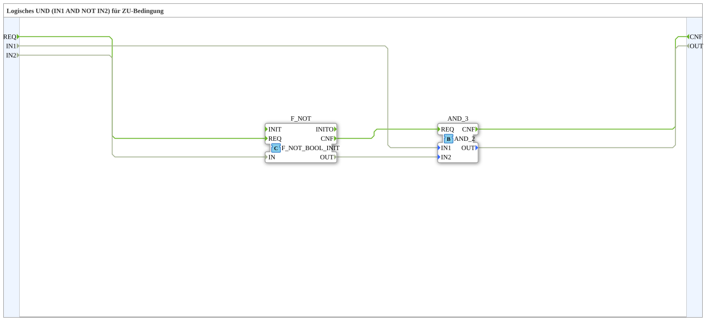

# AND_ZU

* * * * * * * * * *
## Einleitung

`AND_ZU` bildet die logische Verknüpfung `IN1 AND NOT IN2` und liefert damit die Freigabebedingung für eine "ZU"-Bewegung (z. B. Ventil/Klappe schließen): `IN1` muss erfüllt und `IN2` muss negiert erfüllt sein. Komplementär zu [`AND_AUF`](./AND_AUF.md).

## Verwendete Funktionsbausteine (FBs)

### Sub-Bausteine: AND_ZU

- **Typ**: SubAppType
- **Verwendete interne FBs**:
    - **F_NOT** (`F_NOT`): `iec61131::booleanOperators::F_NOT_BOOL_INIT` — negiert `IN2`, bevor verundet wird.
    - **AND_3** (`AND_2`-Typ): `iec61131::bitwiseOperators::AND_2` — verundet `IN1` mit dem negierten `IN2`.
- **Funktionsweise**: `REQ` löst zuerst `F_NOT` aus, dessen `CNF` wiederum `AND_3` auslöst — die Negation erfolgt somit vor der Verundung, sowohl datentechnisch als auch ereignistechnisch sequenziell.

## Programmablauf und Verbindungen

1. `REQ` → `F_NOT.REQ`; `IN2` → `F_NOT.IN`.
2. `F_NOT.CNF` → `AND_3.REQ` (Ereigniskette).
3. `IN1` → `AND_3.IN1`; `F_NOT.OUT` → `AND_3.IN2`.
4. `AND_3.OUT` → `OUT`; `AND_3.CNF` → `CNF`.

## Anwendungsszenarien

- Freigabelogik für Schließen-Bewegungen, bei denen eine Bedingung erfüllt und eine zweite explizit *nicht* erfüllt sein darf (z. B. Freigabe-Taste UND Endschalter AUF nicht aktiv).

## Zusammenfassung

Erweiterung von `AND_AUF` um eine Negation von `IN2` — die passende Gegenstück-Logik für die ZU-Bedingung einer Ventil-/Klappensteuerung.

---

### 🌐 Passende Themen-Unterseiten auf ms-muc-docs.de

* [🌐 Eclipse 4diac IDE & Farb-Referenz auf ms-muc-docs.de](https://www.ms-muc-docs.de/iec-61499/eclipse-4diac/)
