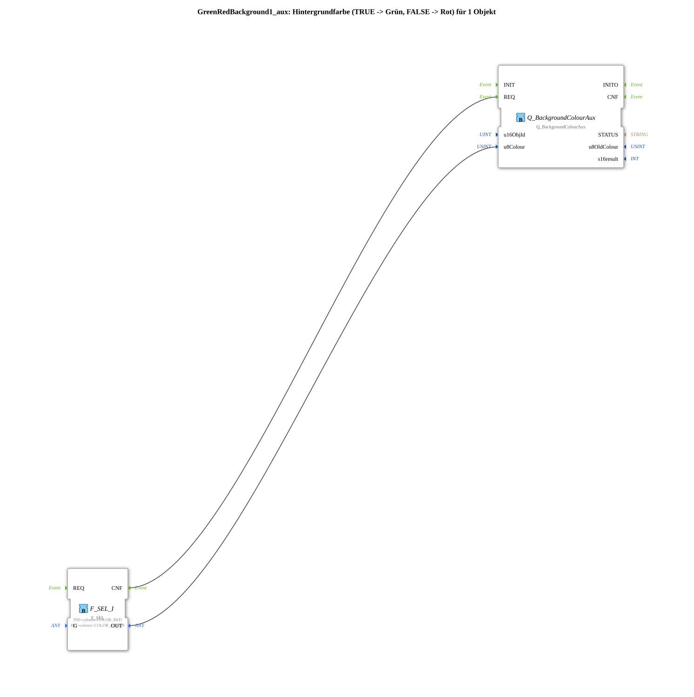

# GreenRedBackground1_aux

* * * * * * * * * *
## Einleitung

`GreenRedBackground1_aux` schaltet die VT-Hintergrundfarbe eines Objekts anhand eines booleschen Selector-Signals: `TRUE` → **Grün**, `FALSE` → **Rot**. Das Selector-Signal kommt als einfacher `BOOL`-Dateneingang (`DI1`). Die Objekt-ID wird über den Eingang `u16ObjId` übergeben.

Allgemeines Muster (Selector → `AX_SEL`/`F_SEL` → `Q_BackgroundColour`) siehe [Background-Farbbausteine (gemeinsames Muster)](../../MyLib_AX/sys/Background-Farbbausteine.md).

## Zusammenfassung

Eine von vielen Varianten der Background-Farbbausteine-Familie: Farbpaar Grün/Rot, 1 Objekt, BOOL-Selector.

---

### 🌐 Passende Themen-Unterseiten auf ms-muc-docs.de

* [🌐 Eclipse 4diac IDE & Farb-Referenz auf ms-muc-docs.de](https://www.ms-muc-docs.de/iec-61499/eclipse-4diac/)
