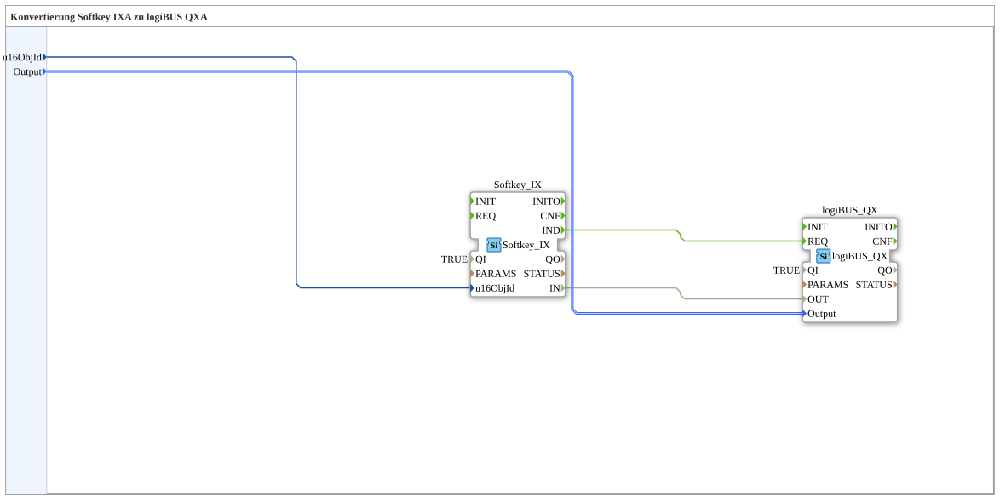

# Softkey_IX_TO_logiBUS_QX

* * * * * * * * * *
## Einleitung

`Softkey_IX_TO_logiBUS_QX` ist das test_B-Gegenstück zu [`Softkey_IXA_TO_logiBUS_QXA`](../../MyLib_AX/sys/Softkey_IXA_TO_logiBUS_QXA.md) — ein VT-Softkey (`Softkey_IX`) schaltet direkt einen physischen Ausgang (`logiBUS_QX`), ohne Adapter.

## Verwendete Funktionsbausteine (FBs)

### Sub-Bausteine: Softkey_IX_TO_logiBUS_QX

- **Typ**: SubAppType
- **Verwendete interne FBs**:
    - **Softkey_IX**: `isobus::UT::io::Softkey::Softkey_IX` — VT-Softkey (Nicht-Adapter-Variante).
    - **logiBUS_QX**: `logiBUS::io::DQ::logiBUS_QX` — physischer digitaler Ausgang.
- **Funktionsweise**: `Softkey_IX.IND` löst `logiBUS_QX.REQ` aus; `Softkey_IX.IN` wird direkt auf `logiBUS_QX.OUT` verdrahtet.

## Programmablauf und Verbindungen

1. `u16ObjId` → `Softkey_IX.u16ObjId`; `Output` → `logiBUS_QX.Output`.
2. `Softkey_IX.IND` → `logiBUS_QX.REQ`; `Softkey_IX.IN` → `logiBUS_QX.OUT`.

## Anwendungsszenarien

- Minimaler Softkey-zu-Ausgang-Baustein für test_B.

## Zusammenfassung

test_B-Pendant zu `Softkey_IXA_TO_logiBUS_QXA`.

---

### 🌐 Passende Themen-Unterseiten auf ms-muc-docs.de

* [🌐 Eclipse 4diac IDE & Farb-Referenz auf ms-muc-docs.de](https://www.ms-muc-docs.de/iec-61499/eclipse-4diac/)
