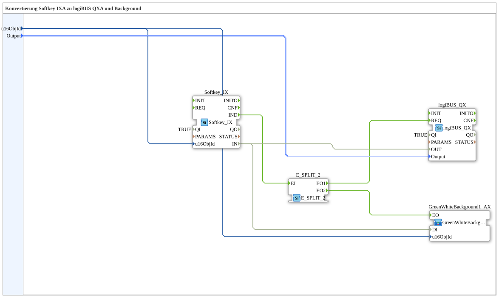

# Softkey_IX_TO_logiBUS_QX_BG

* * * * * * * * * *
## Einleitung

`Softkey_IX_TO_logiBUS_QX_BG` erweitert [`Softkey_IX_TO_logiBUS_QX`](./Softkey_IX_TO_logiBUS_QX.md) um eine VT-Statusfarbe — das test_B-Gegenstück zu [`Softkey_IXA_TO_logiBUS_QXA_BG`](../../MyLib_AX/sys/Softkey_IXA_TO_logiBUS_QXA_BG.md).

## Verwendete Funktionsbausteine (FBs)

### Sub-Bausteine: Softkey_IX_TO_logiBUS_QX_BG

- **Typ**: SubAppType
- **Verwendete interne FBs**:
    - **Softkey_IX**: `isobus::UT::io::Softkey::Softkey_IX` — VT-Softkey.
    - **logiBUS_QX**: `logiBUS::io::DQ::logiBUS_QX` — physischer digitaler Ausgang.
    - **E_SPLIT_2**: `iec61499::events::E_SPLIT_2` — verzweigt das Softkey-Ereignis.
    - **Farbbaustein** (kompakte Background-Variante, siehe [Background-Farbbausteine](../../MyLib_AX/sys/Background-Farbbausteine.md)): setzt die Statusfarbe.
- **Funktionsweise**: `Softkey_IX.IND` wird über `E_SPLIT_2` an `logiBUS_QX.REQ` und den Farbwechsel-Baustein verteilt; `Softkey_IX.IN` geht an `logiBUS_QX.OUT` und an den Farbbaustein.

## Programmablauf und Verbindungen

1. `u16ObjId` → `Softkey_IX.u16ObjId` und Farbbaustein `.u16ObjId`; `Output` → `logiBUS_QX.Output`.
2. `Softkey_IX.IND` → `E_SPLIT_2.EI` → `EO1` → `logiBUS_QX.REQ`, `EO2` → Farbbaustein `.EO`.
3. `Softkey_IX.IN` → `logiBUS_QX.OUT` und → Farbbaustein `.DI`.

## Anwendungsszenarien

- VT-Softkey mit optischer Statusrückmeldung für test_B, ohne OPC-UA.

## Zusammenfassung

test_B-Pendant zu `Softkey_IXA_TO_logiBUS_QXA_BG`.

---

### 🌐 Passende Themen-Unterseiten auf ms-muc-docs.de

* [🌐 Eclipse 4diac IDE & Farb-Referenz auf ms-muc-docs.de](https://www.ms-muc-docs.de/iec-61499/eclipse-4diac/)
