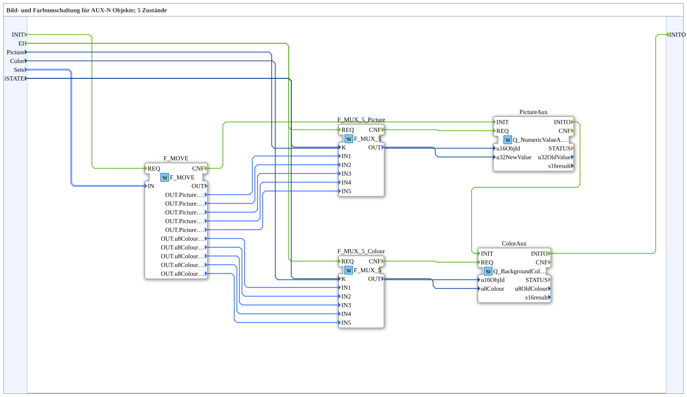

# SwitchPicCol_5_1_aux

* * * * * * * * * *
## Einleitung

`SwitchPicCol_5_1_aux` schaltet zwischen 5 Zuständen sowohl ein Bild als auch eine Hintergrundfarbe um — wie [`SwitchPicCol_5_1`](./SwitchPicCol_5_1.md), aber ausschließlich für **Auxiliary-Function**-Objekte (`Q_NumericValueAux`/`Q_BackgroundColourAux`) statt normale VT-Objekte.

Allgemeines Muster siehe [SwitchPic(Col)-Bausteine (gemeinsames Muster)](./SwitchPic-Bausteine.md).

## Zusammenfassung

AUX-Gegenstück zu [`SwitchPicCol_5_1`](./SwitchPicCol_5_1.md).

---

### 🌐 Passende Themen-Unterseiten auf ms-muc-docs.de

* [🌐 Eclipse 4diac IDE & Farb-Referenz auf ms-muc-docs.de](https://www.ms-muc-docs.de/iec-61499/eclipse-4diac/)
