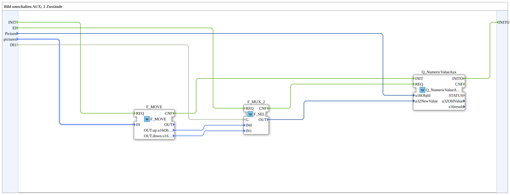

# SwitchPic_2_1_aux

* * * * * * * * * *
## Einleitung

`SwitchPic_2_1_aux` schaltet ein VT-Bild (Object-Pointer) zwischen 2 Zuständen (`up`/`down`) anhand eines booleschen Selectors (`DI1`) um — ausschließlich für ein **Auxiliary-Function**-Objekt (`Q_NumericValueAux`), kein normales VT-Objekt.

Allgemeines Muster siehe [SwitchPic(Col)-Bausteine (gemeinsames Muster)](./SwitchPic-Bausteine.md).

## Zusammenfassung

AUX-Gegenstück zu [`SwitchPic_2_1`](./SwitchPic_2_1.md): dieselbe 2-Zustände-Logik, aber nur für ein AUX-Objekt statt ein normales VT-Objekt.

---

### 🌐 Passende Themen-Unterseiten auf ms-muc-docs.de

* [🌐 Eclipse 4diac IDE & Farb-Referenz auf ms-muc-docs.de](https://www.ms-muc-docs.de/iec-61499/eclipse-4diac/)
