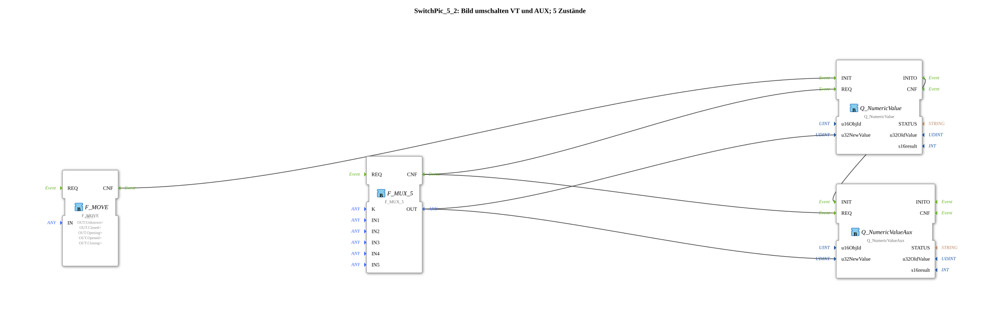

# SwitchPic_5_2

* * * * * * * * * *
## Einleitung

`SwitchPic_5_2` schaltet ein VT-Bild zwischen 5 Zuständen (Schieber-/Ventilanimation) anhand eines `iSTATE`-Werts um — sowohl auf einem normalen VT-Objekt (`Picture`) als auch gleichzeitig auf einem AUX-Objekt (dieselbe ID `Picture`).

Allgemeines Muster siehe [SwitchPic(Col)-Bausteine (gemeinsames Muster)](./SwitchPic-Bausteine.md).

## Zusammenfassung

5-Zustände-Gegenstück zu [`SwitchPic_2_2`](./SwitchPic_2_2.md).

---

### 🌐 Passende Themen-Unterseiten auf ms-muc-docs.de

* [🌐 Eclipse 4diac IDE & Farb-Referenz auf ms-muc-docs.de](https://www.ms-muc-docs.de/iec-61499/eclipse-4diac/)
