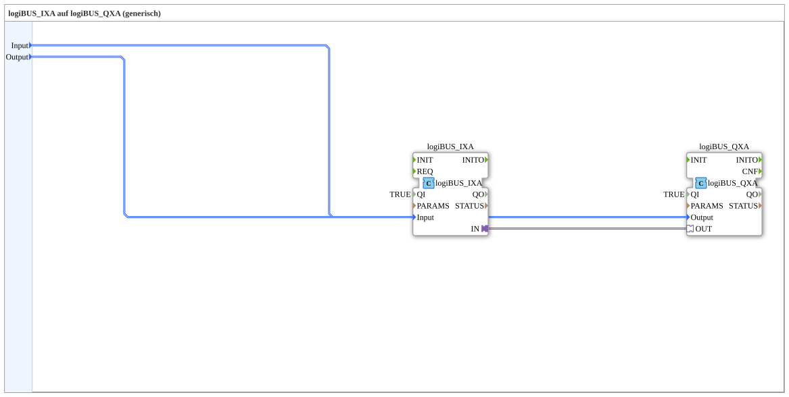

# logiBUS_IXA_TO_logiBUS_QXA

* * * * * * * * * *
## Einleitung

`logiBUS_IXA_TO_logiBUS_QXA` verdrahtet einen physischen digitalen Eingang (`logiBUS_IXA`) direkt auf einen physischen digitalen Ausgang (`logiBUS_QXA`) — eine reine Hardware-Durchschaltung ohne VT-Beteiligung, adapterbasiert (azyklisch mit Bestätigung, `QI=TRUE`). Für die ereignisgesteuerte Variante ohne Adapter siehe [`logiBUS_IX_TO_logiBUS_QX`](./logiBUS_IX_TO_logiBUS_QX.md).

## Verwendete Funktionsbausteine (FBs)

### Sub-Bausteine: logiBUS_IXA_TO_logiBUS_QXA

- **Typ**: SubAppType
- **Verwendete interne FBs**:
    - **logiBUS_IXA**: `logiBUS::io::DI::logiBUS_IXA` — physischer digitaler Eingang, Adapter-Ausgang `IN`, `QI=TRUE`.
    - **logiBUS_QXA**: `logiBUS::io::DQ::logiBUS_QXA` — physischer digitaler Ausgang, Adapter-Eingang `OUT`, `QI=TRUE`.
- **Funktionsweise**: Der Adapter-Ausgang des Eingangs wird direkt auf den Adapter-Eingang des Ausgangs verdrahtet — keine Zwischenlogik, keine VT-Anbindung.

## Programmablauf und Verbindungen

1. `Input` → `logiBUS_IXA.Input`; `Output` → `logiBUS_QXA.Output`.
2. `logiBUS_IXA.IN` (Adapter) → `logiBUS_QXA.OUT` (Adapter) — direkte Durchschaltung.

## Anwendungsszenarien

- Reine Hardware-zu-Hardware-Verdrahtung, z. B. für einen physischen Notaus-Kontakt oder eine feste Verriegelung, die unabhängig vom VT funktionieren muss.

## Zusammenfassung

Adapterbasierte Direktverdrahtung eines physischen Eingangs auf einen physischen Ausgang, ohne VT- oder Ereignislogik.

---

### 🌐 Passende Themen-Unterseiten auf ms-muc-docs.de

* [🌐 Eclipse 4diac IDE & Farb-Referenz auf ms-muc-docs.de](https://www.ms-muc-docs.de/iec-61499/eclipse-4diac/)
