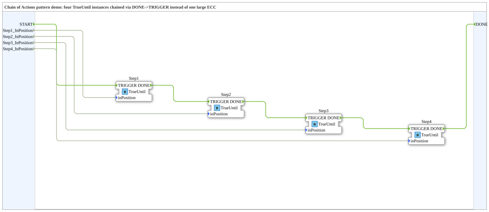

# Design Pattern: Chain of Actions (inkl. Generic Actuation)

* * * * * * * * * *

## Einleitung

Eine mehrstufige Bewegungssequenz (z. B. "fahre Zylinder A aus, dann
Zylinder B aus, dann Zylinder B ein, dann Zylinder A ein") lässt sich
als EIN großes ECC mit vielen Zuständen/Transitionen implementieren –
das wird schnell unübersichtlich ("Spaghetti-Code"). Die Lösung: Man
zerlegt die Sequenz in gleichartige, wiederverwendbare
**Aktions-Bausteine** und verkettet sie über
`DONE`→`TRIGGER`-Verbindungen zu einer linearen Kette – jeder Baustein
kennt nur seinen eigenen Schritt, die Reihenfolge ergibt sich rein aus
der Verdrahtung, nicht aus einem zentralen ECC.

## Bezug zur Kursfolie

- Folie 65 – *"Generic Actuation"* (Structural, Problem:
  Code-Wiederverwendbarkeit) – führt den generischen Baustein
  `TrueUntil` ein.
- Folie 66 – *"Chain of Actions"* (Behavioural, Compositional, Problem:
  "Spaghetti code") – Beispiel mit einem Vakuumgreifer (zwei Zylinder
  `LC`/`RC`).
- Folie 67 – komplexeres Beispiel mit 5 verketteten Aktionsbausteinen
  plus `E_SWITCH`/`E_MERGE` für Verzweigungen – für die Umsetzung hier
  bewusst nicht nachgebaut (siehe "Abgrenzung" unten).

## Der generische Baustein: `TrueUntil`

- **Eventeingänge:** `TRIGGER`, `REQ` (alternativer Auslöser)
- **Eventausgänge:** `TO_POSITION` (Aktuator ansteuern), `STOP`,
  `DONE` (Kette fortsetzen)
- **BOOL-Eingang:** `inPosition` (Rückmeldung, Position erreicht)

Idee: "Fahre in eine Position und warte, bis `inPosition` wahr wird
(`DONE`)." Generisch, weil derselbe Baustein für JEDE Bewegungsart
wiederverwendet wird – nur über `TRIGGER`/`inPosition` extern
angebunden, ohne eigene aktuatorspezifische Logik. Bewusst ohne
`INIT`/`INITO` (kein Zustand, der initialisiert werden müsste).

## Demo: `ChainOfActionsDemo`

Kette aus 4 `TrueUntil`-Instanzen (`Step1`…`Step4`), analog zum
LCExtend/RCExtend/RCRetract/LCRetract-Beispiel der Folie, aber generisch
benannt statt zylinderspezifisch, verkettet über `DONE`→`TRIGGER`. Jede
Stufe hat ein eigenes, an der Subapp-Schnittstelle exponiertes
`StepN_InPosition`-BOOL, mit dem sich das "Erreichen der Position" beim
Testen manuell simulieren lässt.

## Abgrenzung

Das komplexere Beispiel mit Verzweigung/`E_MERGE` (Folie 67) ist eine
spätere Erweiterung, kein Teil dieser Umsetzung. Das
[Decorator-Pattern](DecoratorPattern.md) (Folie 68, `TrueUntil` + `TE`-
Bedingung) ist ein eigenes, separates Muster.

## Offener Punkt

Die genaue Rolle von `REQ` neben `TRIGGER` ist aus der komprimierten
Folien-Grafik nicht zweifelsfrei ablesbar (evtl. ein
Abbruch-/Wiederholungs-Event). Für die Umsetzung hier wird `REQ`
vorerst wie `TRIGGER` behandelt (erneutes Anstoßen der Bewegung).
Noch nicht in 4diac getestet.

## Zusammenfassung

`TrueUntil` ist der wiederverwendbare Baustein hinter drei weiteren
Mustern dieser Sammlung: [Decorator](DecoratorPattern.md),
[Start/Stop](StartStopPattern.md) und [Reset](ResetPattern.md) nutzen
ihn alle unverändert. `ChainOfActionsDemo` zeigt die Grundidee: eine
lineare Sequenz aus reiner Verdrahtung statt aus einem zentralen ECC.
